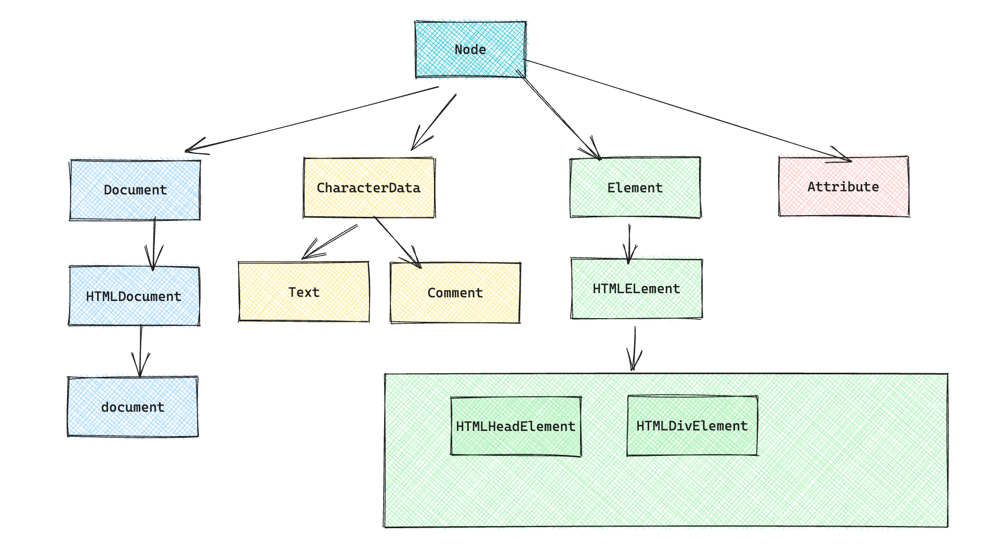

# DOM与事件
1. DOM选择器
2. 常见的dom操作（增加，修改，删除，查找）
3. HTMLCollection和NodeList
4. **事件流（事件冒泡和事件捕获）**
5. **事件处理程序**
6. **event事件对象**
7. 事件委托
8. 重排与重绘

## 1. DOM选择器

:::info

`document.getElementById('id_name')` 通过id定位元素，返回匹配到id的第一个元素

`document.getElementsByClassName()`函数，通过类名定位元素，返回匹配的元素构成的HTMLCollection对象，是一个类数组结构

`document.getElementsByName()`函数，通过元素的name定位，返回匹配的元素构成的NodeList对象

`document.getElementsByTagName()`,通过标签名定位元素，返回匹配元素组成的`HTMLCollection`对象

`element = baseElement.querySelector(selectors) `返回基准元素下，选择器匹配到的元素集合中的第一个元素,实际匹配过程是创建一个匹配元素的初始列表，然后判断每个元素是否为基准元素的后代元素，第一个属于基准元素的后代元素将会被返回

`elementList = baseElement.querySelectorAll(selectors)`, 返回一个`NodeList`的集合

:::

```js
var oLi = document.getElementsByTagName('li')
var oBox = document.getElementsByClassName('box')
var oSpan = document.getElementById('box2')
var box = document.querySelector('div')
var allBox = document.querySelectorAll('div')
console.log(oLi) // HTMLCollection
console.log(oBox) // HTMLCollection
console.log(oSpan)
console.log(box)
console.log(allBox) // NodeList

var all = document.getElementsByTagName('*')
console.log(all)
```

## 2. HTMLCollection和NodeList对象
相同点：
1. 两者都是类数组对象，有length属性，可以通过属性操作，可以通过call/apply处理成真正的数组
2. 都有item()函数，通过索引定位元素
3. 都是实时性的，dom树的变化会及时反映到HTMLCollection对象和NodeList对象上，只是在某些函数调用的返回结果上会存在差异（比如**querySelectorAll获取的nodeList对象就不是实时的**）

```js
var divs = document.querySelectorAll('div')
console.log(divs)
divs[0].remove()
console.log(divs)
console.log(divs.length)
```

不同点: 

1. HTMLCollection对象比NodeList对象多了个namedItem()函数，可以通过id或者name属性定位元素
2. HTMLCollection对象是只包含元素的集合，而NodeList对象是节点的集合，既包括元素，也包括节点，比如文本节点

## 3. 节点和元素

节点具有多种类型：比如`元素节点（1）/ 属性节点（2）/ 文本节点（3）/ 注释节点（8）/ document（9）/ documentFragment（11）`

- `parentNode`: 某节点的父节点, 直到找到`document`为止，`        body -> html -> document -> null`
- `childNodes`: 某节点的全部子节点
- `firstChild/lastChild`: 某节点的第一个子节点和最后一个子节点
- `nextSibling / previousSibling`: 某节点的上一个节点和下一个节点

元素指的是标签及中间的内容，比如`<div class="box">box</div>`

- `parentElement`: 父元素，直到找到`html`为止，`body -> html -> null`
- `children`: 子元素， `childElementCount = children.length`
- `firstElementChild/lastElementChild `: IE9以下不支持，表示第一个和最后一个子元素
- `nextElementSibling/previousElementSibling `: IE9以下不支持，表示下一个和上一个元素

节点的属性：

- nodeName: 元素节点的属性是大写形式，只读
- nodeValue: 属性节点/文本节点/注释节点可以使用，是可写的
- nodeType: 根据数值来判断是哪种类型的节点，不可以修改

```js
// 重写elemChildren, 获取某个节点的子元素节点
function elemChildren(node) {
    var temp = {
        length: 0,
     		// 继承splice方法，会表现出数组的形式
        splice: Array.prototype.splice,
        push: Array.prototype.push
    }
    var children = node.childNodes
    for(var i = 0; i < children.length; i++) {
        var childItem = children[i]
        if (childItem.nodeType === 1) {
            // temp[temp['length']] = childItem
            // temp['length']++
            temp.push(childItem)
        }
    }
    return temp
}
```

获取属性节点: 可以通过`attributes`或者`getAttributeNode`来获取

```js
console.log(oDiv.getAttributeNode('id').value)
console.log(oDiv.attributes[0].nodeValue)
```

判断某个节点是否有子节点：`ele.hasChildNodes()`

## 3. DOM结构树



我们可以用过`document`访问`getElementById/getElementByName`方法，那是因为`document`会沿着`HTMLDocument.prototype -> Document.prototype`的原型链查找

同样的，元素也可以访问`getElementsByTagName/getElementsByClassName/querySelector/querySelectorAll`这几个方法，这是因为他们在`Document/Element.prototype`上都有实现。

那`Node.__proto__`指向哪里呢，指向`EventTarget.prototype`, 直到找到原型链的顶端为止。

## 4. DOM操作

### 1.  增加节点
```javascript
// 新创建一个元素节点
var newLi = document.createElement('li')

// 新创建一个属性节点，并设置值
var newLiAttr = document.createAttribute('class')
newLiAttr.value = 'myClass'
newLi.setAttributeNode(newLiAttr)
// 另一种方式, 更加推荐
newLi.setAttribute('class', 'myClass')

// 新创建一个文本节点
var newTextNode = document.createTextNode('zzf')
// 新创建一个注释节点
var comment = document.createComment('注释')
// 使用appendChild函数将新增元素添加到末尾 [或者是剪切节点]
newLi.appendChild(newTextNode)
// 使用insertBefore函数将节点添加到另一个节点之前
// parent.insertBefore(a,b) 插入节点，在父节点c下的子节点b之间插入a节点
parentNode.insertBefore(newLi2, newLi1)
```
### 2. 删除节点
```javascript
// 删除元素节点，方法执行返回的内容就是删除的元素
parentNode.removeChild(childElementNode)

// 删除属性节点
element.removeAttribute('attr')

// 删除文本节点
element.innerHTML = ''
```
### 3. 修改节点
```javascript
// 修改元素节点
parentNode.replaceChild(newNode,oldNode) // 第一个参数是新元素，第二个参数表示被替换的旧元素

// 修改属性节点
var div = document.querySelector('#div')
// setAttribute设置
div.setAttribute('class', 'classA')
// 修改属性名
div.className = 'classA'

// 修改文本节点
element.innerHTML = '新设置的内容'
```
### 4. innerHTML/innerText

- innerHTML和innerText都在HTMLElement.prototype中
- innerHTML还在Element.prototype上, 可以取值/追加/修改
-  innerText表示文本内容, 将标签改成字符实体，比如`<`改成`&lt;`

### 5. 自定义属性

```html
<p data-name="zzf" data-age="18"></p>
```

```js
//   HTML5新增了一个data-*属性 
var p = document.getElementsByTagName('p')[0]
console.log(p.dataset) // 可以访问到 { name: 'zzf', age: 18}
console.log(p.getAttribute('data-name'))
```

### 6. 文档碎片

```js
var oUl = document.getElementById('list')
var oFrag = document.createDocumentFragment()
// 每次新加节点都需要重新回流（计算位置），消耗很多性能
for(var i = 0; i < 100; i++) {
    var oLi = document.createElement('li')
    oLi.innerHTML = i + `:这是第${i}个项目`
    // 标签应该有类名
    oLi.className = 'list-item'
    oFrag.appendChild(oLi)
}
oUl.appendChild(oFrag)
```

## 5. 计时器

```js
// 每隔特定的毫秒数时间执行一次内部函数
// 每个定时器有一个唯一标识，timer, 使用clearInterval清除定时器
var timer = setInterval(() => {console.log(1)}, 1000)
console.log(timer)
clearInterval(timer)
```

```js
// setTimeout(() => {}, 100) 延时器
// 延迟特定的毫秒时间执行一次函数
setTimeout(() => {
    console.log('zzf')
}, 1000)
```

## 6. Date对象

```js
// Date()
var date = new Date()
console.log(date) // 标准时间格式
console.log(date.toString() === Date())

// 返回当前是一个月的第几天 getDate()
console.log(date.getDate())

// 返回当前是一周中的第几天 getDay()
console.log(date.getDay())  // 0是星期天 ，取值范围为0-6

// 返回当前为第几个月 getMonth
console.log(date.getMonth() + 1)

// getYear() -> getFullYear() 返回当前的年份
console.log(date.getFullYear())

// getHours()/getMinutes()/getSeconds()
console.log(date.getHours(), date.getMinutes(), date.getSeconds())
// getMilliseconds()
```

```js
// getTime() 时间戳 TimeStamp 1970年 1月1日 0点0分0秒，计算的毫秒数
console.log(date.getTime())
var dataTime = new Date(1693040126330)
console.log(dataTime)

var date = new Date()
var dateTime2 = date.setTime(1693040126330)

// 传递参数创建Date对象的三种方式
var date = new Date(2020,1,1,0,0,0)
console.log(date)
var date = new Date('2023-7-1 00:00:00')
console.log(date)
var date = new Date('2023/7/1 00:00:00')
console.log(date)
```

