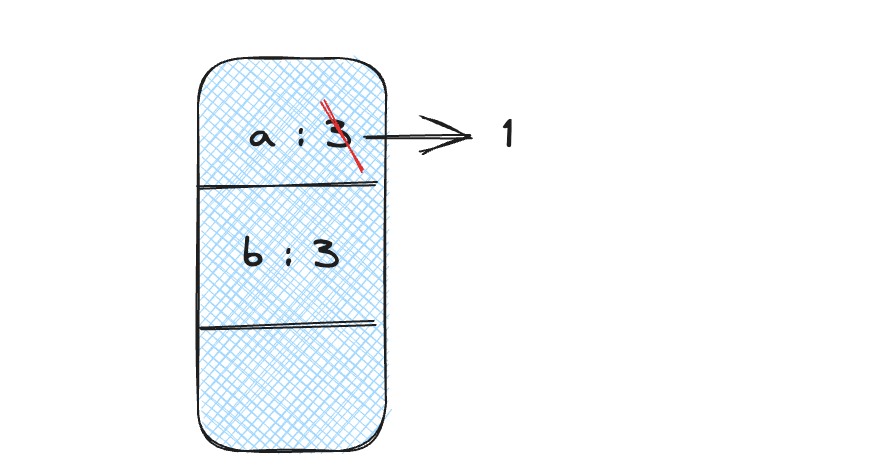
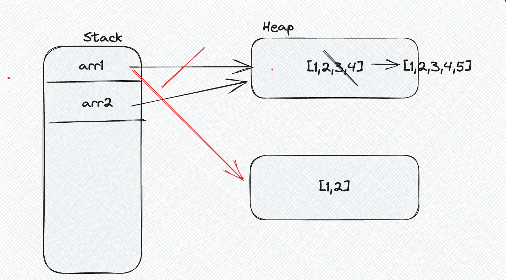
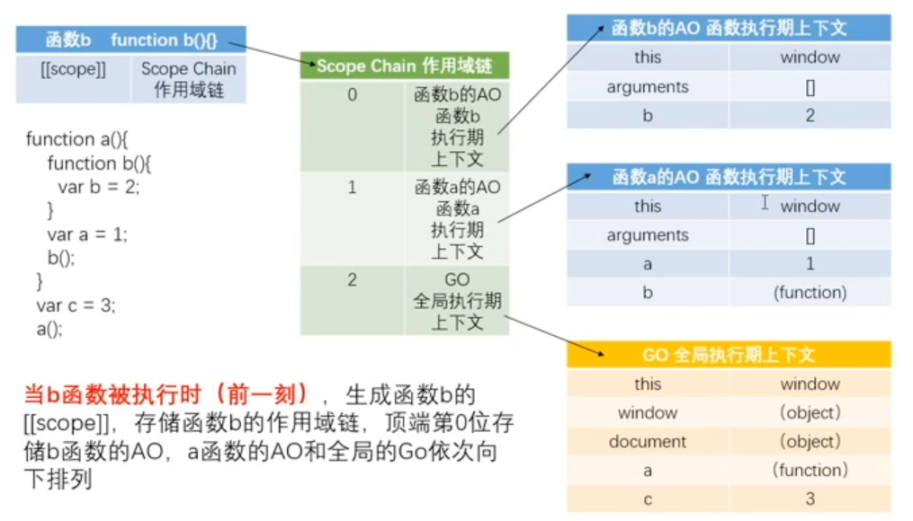
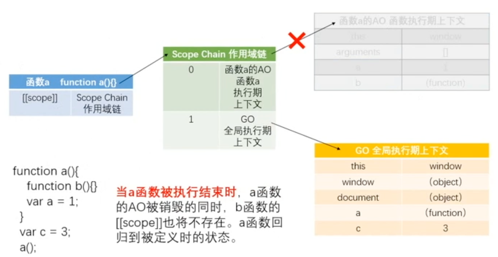
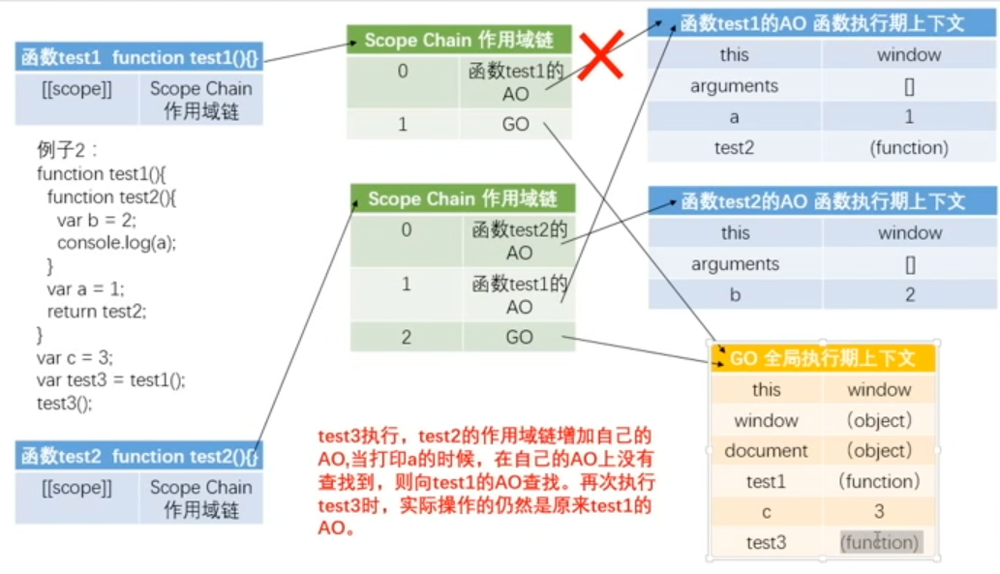
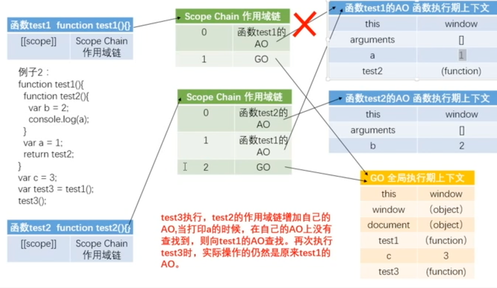
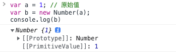

# JS语法基础

### 变量和值

```js
var a = 3; // 变量声明
a = 3; // 变量赋值

var a = 10;  // 变量声明并赋值 
var x = 1, y = 2;  

var bar = 1; 
bar = 2; // 改变变量的值
console.log(bar);
```

:::info

1. 变量名只能以$、下划线、字母开头，后面可以是$、下划线、字母、数字。特别注意不能以数字开头。
2. 不能以js的关键字、保留字作为变量的名称
3. 变量命名要语义化
4. 小驼峰命名 testName（类名首字母大写）

:::


### 数据类型

> JavaScript分为**基础数据类型**和**引用数据类型**

基础数据类型

- Number
- String
- Boolean
- Undefined
- Null
- Symbol
- BigInt

常用的引用值

- Object
- Array
- Date
- Function
- RegExp


### 数据类型的存储方式-堆内存和栈内存



```js
var a = 3; 
var b = a; 
a = 1; 
console.log(a,b) // 1,3
```


```js
var arr1 = [1,2,3,4]
var arr2 = arr1;
console.log(arr1,arr2) // [1,2,3,4]
arr1.push(5)
console.log(arr1,arr2) // [1,2,3,4,5]
arr1 = [1,2]
console.log(arr1,arr2) // [1,2]和[1,2,3,4,5]
```



### 运算和运算符

```js
console.log("str" + true) // "strtrue", 任何数据类型 + 字符串都是字符串

console.log(0 / 0) // NaN，属于Number数据类型
console.log(1 / 0) // Infinity,Number数据类型
console.log(3 % 5) // 3

// 交换a,b的值
var c = a;
    a = b;
    b = c;
a = a + b;
b = a - b;
a = a - b;

// ++运算与--运算
var a = 5,
    b;
b = ++a + 1;
console.log(b,a) // 7 6

// 运算符具有优先级


```

```js
// 比较运算符
// 1. 字符串比较时：从左到右依次比较ASCII码的大小
// 2. 比较时，可能会进行数据类型的转换
var bool = 1 > '2' // 1 > 2 = false
var bool = '1.5' > '11' // . < 1, 所以结果为false
var bool = 1 == '1'
var bool = 1 === '1' // 判断数据类型, false
var bool = NaN === NaN // NaN与包括自己在内的任何值都不相等
```

```js
// 逻辑运算符：与、或、非的使用
var a = 1 && 2; 
console.log(a) // 2 
// 遇到真就往后走，遇到假或走到最后就返回当前的值
// 第一个为真就返回第二个的值
// 第一个为假就返回第一个的值

var b = 0 || null || 1 || 0
console.log(b) // 1
// 遇到假就往后走，遇到真或者走到最后就返回当前的值

var a = !1
console.log(a) // false
```


### 分支语句

```js
if(score >= 90){
  
} else if(score >= 80 && score <90){
  
} else {
  
}
```

```js
switch(city) {
  case '北京':
    return 'bei jing'
    break;
  case '上海':
    return 'shang hai'
    break;
  default:
    return 'other city'
}
```

### 循环

```js
// for(声明；判断；操作）{}
for(var i = 0; i < 10; i++) {
    console.log(i)
}  // 当 i = 10, 不满足条件，退出循环
var i = 0;
for(;i<10;) {
  console.log(i);
  i++;
}


// while(true) {} 
var j = 0
while(j < 10) {
  console.log(j)
  j++;
}

// do while操作
var i = 0;
do {
  // 执行一次
}while(condition)
```

###  数组和对象

```js
var arr = [1,2,3,4]
for(var i = 0; i < arr.length; i++) {
  arr[i] += 2;
}

var obj = {
  name: 'zzf',
  age: 22,
  job: '演员‘
}
console.log(obj.name)
```

### typeof

```js
// typeof 可以用来检测基本数据类型,返回的结果都是字符串
typeof [] // "object"
typeof null //"object"
typeof undefined // "undefined"
typeof function() {} // "function"

console.log(a) // ReferenceError a is not defined

console.log(typeof(a))  // "undefined"

console.log(typeof(typeof(a))) // "string"
```

### 类型转换

#### Number

:::info

- Number()
- parseInt(string,radix)
- parseFloat()
- +'123'

:::

```js
console.log(Number(null)) // 0
console.log(Number(undefined)) // NaN


// parseInt只解析数字，对于null,false,undefined，NaN都转为NaN
// radix的取值范围是2-36
var a = '10'
console.log(parseInt(a,16)) // 16
parseInt('abc123') // NaN
parseInt('123abc') // 123
parseInt(null) // NaN

parseFloat('3.1415926') // 3.1415926
var num = '3.1415926'
console.log(num.toFixed(2)) // 四舍五入保留两位小数
```

#### String

:::info

- toString() 
- String() 
- 字符串拼接 ''+

:::

#### Boolean

> 除去nudefined、null、0、NaN、false、空字符串转换为false,其他都转换为true

#### 隐式类型转换

```js
var a = '123'
a++;
console.log(a) // 124

// 在关系运算符中，null,undefined都会被Number()转为数字类型
// 相等运算符中，null和undefined都不会转换为数字类型
console.log(undefined == 0) // false,大于0,小于0都为false
console.log(null == 0) // false, 大于0,小于0都为false
console.log(null == undefined) // true
```

#### isNaN()

> `isNaN()`会进行数据类型的转换，在处理的时候会判断传入的变量能否转换为数字，如果能转换为数字则会返回false,如果无法转换则会返回true

```js
isNaN(undefined) // true
isNaN({}) // true
isNaN('王小波') // true
isNaN(null) // false
```

### 函数

#### 函数声明

```js
// 函数声明
// 函数一般以小驼峰命名 myFunctionName
function test() {
    var a = b = 1;
  // var a = 1, b = 2;
    console.log(a,b) // 1,1
  // return;
}
test()
console.log(a,b) // undefined, 1


// 函数表达式
var test1 = function test2() {}
test1()
console.log(test1.name) // test2
test2() // 报错

// 匿名函数表达式
var foo = function() {}
```

#### arguments

```js
function foo(a,b) {
    console.log(a,b)
}
foo(1,2)

function bar(a,b,c) {
    console.log(bar.length) // 获取形参长度,3
    console.log(arguments) // 获取实参 [1,2]
    console.log(a,b,c) // 1,2,undefined
}
bar(1,2) 
```

```js
function sum() {
  var a = 0;
  for(var i = 0; i< arguments.length;i++) {
    a += arguments[i];
  }
  console.log(a)
}
```

> 传递了实参，arguments可以修改，没有传递，则不能修改

```js
function test(a,b) {
  a = 3;
  console.log(arguments[0]) // 3
}
test(1,2) // 3

function test(a,b) {
  b = 3;
  console.log(arguments[1]) // undefined
}
test(1) // undefined


function test(a,b) {
  console.log(a,b) // 1,2
  console.log(arguments) // [1,2,3]

  a = 11;
  console.log(arguments[0]) // 11
  arguments[0] = 111;
	console.log(a); // 111

  argumemts[2] = 33;
  console.log(arguments[2]);
}
test(1,2,3)


function test(a,b){
  console.log(a,b) // 1,undefined
  console.log(arguments) // [1]

  b = 2;
  console.log(arguments[1]) // undefined

  arguments[1] = 22;
  console.log(b)  // 2
}
test(1)
```

#### 参数默认值

```js
function foo(a,b) {
  console.log(a,b)
}
foo(1) // 1, undefined
```

```js
function test(a = 1, b =2) {
    console.log(a,b)
}
test(undefined,3) // 1, 3


function foo(a,b) {
    var a = arguments[0] || 1'
    // a = a || 1;
    // b = b || 2;
    console.log(a + b);
}
foo()

function bar(a,b) {
   // a = typeof a === 'undefined' ? 1 : a;
  a = typeof arguments[0] === 'undefined' ? 1 : arguments[0];
}
```

### 函数执行

#### 预编译

:::info

执行的过程：

1. 检查语法错误
2. 预编译
3. 解释执行

:::

> ℹ️ 函数声明整体提升，变量只有声明提升，赋值不提升

```js
test()
function test() {
  console.log(1)
}

console.log(a);
var a = 1;
```

```js
console.log(a) // function a() {}
function a(a) {
  var a = 10;
  var a = function() {}
} 
var a = 1;
```

```js
var a = 1;
b = 2;
console.log(window.a)  // 1
console.log(window.b)   // 2
```

```js
/*
GO = {
	b: 1
}
AO = {
	a: unefined -> 1
}
*/
function test() {
  var a = b = 1;
}
console.log(b) // 1
console.log(a) // 报错
console.log(window.a) // undefined
```

#### AO

:::info

**AO: 活跃对象，函数上下文**

- 寻找**形参和变量声明**
- 实参赋值给形参
- 寻找函数体中的函数声明
- 函数执行

:::

```js
/*
AO = {
	a: undefined -> 2 -> function a() {}
  b: undefined -> function() {},
  d: function () {}
}
*/
function test(a) {
  console.log(a) // function a() {}
  var a = 1;
  console.log(a); // 1
  function a() {}
  console.log(a)  // 1
  console.log(b) // undefined
  var b = function() {}
  console.log(b) // function() {}
  function d() {}
}
```

#### GO

:::info

GO:  全局上下文  === window

- 找变量
- 找函数声明
- 全局执行

:::

```js
/*
GO = {
	 a: undefined  -> fn -> 1
}
*/
var a = 1;
function a() {
  console.log(2)
}
console.log(a) 
```

```js
var b = 3;
console.log(a); // fn a(a) {}
function a(a){
 console.log(a); // fn a
 var a = 2;
 console.log(a); // 2
 function a() {}
 var b = 5;
 console.log(b) // 5
}
a(1)
```

```js
/*
GO: {
 a: undefined,
 test: fn,
 c: 3
}
AO = {
 b: undefined
}
*/
function test() {
  console.log(b) // undefined
  if(a) {
    var b = 2
  }
  c = 3;
  console.log(c) // 3
}
var a;
test();
a = 1;
console.log(a); // 1
```

#### 练习题

```js
/*
AO = {
 a: undefined -> fn
}
*/
function test() {
  return a;
  a = 1;
  function a() {}
  var a = 2

}
console.log(test()) // fn a
```

```js
/*
AO = {
  a: undefined -> fn a -> 1 -> 2
}
*/
function test() {
  a = 1;
  function a() {}
  var a = 2;
  return a;
}

console.log(test()) // 2
```

```js
/*
GO: {
 a: undefined -> 1,
 test: fn,
 f: 5
}
AO: {
	e: undefined -> 1 -> fn -> 2,
  a: undefined -> 4,
  c: undefined,
  b: undefined
}
*/
a = 1;
function test(e) {
  function e() {
  }
  arguments[0] = 2;
  console.log(e) // 2
  if(a) {
    var b = 3;
  }
  var c;
  a = 4;
  var a;
  console.log(b) // undefined
  f = 5;
  console.log(c)  // undefined
  console.log(a) // 4
}
var a;
test(1);
console.log(a); // 1
console.log(f); // 5
```

```js
var a = false + 1; // 1
var b = false == 1; // false
typeof a && (-true) + (+undefined) + '' // "undefined" &&  'NaN'
!!' ' + !!'' - !!false || '通过了'  // 1
// true + false - false
```

### 作用域和作用域链

:::info

函数存储作用域链的容器（AO和GO)

AO: 函数的执行上下文

GO：全局的执行上下文

函数执行完成之后，AO是要销毁的（AO是一个即时的存储容器）

:::





```js
function a() {
  function b() {
    var b = 2;
  }
  var a = 1;
  b();
}
var c = 3;
a();
// 当a函数被定义时，a的[[scope]]属性中保存该函数的作用域链，作用域链的第0位存储当前环境下的全局执行上下文GO
// 当a函数执行时，作用域的顶端（第0位）存储当前函数的执行上下文AO，同时第一位存储G0
// 查找变量是到a函数存储的作用域链中从顶端开始向下查找

// b函数被定义时，在a函数环境下，所以b函数这时的作用域链就是a函数被执行期的作用域链
// b函数被执行时，生成函数b的[[scope]],存储函数b的作用域链，顶端第0位存储b函数的A0
// b函数执行结束后，b函数的AO被销毁

// a函数执行结束，a函数的AO被销毁，b函数与之的关联也消失

// 函数定义的时候，函数已经存在[[scope]], 形成	Scope Chain,并放入GO,执行时形成AO，放入Scope Chain的最顶端
```

### 闭包

> 函数执行时，内部的函数被返回到外部并保存时，会使得原来的作用域链不释放，则产生闭包，过度的闭包可能会导致内存泄露。

```js
function test1() {
  function test2() {
    var b = 2;
    a = 2;
    console.log(a); // 2
  }
  var a = 1;
  return test2;
}
var test3= test1();
test3();
```





```js
function utils() {
  var utilFunc = {
    a: function () {},
    b: function () {}
  }
  return utilFunc;
}
var util = utils();
util.a()
util.b()
```

### 闭包总结

> 根据新的MDN文件解释

```javascript
// 理论上，test就是一个闭包
// 闭包在ECMA262上的定义：当一个函数被系统创建时，闭包就会被一同创建起来
// 闭包让开发者可以从内部函数访问外部函数的作用域。
function test() {
  var name = 'zzf';
  function displayName() {
    console.log(name)
  }
  displayName()
}
```

```js
function b(a) {
  console.log(a)
}
// 是否形成闭包： 否，形成闭包，则应该能访问到test的环境
function test() {
  var a = 1;
  b(a)
}

function test() {
  function b() {
    
  }
}
```

### 立即执行函数IIFE

```js
(function() {})() // 函数执行完毕之后，被立即销毁
(function(){}())
// 函数声明变成表达式的方法， + - ｜｜ && ！，且是表达式才能被执行符号执行，执行时会忽略名称
!function(){}()
+function(){}()
```

```js
(function(a,b) {
  console.log(a+b);
}(2,4))

var num = (function(a,b) {
  console.log(a+b)
  return a + b;
}(2,4))
console.log(num) // 6

// 一定是表达式才能被执行符号执行
var test = function(){ console.log(1) }(); // 能执行
// var test = (function(){})()
console.log(test) // undefined
```

```js
function test(a){}(5); // 不报错，括号理解成为表达式
// 会变成 funtion test(a){}   (5)
console.log((6,5)) // 5,逗号运算符，返回逗号最后面的内容
function test(a){}() // 报错
```

```js
function test() {
  var arr = [];
  // var i = 0;
  for(var i = 0;i<10;i++) {
    arr[i] = function() {
      console.log(i)
    }
    // i++;
  }
  return arr;
}
var myArr = test();
// console.log(myArr);

// 输出10
for(var j = 0; j<10; j++) {
  myArr[j]();
}

// 立即输出0-9
function test() {
  for(var i = 0; i<10;i++) {
    (function() {
      console.log(i)
    })()
  }
}

function test() {
  var arr = [];
  for(var i = 0;i<10;i++) {
    arr[i] = function(num) {
      console.log(num)
    }
  }
  return arr;
}
var myArr = test();
// 输出10
for(var j = 0; j<10; j++) {
  myArr[j](j);
}

```

```js
function test() {
  var n = 10;
  var a = function() {
    console.log(n)
  }
  var b = function() {
    console.log(n)
  }
  return [a,b]
}
var arr = test()
arr[0];
arr[1];
```

```js
function test() {
  var arr = [];
  for(var i = 0;i<10;i++) {
    // i传入到了立即执行函数中，成为了形参j
    (function(j) {
      arr[j] = function() {
        console.log(j)
      }
    })(i)
  }
  return arr;
}

// 5个li,点击输出下标
var oLi = document.querySelectorAll('li')
for(var i = 0; i < oLi.length;i++) {
  oLi[i].onclick = function() {
    console.log(i) // 5
  }
}

for(var i = 0; i < oLi.length;i++) {
  (function(j) {
    oLi[j].onclick = function() {
      console.log(j) // 0 1 2 3 4
    }
  })(i)
}
```

```js
var fn = (
  function test1() {
    return 1;
  },
  function test2() {
    return '2';
  }
)()
console.log(typeof(fn)) // "string"
```

> 🎨注意点：()是个表达式，里面的函数名会忽略

```js
var a = 10;
if(function b() {}){ // (function b(){}) ---> (function(){}), ()这是个表达式
  a += typeof(b) 
}
console.log(a) // "10undefined"
```

```js
function sum() {
  var num = 0;
  return function add() {
    num++;
    console.log(num)
  }
}
var fn = sum();
fn();
```

```js
function() 
  var students = ['小明', '小红']
  var fns = {
    joinClass: function(name) {
      students.push(name)
      console.log(students)
    },
    leaveClass: function(name){
      var idx = students.indexOf(name)
      if(idx!=-1) {
        students.splice(idx,1)
      } else {
        console.log('该学生不在此班级')
      }
      /*
      for(var i = 0; i< students.length;i++) {
        var item = students[i];
        if(item === name) {
          students.splice(i,1)
        }
      }
      */
      console.log(students)
    }
  }
  return fns;
}
```

### 对象

> 一般来说，对象里面的函数叫方法，其余情况下叫函数

```javascript
// 创建一个对象，通过 var obj = {}
var student = {
  name: 'zzf',
  age: 22,
  weight: 10,
  eat: function() {
    this.age++;
    console.log(this.age)
  }
}
student.job = '演员'
student.age = 21

delete student.job
delete student.eat
// 系统自带的构造函数 Object, new构造函数，对象实例化
var obj = new Object()
obj.name = 'zzf'
```

### 构造函数

```javascript
// 构造函数一般以大写字母开头，并通过new创建实例对象
function Student() {
  this.name = 'zzf';
  this.age = 22;
  this.eating = function() {
    console.log('i am eating')
  }
}
// 实例化出的对象不相互影响
var s1 = new Student();
var s2 = new Student();

s2.name = 'zdf'
console.log(s1,s2)

function Teacher(name,age) {
  this.name = name;
  this.age = age;
  this.eating = function() {}
}
var t1 = new Teacher('zdf', 22)
var t2 = new Teacher('zzf', 18)

```

```js
var opt = {
  name: 'zzf',
  age: 22
}
function Teacher(opt) {
  this.name = opt.name
  this.age = opt.age
}

var app = new Vue({
  el: '#app',
  data: {
    message: 'hello vue'
  }
})
```

> 实例化的过程就是构造函数被执行的过程, 如果构造函数中返回一个对象类型的值，则返回这个新对象obj。否则直接返回对象实例

```javascript
function Car() {
  /*
  A0 = {
    this: {
      color: 'red',
      brand: 'baz'
    }
  }
  */
  this.color = 'red'
  // return this
  // return {}
}
Car() // this指向window
// 实例化的过程就是构造函数被执行的过程, car指向返回的实例对象
var car = new Car(); // this指向实例对象

```

### 包装类

原始值没有自己的属性和方法

```javascript
var a = 1;
var b = 'abc'
a.add = function() {}


var a = 1; // 原始值
var b = new Number(a); // 数字对象
var c= b + 1;
console.log(b)
```



```javascript
var a = 123;
a.len = 3;
// new Number(a).len = 3; delete
console.log(a.len) // undefined

var str = 'abc'
// new String(str).length
console.log(str.length) // 3

str.length = 1  // new String(str).length = 1; delete
console.log(str)  // abc


function Compute() {
  var args = arguments;
  this.plus = function() {
    var res = 0;
    for(var i = 0; i < args.length;i++) {
      var item = args[i]
      res += item
    }
  }
  this.times = function() {
    
  }
}

```

```js
var name = 'zzf'
name += 10;
var type = typeof(name) // "string"
// var type = new String(typeof(name))
if(type.length === 6) { // true
  type.text = 'string'
}
console.log(type.text) // undefined
```

```js
funcion Test(a,b,c) {
  var d = 1;
  this.a = a;
  this.b = b;
  this.c = c;
  function f() {
    d++;
    console.log(d)
  }
  this.g = f;
  // return this
}
var test1 = new Test();
test1.g();  // 2
test1.g(); //3
var test2 = new Test();
test2.g() // 2
```

```js

var x = 1, y = z = 0;
function add(n) {
  return n = n+1;
}
y = add(x)
function add(n) {
  return n = n + 3;
}
z = add(x)
console.log(x,y,z) // 1 4 4
/*
GO = {
 x: 1,
 y: 0,
 z: 0,
 add: function add(n) {
    return n = n + 3;
 }
}
*/
```

```js
function foo(x) {
  console.log(arguments) 
  return x;
}
foo(1,2,3,4,5)

function foo(x) {
  console.log(arguments)
  return x;
}(1,2,3,4,5)  // (1,2,3,4,5)会隔离开来，所以不输出

(function foo(x) {
  console.log(arguments)
  return x;
})(1,2,3,4,5)
var str = 'abc'
var pos = str.charCodeAt(1)
console.log(pos)  // 98
```

```js
var compute = new Compute(2,4,6)
compute.plus()
function Compute() {
  var res = 0;
  this.plus = function() {
    loop(arguments,'add',res)
  }
  this.times = function() {
    res = 1;
    loop(arguments,'mul',res)
  }
  function loop(args,method,res) {
    for(var i = 0; i<args.length;i++) {
      var item = args[i]
      if(method === 'add') {
        res += item
      }else if(method === 'mul') {
        res *= item;
      }
    }
  }
}
```

```js
function Car(opt) {
  this.brand = opt.brand
  this.color = opt.color
  this.displacement = opt.displacement
}
function Person(opt) {
  this.name = opt.name
  this.age = opt.age
  this.income = opt.income
  this.selectCar = function() {
    var myCar = new Car(opt.carOpt)
  }
}
var jogn = new Person({
  name: 'zzf',
  age: 22,
  income: '100w',
  carOpt: {
    brand: '宝马',
    color: '红色',
    displacement: '2.0'
  }
})
```


### 原型

- 构造函数的`prototype`指向一个对象
- 原型的`constructor`指向构造函数
- 实例的`__proto__`指向构造函数的`prototype`

```javascript
function Phone(brand, color) {
  var this = {
    __proto__: Phone.prototype
  }
  this.brand = brand;
  this.color = color;
}
// 所有被构造函数构造出来的对象都可以继承原型上的属性和方法
Phone.prototype.system = 'Android'
Phone.prototype.brand = 'vivo'

var phone1 = new Phone('小米','red')
var phone2 = new Phome('华为', 'black')

```

```js
function Person() {
  
}
var p1 = { name: 'zzf' }
var person = new Person()
person.__proto__ = p1
```

```js
function Car() {}
Car.prototype.name = 'Benz'

var car = new Car()  // 已经实例化，__proto__已经指向原来Car的prototype
Car.prototype = {
  name: 'Mazda'
}
console.log(car.name) // 'Benz'
```

### 继承

```js
function Teacher() {}
function Buffer() {}
function Student() {}
/*
Buffer.prototype = Teacher.prototype
var buffer = new Buffer()
Student.prototype = buffer
*/
inherit(Student, Teacher)
var s = new Student()
function inherit(Target, Origin) {
    function Buffer() {
    }
    Buffer.prototype = Origin.prototype
    Target.prototype = new Buffer()
    // 还原 constructor
    Target.prototype.constructor = Target
    // 继承源
    Target.prototype.super_class = Origin
}
```

```js
// 模块化开发，拥有自己的命名空间，防止对全局的污染
var inherit = (function() {
    var Buffer = function() {}
    // var inherit = function() {}
    return function(Target, Origin) {
        Buffer.prototype = Origin.prototype
        Target.prototype = new Buffer()
        Target.prototype.constructor = Target
        Target.prototype.super_class = Origin
    }
    // return inherit
})()
```

### window

```javascript
(function() {
  function Test() {
  
  }
  window.Test = Test;
})()
```

### 原型链

```js
var obj = {
    a: 1
}
console.log(obj)
// obj身上的[[prototype]]就是obj的原型
// obj是通过new Object创造的实例 -> obj是由Object构造出来的
// obj的原型 -> Object的原型属性

// 实例对象  -> [[proto]] -> obj.__proto__
// Object.prototype -> Object的静态原型属性
```

```js
function Test() {
    this.a = 1;
}
Test.prototype.b = 2;

Object.prototype.c = 3;
console.log(new Test())

// 从实例对象出发，沿着[[prototype]]往上寻找，直到找到Object.prototype的链条就叫做原型链
// 原型链的目的就是为了继承静态属性，原型链继承
```

```js
var obj1 = Object.create(null)
obj1.a = 1;
var obj2 = Object.create(obj1)
obj2.b = 2;
// console.log(obj2)
// 只要原型链断掉，就无法获取__proto__
console.log(obj2.__proto__)  // undefined
// 只有原型，但是没有原型链（直到Object.prototype中间断了一个都不行)，所以无法获取
// __proto__是原型链的节点，没有链
```

```js
var obj3 = Object.create(obj2)

console.log(obj3.__proto__)
console.log(Object.getPrototypeOf(obj3)) // 能获取到本身的原型
// __proto__ 是原型链的指针 断了，自然无法获取到原型
```

### 深浅拷贝

```js
// 浅拷贝方法
function clone(origin, target) {
    var target = target || {}
    // for in循环会遍历原型上的属性
    for(var key in origin) {
        // 剔除原型上的属性
        if (origin.hasOwnProperty(key)) {
            target[key] = origin[key]
        }
    }
}
```

```js

// 深拷贝方法
function deepClone(origin, target) {
  var target = target || {},
      toStr = Object.prototype.toString,
      arrType = '[object Array]';
  for (var key in origin) {
      if (origin.hasOwnProperty(key)) {
          // 首先判断是否是对象
          if (typeof (origin[key]) === 'object' && origin[key] !== null) {
              toStr.call(origin[key] === arrType) ? target[key] = [] : target[key] = {}
              // if (toStr.call(origin[key]) === arrType) {
              //     target[key] = []
              // } else {
              //     target[key] = {}
              // }
              // 递归调用
              deepClone(origin[key], target[key])
          } else {
              target[key] = origin[key]
          }
      }
  }
  return target
}
```

