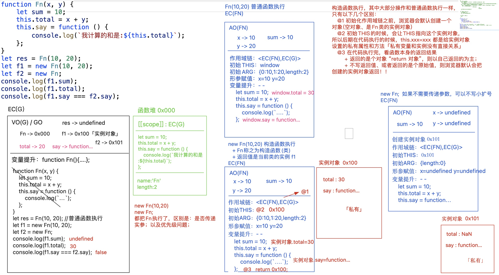
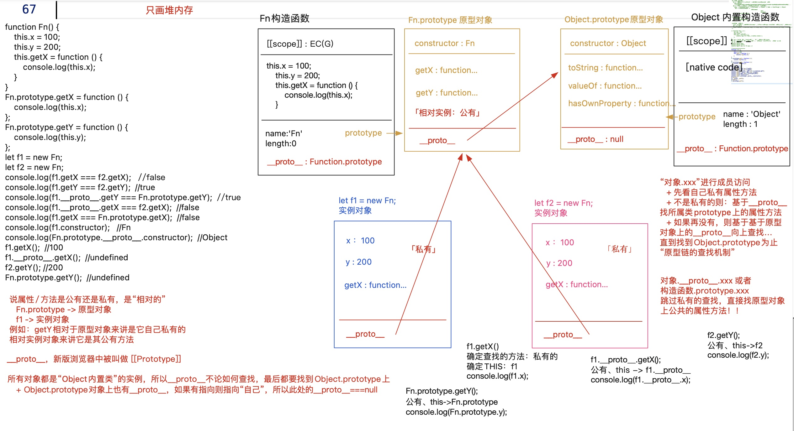
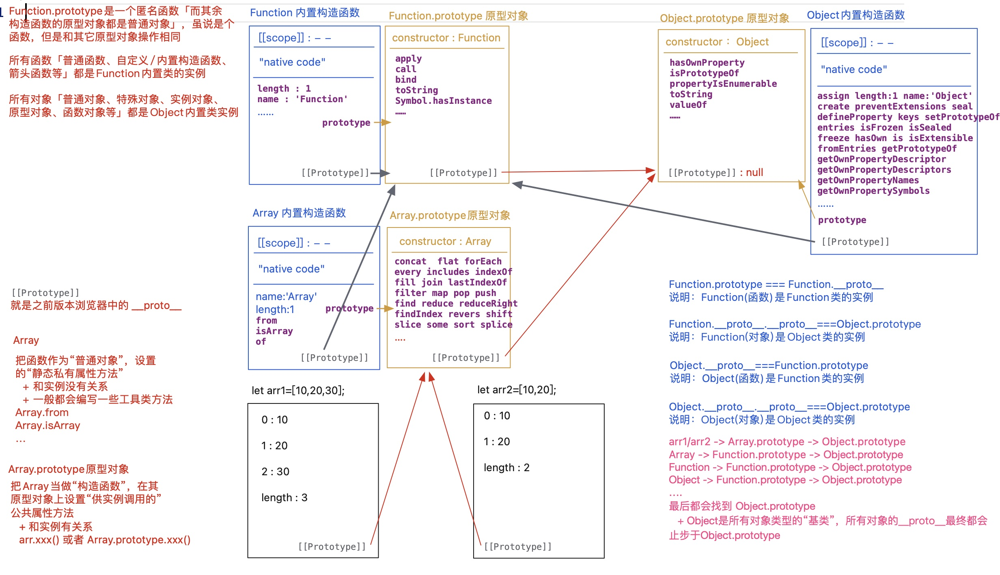
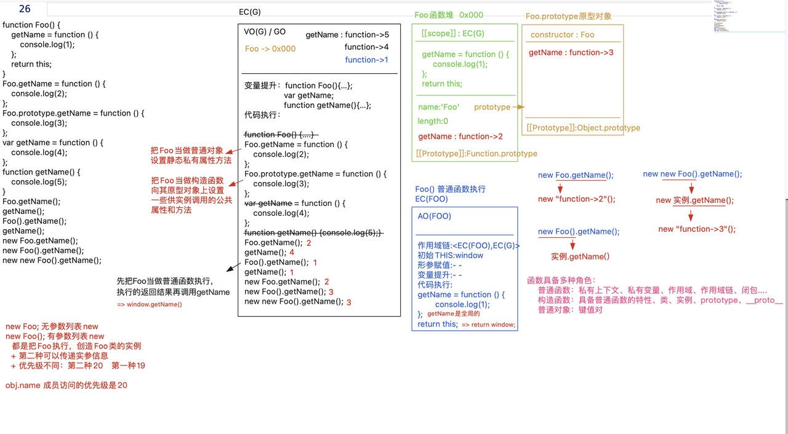
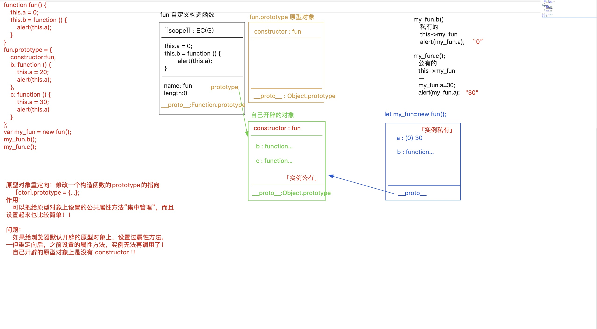

# JS面向对象

1. 什么是对象、对象的属性和访问方式？如何创建对象
2. 原型对象、构造函数、实例之间的关系？
3. 原型与原型链
     -  prototype
     -  __proto__
     - constructor
4. ES6新增class语法
5. 原型重定向
6. 继承的实现方式
     - 原型继承
     - 构造call继承
     - 寄生组合继承
     - class继承

## 1. 面向对象基础
JS中的每一个东西，都是我们要研究的【对象】，按照功能特点进行分【类】 ，拿出类中具体的某个事物，称为【实例】
举例来说，js中有很多的内置类，每一种数据类型值都有自己所属的内置类 （构造函数） 

- 引用数据类型：Object, Function, Array, RegExp, Set, Map, Date
- 基本数据类型： Number(每一个数字都是Number类的实例)String Boolean Symbol BigInt

还比如，每一个DOM元素对象是一个实例，也有自己所属的内置类
```
body--->HTMLBodyElement-->HTMLElement--->Element--->Node--->EventTarget--->Object
```
再比如，我们获取的元素HTMLCollection和NodeList也是对象
学习面向对象的作用？ 

- 更好的学习js

`[] ---> Array ---> Array.prototype / Object.prototype`
 	`vm ---> Vue --> Vue.Prototype `

-  封装插件，组件，框架（复用）
### 1.1 对象的属性和访问方式
> 以下内容来自于《javascript重难点实例精讲》

[Object.defineProperty-MDN](https://developer.mozilla.org/zh-CN/docs/Web/JavaScript/Reference/Global_Objects/Object/defineProperty)<br/>
对象是一组键值对的集合，键表示的是属性名称，值表示的是属性的值
对象的属性可以分为数据属性和访问器属性

#### 1.1.1 数据属性

- [[value]]: 表示属性的真实值，默认是undefined
- [[Enumerable]]: 表示数据是否可以被枚举，可枚举的属性能够通过for ... in循环返回，默认为true
- [[Writable]]: 表示属性值能否被修改，默认为true
- [[Configurable]]: 表示属性能否删除而重新定义，或者是否可以修改对象的数据属性的值
```javascript
var person = { name: 'lmy' }

Object.defineProperty(person, 'name', {
	configurable: true,
  enumerable: false,
  writable: false
})
person.name = 'zzf'
console.log(person.name)// 'lmy', 无法被修改
```
#### 1.1.2 访问器属性
[[Configurable]]和[[Enumerable]]和之前的类似

- [[Get]]： 在读取属性值时调用的函数，负责返回值
- [[Set]]:  在写入属性值的时候调用的函数，负责处理数据
```javascript
var person = { _age: 10 }
Object.defineProperty(person, "age", {
	get() {
  	return this._age
  },
  set(newValue) {
		if(newValue > 10) {
    	this._age = newValue
    }
	}
})
person.age = 9
console.log(person.age)
```
#### 1.1.3 属性的访问方式

- 点操作符
- 中括号操作符
```latex
两者的区别？
1. 点操作符是静态的，中括号操作符是动态的，可以传递字符串或者变量
2. 点操作符不能以数字作为属性名，而中括号操作符可以
3. 如果属性名中包含会导致语法错误的字符，或者属性名中含有关键字或保留字，可以使用方括号操作符，而不能使用点操作符
```
### 1.2 创建对象
#### 1.2.1 基于object构造函数
```javascript
var person = new Object()
person.name = 'lmy'
```
#### 1.2.2 基于对象字面量
```javascript
var person = {
	name: 'lmy',
  age: 20,
  address: {
  	name: 'chongqing'
  },
  getName: function() {
  	return this.name
  }
}
```
#### 1.2.3 工厂方法
```javascript
function createPerson(name, age, address) {
	var o = new Object()
  o.name = name
  o.age = age
  o.address = address
  o.getName = function() {
  	return this.name
  }
  return o
}
var person = createPerson('lmy', 20, {name: 'chongqing'})
```
#### 1.2.4 基于构造函数
```javascript
function Person(name, age, address) {
	this.name = name
  this.age = age
  this.address = address
  this.getName = function() {
  	return this.name
  }
}
var person = new Person('lmy', 20, {name: 'chongqing'})
// 每个实例都函数都会占据一定的内存空间
```
#### 1.2.5 构造函数和原型混合
```javascript
function Person(name,age,address) {
	this.name = name
  this.age = age
  this.address = address
}
Person.prototype.getName = function () {
	return this.name
}
```
#### 1.2.6 Object.create()
`Object.create(obj/null)`创建一个以obj为原型的对象
```javascript
const person = Object.create(Person.prototype);  
Object.create(null)
```
```javascript
  let obj1 = Object.create(null);
  obj1.a  = 1;
  let obj2 = Object.create(obj1);
  let obj3 = Object.create(obj2);
  console.log(obj2)
  console.log(obj2.a) // 1
  console.log(obj2.__proto__); // undefined, 原型存在，仅仅是赋值了个原型，但是原型链不存在
  console.log(Object.getPrototypeOf(obj2)) // obj1
  console.log(obj3.__proto__); // undefined
```
## 2. 函数 VS 构造函数
> 前置知识：new 构造函数Fn 过程发生了什么？(详细内容见关于this的解析）

构造函数执行，其中大部分操作和普通函数执行一样，只有以下几个区别 

1. 初始化作用域之前，浏览器会默认创建一个对象（空对象，是Fn的实例） 
2. 初始化this的时候，会让this指向这个实例对象，所以后期在代码执行的时候，**this.xxx = xxx都是给实例对象设置的私有属性和方法**
3. 在代码执行完，看函数本身的返回结果 
   - 返回的是对象类型值，“return 对象”，则以自己返回的为主！ 
   - 其余情况，不写返回值，或者返回的是个原始值，则浏览器会默认把创建的实例对象返回！

new Fn(10,20)和new Fn都把Fn执行了，区别是：是否传递实参，以及优先级问题

- 创建一个函数，执行的时候，把其new执行，则当前函数被称为自定义构造函数（类），执行的返回结果一般是当前类的一个实例 
-  new多次会创建多个不同的实例对象【实例对象的独立性】，基于this.xxx = xx是给实例对象设置“私有属性和方法”
```javascript
function Fn(x,y) {
    let sum = 10
    this.total = x + y
    this.say = function() {
        console.log(`和为：${this.total}`）
    }
}
let res = Fn(10,20)// 普通函数执行
let f1 = new Fn(10,20) // 构造函数执行
    
let f2 = new Fn; // 也执行了函数，但是没有传递参数
console.log(f1.sum) // undefined
console.log(f1.total) // 30
console.log(f1.say === f2.say) // false
```

## 3. prototype和__proto__

1. **大部分函数数据类型的值都具备prototype(原型、显式原型）属性**，属性值本身是一个对象（浏览器会默认为其开辟一个堆内存，用来存储实例可调用的公共的属性和方法，在浏览器默认开辟的这个堆内存中**【原型对象】有一个默认的属性constructor（构造函数、构造器）,属性值是当前函数/类本身）**

函数数据类型

   - 普通函数 （实名或者匿名函数） 
   - 箭头函数
   - 构造函数 「内置类/自定义类」
   - 生成器函数  Generator

不具备prototype的函数

   - 箭头函数（不能new） 
   - 基于ES6给对象某个成员赋值函数值的快捷操作

2. **每一个对象数据类型的值都具备一个属性 __proto__[[Protytype]]）(原型链，隐式原型）， 指向其构造函数的prototyoe**


3. 当进行【对象.属性】进行成员访问的时候
   - 先看自己私有的属性和方法
   - 如果不是自己私有的，则基于`__proto__`方法找所属类prototype上的属性和方法
   - 如果还没有，则基于基于原型对象上的`__proto__`向上查找，直到找到Object.prototype为止 **（原型链的查找机制)**
> - __proto__ 在新浏览器中叫做[[Prototype]]
> - 所有对象都是Object内置类的实例，所以对象的__proto__不论如何查找，都要查找到Object.prototype上
> - Object.prototype对象上也有__proto__,如果有指向则指向自己，所以最终指向null。 
> - 对象.__proto__.xxx或者构造函数.prototype.xxx跳过私有的查找，直接找原型对象上公共的属性和方法

```javascript
function Fn() {
    this.x = 100;
    this.y = 200
    this.getX = function() { console.log(this.x) }
}
Fn.prototype.getX = function() { console.log( this.x) }
Fn.prototype.getY = function() { console.log( this.y) }

let f1 = new Fn;
let f2 = new Fn;
console.log(f1.getX === f2.getX) // false
console.log(f1.getY === f2.getY) // true
f1.__proto__.getY === Fn.prototype.getY // true
f1.__proto__.getX === f2.getX // false
f1.getX === Fn.protype.getX // false
f1.constructor // function Fn() {}
Fn.prototype.__proto__.constructor // Object
f1.getX() // this: f1, 私有的x是100
f1.__proto__.getX() // this: f1.__proto__, 私有的x为undefined
f2.getY() // this：f2， y: 200, 输出200
Fn.prototype.getY() // undefined
/*
说属性、方法是公有还是私有，是相对的，
    Fn.prototype ---> 原型对象
              f1 ---> 实例对象
例如：getY相对于原型对象来说是自己私有的，但是相对于实例对象来说是公有方法
*/
```

```javascript
function C1(name) {
    if (name) {
        this.name = name;
    }
}
function C2(name) {
    this.name = name;
}
function C3(name) {
    this.name = name || 'join';
}
C1.prototype.name = 'Tom';
C2.prototype.name = 'Tom';
C3.prototype.name = 'Tom';
alert((new C1().name) + (new C2().name) + (new C3().name)); // Tomundefinedjoin
```
## 4. 原型与原型链
> 把arr当成实例，从实例出发，找到一条完整的原型链
> 涉及的内容有以下几个函数、对象：

1.  Array: 把函数当做普通对象，设置的静态私有属性方法 
   - 和实例没有关系
   - 一般都会编写一些工具类方法 
      - Array.isArray
      - Array.from
2.  Array.prototype: 把Array当做构造函数，在其原型对象上设置的供实例调用的公共属性方法 
   - 和实例有关系
   - arr.xxx()或Array.prototype.xxx()
   - 常见的有：数组方法 
      - sort
      - map
      - reduce
      - filter
      - flat
3.  Object内置构造函数：里面也有静态的工具类属性和方法 
   - `assign/defineProperty/keys/getPropertyOf/getOwnPropertyNames`
4.  Object.property原型对象：公共属性和方法 
   - hasOwnProperty
   - isPropertyOf
   - propertyIsEnumerable
   - toString
   - valueOf
5.  Fcuntion内置构造函数 
6. **Function.prototype是一个匿名函数（而其他构造函数的原型对象都是普通对象)**，虽说是个函数，但是和其他原型对象操作相同 
   - apply/call/bind
   - toString
   - Symbol.hasInstance
7.  所有的函数【普通函数，自定义构造函数、内置构造函数、箭头函数】都是Function内置类的实例
 所有对象【普通对象、特殊对象、实例对象、原型对象、函数对象】都是Object内置类的实例 
```
Function.prototype === Functiuon.__proto__ 说明 Function（函数）是Function类的实例
Function.__proto__.__proto__=== Object.prototype 说明Function(对象）是Object类的实例

Object.__proto__ === Function.prototype, 说明Object（函数）是Function类的实例
Object.__proto__.__proto__ === Object.prototype说明：Object对象是Object类的实例
```
**!!!最终都会找到Object.prototype上， Object是所有对象类型的基类，所有对象的**`**__proto__**`**最终都会止步于Object.prototype**


## 5. 基于内置类原型扩展方法
在内置类原型上自定义或扩展属性方法，供其实例调取使用
优势：

1. 操作起来更贴近于“原生”操作
2. 方法中的this一般都是当前类的实例，直接去操作即可，不需要额外判断处理数据的类型
3. 可以实现链式写法，方法执行完返回的结果，依然是当前类的实例，这样就可以调用其他的方法进行操作了

特殊：

1. 我们自己扩展的方法，最好设置前缀，例如myXXX, 这样可以防止自己写的方法覆盖了内置的属性方法，导致不可控的bug
```javascript
Array.prototype.unique = function unique() {
    // this: 当前arr实例
   return Array.from(new Set(this))

}
arr = arr.unique().sort((a,b) => a-b） // 实现链式写法
```
```javascript
// 内置类原型指向图：arr -> Array.prototype -> Object.prototype
let n = 10;
let m = n.plus(10).minus(5);
console.log(m);   //=>15（10+10-5）

Number.prototype.plus = function plus(x) {
	return this + x
}
Number.prototype.minus = function minus(x) {
	return this - x
}

```
## 6. hasOwnProperty和in

1.  Object.prototype.hasOwnProperty用来检测是否为私有属性

语法：`[对象].hasOwnProperty(【属性】) `
检测【属性】是否为【对象】的私有属性，如果是返回true,不是则返回false,只看私有中有没有（和公有是否存在没有关系） 

> 私有属性还是公有属性本来就是相对的概念,自己堆内存的就是私有属性，基于__proto__查找的就是相对自己的公有属性

```javascript
let arr = [10,20]
arr.push(30）
// arr首先找自己私有的属性，发现没有push方法，则默认基于__proto__去Array.prototype上找，所以他是找到Array.prototype.push方法，将其执行【this，arr，实参：30】,而push方法执行的作用，就是给arr的末尾追加新的内容30,并让数组长度累加1，返回新增后数组长度

console.log(arr.hasOwnProperty('push')) // false
console.log(Array.prototype.hasOwnProperty('push') // true
```

2. in操作符：用于检测属性是否属于这个对象

语法：`【属性】 in 【对象】`
检测【属性】是否属于这个【对象】，不论公有还是私有，只要能访问到这个属性，结果就是true
```javascript
console.log('push' in arr) // true
```

3. 封装一个hasPubProperty: 用来检测当前属性是否为对象的公有属性(无关私有中是否存在）
```javascript
Object.prototype.hasPubProperty = function hasPubProperty(attr) {
    // this:obj要处理的对象，attr: toString要检测的属性
    // 方案二思路： 跳过私有属性的查找，直接在公有属性中查找，看看是否存在
    // Object.getPrototypeOf([实例对象]) 获取当前实例对象的原型对象（或者获取“实例对象.__proto__”）
    // 有一种情况下不能获取原型对象 Object.create(null)
    // 只找一次可能是不够的，应该一直往上找，直到null为止
    let proto = Object.getPrototypeOf(this)
    while(proto) {
        if(proto.hasOwnProperty(attr)) return true
        proto = Object.getPrototypeOf(this)
    }
    return false
    
    
    // 方案一思路：是对象的属性，但是不是私有的属性，这样就只能是公有的属性
    // 局限：attr既是私有的属性，也是公有的属性，检测结果是false,这种方案是不完善的
    // return (attr in this) && !this.hasOwnProperty(attr)
}

let obj = {
    name: 'zzf',
    age: 20，
    // toString() {}
}
console.log(obj.hasPubProperty('toString')
```
## 7. class
class是ES6新增的语法，按照对应的语法，也可以给类的实例添加私有属性和方法、类上添加公有方法(无法添加公有属性）
```javascript
function Modal(x,y){
    // 构造函数体： this --> 实例
    // 给实例设置的私有属性和方法
    this.x=x;
    this.y=y;
}
// 把Modal作为构造函数，在其原型对象上设置供实例调用的公共属性和方法
Modal.prototype.name='zzf';
Modal.prototype.getX=function(){
    console.log(this.x);
}
Modal.prototype.getY=function(){
    console.log(this.y);
}
// Modal当做普通对象，设置的静态私有属性方法
Modal.n=200;
Modal.setNumber=function(n){
    this.n=n;
};
let m = new Model(10,20);
```
```javascript
class Modal {
    // 构造函数体：两种写法都是给实例设置私有的属性和方法
    constructor(x,y) {
        this.x = x
        this.y = y
        // 私有方法
        this.sum = function() {}
    }
    // z = 10; // 给实例添加的私有属性
    // 私有方法
    sum = function sum() {} 
    
    // 在原型对象上设置供实例调用的“公共方法”【基于class语法，无法向原型上直接设置公有属性】
    // 基于class语法，设置的原型上的公共方法（或者静态私有方法）都是不可枚举的属性，但是基于xxx = xxx的写法，设置的属性是可枚举的
    // 基于class语法创建的构造函数，是不能当做普通函数执行的，会报错
    getX() {
        console.log(this.x)
    }
    getY() {
        console.log(this.y)
    }
    
// 将其作为普通对象设置静态私有属性方法，dir(Modal)可以查看，在私有属性和原型链上无法查看
    static n = 200
    static setNumber() { this.n += n}
    
}
// 向原型上扩展公共属性
Modal.prototype.name = 'zzf'

let m = new Modal(10,20） 
```

## 8. 函数的三种角色

函数具备多种角色：

1. 普通函数：私有上下文，私有变量，作用域，作用域链，闭包
2. 构造函数：具备普通函数的特性。类、实例、prototye、__proto__
3. 普通对象：键值对
```javascript
function Foo(){
    getName = function () {
       console.log(1);
    };
    return this;
}
Foo.getName = function () {
    console.log(2);
};
Foo.prototype.getName = function () {
    console.log(3);
};
var getName = function () {
    console.log(4);
};
function getName() {
    console.log(5);
}
Foo.getName(); // 2
getName();  // 4
// getName() --> 5 --> 4 --> 1
Foo().getName(); // window.getName() ===> 1
getName(); // 1
/*
new Foo和new Foo()的区别
都是把Foo执行，创造Foo类的实例，
区别：第二种可以传递实参信息
     优先级不同 第二种20， 第一种19
obj.name成员访问的优先级是20 
 
*/
new Foo.getName(); // 输出2 new "function() {2}"
new Foo().getName(); // 优先级相同，从左到右执行
// new Foo()创建实例，实例.getName() // 找到原型上的getName, 输出3
new new Foo().getName();
// 先算new Foo() ---->   new 实例.getName() ---> 先算成员访问
// new "function() {3}" 输出3
```

## 9. 原型重定向
原型对象的重定向，修改一个构造函数的prototype指向
作用：可以把给原型对象上设置的公共属性和方法集中管理，而且设置起来也比较简单
问题：

1. 如果给浏览器默认开辟的原型对象上，设置过属性方法，一旦重定向后，之前设置的属性方法，实例无法再调用了
2. 自己开辟的原型对象上是没有constructor的，如果需要，可以手动设置
3. 如果想要重写原型对象，需要保证不要在重写完成之前生成对象的实例，否则会出现异常（重写之前生成对象无法访问重写后的属性或方法）
```javascript
function fun() {
    this.a = 0;
    this.b = function () {
        alert(this.a);
    }
}

fun.prototype = {
    // constructor: fun,
    b: function () {
        this.a = 20;
        alert(this.a);
    },
    c: function () {
        this.a = 30;
        alert(this.a)
    }
}
var my_fun = new fun();
my_fun.b(); // "0"
my_fun.c(); // this:my_fun, my_fun.a = 30, alert "30"
```

## 10. 继承的实现方式
面向对象的语言有三大特征：

- 封装
- 继承: **让子类的实例同时也具备父类中私有的属性和公共的方法**
- 多态
```javascript
function Parent() {
    this.x = 100
}

Parent.prototype.getX = function getX() {
    return this.x
}
```
### 1. 原型继承
**重写子类的prototype属性，将其指向父类的实例**

1. **父类中私有的和公有的属性方法，最后都变为子类实例公有的**，和其他语言不同的是，原型继承并不会把父类的属性方法拷贝给子类，而是子类实例基于__proto__原型链找到定义的属性和方法，“指向/查找”方式的
2. c1.__proto__.xxx = xxx修改子类原型（原有父类的一个实例）中的内容，内容被修改后，对子类的其他实例有影响，但是对父类的实例不会有影响
3. c1.__proto__.__proto__.xxx = xxx，直接修改的是父类原型，这样不仅会影响其他父类的实例，也影响其他子类的实例
4. 在创建子类实例时，无法向父类的构造函数传递参数
5. 无法实现多继承（prototype只能设置一个值）
6. 为子类增加原型对象上的属性和函数时，必须放在原型继承之后
```javascript
function Child() {
	this.y = 200
}

Child.prototype = new Parent; // 原型继承
Child.prototype.constructor = Child; /// 将构造函数指向自身


Child.prototype.getY = function getY() {
    return this.y
}
```
### 2. 构造继承
在子类的构造函数中通过call()函数改变this的指向，调用父类的构造函数，从而能将父类的实例的属性和函数绑定在子类的this上。
优点：

1. 父类的私有属性和方法也成了子类的私有属性和方法（解决了子类实例共享父类属性的问题）
2. 创建子类的实例时，可以向父类传递参数
3. 可以实现多继承

缺点：

1. 实例只是子类的实例，而不是父类的实例
2. **只能继承父类实例的属性和函数，并不能继承原型对象上的属性和函数**
```javascript
function Child(){
    // 在子类构造函数中，把父类当做普通方法执行（没有父类实例，父类原型上的那些东西也就和它没关系了）
    Parent.call(this) // this: Child的实例c1， this.x = 100, 相当于强制给c1这个实例设置一个私有的属性值x,属性值100相当于让子类的实例继承了父类的私有的属性，并且也变为了子类私有的属性“拷贝式”
    this.y = 200
}

Child.prototype.getY = function getY() {
    return this.y
}

let c1 = new Child;
console.log(c1)
```
### 3. 复制继承
首先生成父类的实例，然后通过`for in`遍历父类实例的属性和函数，并将其一次设置为子类实例的属性和函数或者原型对象上的属性和函数
```javascript
function Child() {
  let p1 = new Parent() 
  // 父类的属性和函数，都添加到子类中
  for(let key in p1){
  	if(p1.hasOwnProperty){
    	this[key] = p1[key]
    } else {
    	Child.prototype[key] = p1[key]
    }
  }
	this.y = 100
}
```
### 4. 寄生组合继承
组合了构造继承和原型继承两种方法，一方面在子类的构造函数中通过call方法调用父类的构造函数，将父类的实例的属性和函数都绑定到子类的this中，另一方便，通过改变子类的prototype属性，继承父类的原型对象上的属性和方法
```javascript
function Child(){
    Parent.call(this)
    this.y = 200
}
// Child.prototype.__proto__ = Parent.prototype
// 创造一个空对象，让其__proto__ 指向Parent.prototype
Child.prototype = Object.create(Parent.prototype)
Child.prototype.constructor = Child

Child.prototype.getY = function getY() {
    return this.y
}

let c1 = new Child;
console.log(c1)
```
### 5. class继承
ES6中新增`extends`用于继承
```javascript
class Parent {
    constructor() {
        this.x = 100;
    }
    getX() {
    	return this.x
    }
}

class Child extends Parent {
    /* constructor() {
        // 一但使用extends，并且编写了constructor，必须在constructor函数第一行写上 super()
        // 从原理上类似call继承  super() ==> Parent.call(this)
        super();
        this.y = 200;
    } */
    y = 200;
    getY() {}
}

let ch = new Child;
console.dir(ch);
```

6. 封装继承方法
```javascript
var inherit = (function () {
    var Buffer = function () {}
    return function inherit(Target, Origin) {
      Buffer.prototype = Origin.prototype;
      Target.prototype = new Buffer();
      Target.prototype.constructor = Target;
      // Target.prototype.super_class = Origin;
    }
    // return inherit;
  })()
```
