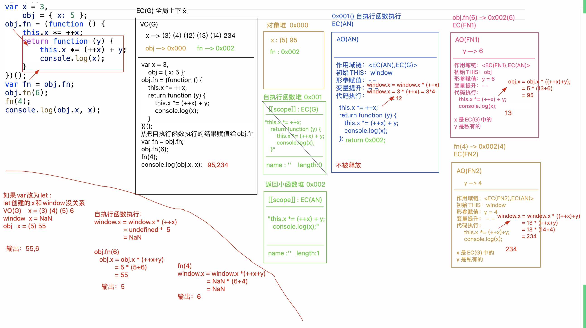

# this是谁？


1. DOM元素进行事件绑定中的this(指向DOM实例）
2. 函数执行中的this（自执行函数&回调函数）
3. new和构造函数
4. **箭头函数没有自己的this**
5. 如何改变this: call/bind/apply

总结：在js中，this指向函数的调用者

## 1. this的几种基本情况
::: info
this是当前环境执行上下文对象中的一个属性
this在不同的环境下，有不同的的指向，在全局作用域下，this指向全局对象
不同环境下的全局对象：

- 浏览器: window/self/frames，var声明的变量会放在window中
- Node环境： global, var声明的变量不会放在global中
- web worker: self
- 通用: globalThis
:::
```javascript
var a = 'global -> a';
var obj = {
  a: 'obj -> a',
  foo: function() {
    console.log(this.a);
    console.log(globalThis.a);
    console.log(window.a);
    console.log(self.a);
    console.log(frames.a);
  }
};
obj.foo();
```
我们研究的this,都是研究函数私有上下文中的this

- 全局上下文中的this ---> window
- 块级上下文中没有自己的this,在此上下文中遇到的this,都是所处上下文中的this
- ES6中的箭头函数和块级上下文类似，也是没有自己的this,遇到的this也是上级上下文的

**this是执行主体，通俗来说，是谁执行的，而不是在哪执行的，所以this是谁和在哪执行以及在哪定义都没有直接的关系**

1. 给DOM元素进行事件绑定（不论是DOM0还是DOM2），当事件行为触发，绑定的方法执行，方法中的this是当前DOM元素本身
2. 当方法执行，我们看函数前面是否有“点” 
   - 有：点前面是谁this就是谁
   - 没有：this就是window(非严格模式）或者undefined(严格模式）
   - 匿名函数（自执行函数或者回调函数等）中的this一般是window/undefined, 除非做过特殊的处理
```javascript
// 1. DOM元素进行事件绑定， this为绑定的当前DOM元素本身
document.onclick = function() {
    console.log(this) // document
}
document.addEventListener('click', function() {
  console.log(this)
}) // document


// 2. 普通函数执行，看函数执行前面是否有“点”
const fn = function () {
    console.log(this);
};
let obj = {
    name: 'zzf',
    // fn:fn的简写形式
    fn
};
fn(); // 函数前面没有点，this->window/undefined
obj.fn(); // 函数前面有点，this->obj

// 3. 自执行函数，this一般为window/undefined
// 自执行函数:创建完立即执行
// (function(){})();
// ~function(){}();
// !function(){}();
// +function(){}();
(function (x) {
    console.log(this); // window/undefined
})(10); 

// 4. 回调函数，this一般为window/undefined
// 回调函数：把一个函数作为实参值，传递给另外一个函数「在另外一个函数中，把其执行」
const fn = function fn(callback) {
    callback();
};
fn(function () { }); 

setTimeout(function () {
    console.log(this); //window
}, 1000); 

let arr = [10, 20];
let obj = { name: 'zzf' };
arr.forEach(function (item, index) {
   // console.log(item, index);
  console.log(this); // window/undefined
});
 
arr.forEach(function (item, index) {
    console.log(this); // this被修改为obj
}, obj); // forEach([回调函数],[修改回调函数中的THIS])

```
```javascript
var x = 3, obj = {x: 5};

// 把自执行函数的结果赋值给obj.fn
obj.fn = (function () {
  /* 
  	自执行函数中的this为window, window.x = window.x *(++x) 
    window.x = 3 * (++3) = 12
    返回一个函数 function(y) {}
  */
    this.x *= ++x;
    return function (y) {
        this.x *= (++x)+y;
        console.log(x);
    }
})();
var fn = obj.fn;
obj.fn(6); 
// this为obj obj.x = obj.x * ((++12) + 6), obj.x = 5 * 19 = 95, 输出x为13
fn(4); 
// this为window window.x = window.x * ((++13) + 4) = 13 * 18 = 234
console.log(obj.x, x); // 95 234
```

```javascript
function f(k) {
	this.m = k
  return this
}
var m = f(1)
var n = f(2)
console.log(m.m)  // window.m.m = 2.m -> 'undefined'
console.log(n.m)  // window.m = 2
```

## 2. new和构造函数中的this
### 1. new过程中发生了什么
`function new(Ctor, ...params) {}`

1. 创建当前类Ctor的一个实例对象【空对象，并且`__proto__`指向Ctor.prototype】
2. 让**函数中的this指向新创建的实例对象**
3. 把构造函数当做普通函数执行（为实例添加属性）
4. 判断函数执行的返回值，如果返回的是对象，则以自己返回的为主，否则把创建的实例对象返回
> 注意点：箭头函数、Symbol()和BigInt()无法当做构造函数使用

```javascript
let fn = () => {}
new fn() // 报错，fn.prototype为undefined
// 同样的，Symbol()和BigInt()也不能被new
```
```javascript
class Test {
  constructor() {
    // instance.test = function() {}
    this.test = function() {
      console.log('类的实例上的的方法')
    }
  }
  // Test.prototype.test = function() {}
  test() {
    console.log('类原型上的方法')
  }
}
const test = new Test();
test.test();
// 子类只要有constructor,就必须super()
// super调用了父类上的constructor
```
### 2. 手写new
```javascript
function Dog(name) {
    this.name = name;
}
Dog.prototype.bark = function () {
    console.log('wangwang');
}
Dog.prototype.sayName = function () {
    console.log('my name is ' + this.name);
}
/*
let sanmao = new Dog('三毛');
sanmao.sayName();
sanmao.bark();
*/
function _new() {
    //=>完成你的代码   
}
let sanmao = _new(Dog, '三毛');
sanmao.bark(); //=>"wangwang"
sanmao.sayName(); //=>"my name is 三毛"
// instanceof用来检测某个对象是否是当前构造函数的实例对象
console.log(sanmao instanceof Dog); //=>true
```
```javascript
// 简易版
function _new(Ctor, ...params) {
    let obj = {}
    obj.__proto__= Ctor.prototype
    let result = Ctor.call(obj, ...params) // 把传递的参数展开传递给Ctor并改变this
    // 如果返回的结果是对象，则以自己返回的为主
    if(result !== null && /^(object | function)$/.test(typeof result)) 
        return result
    return obj
}
```
**Object.create(proto)) 用于创建一个空对象，并且把proto作为空对象的原型指向（空对象.__proto__=== proto），并且proto是对象或者null，如果是null则是创造一个没有原型指向的对象，不兼容IE6-8**
```javascript
function _new(Ctor) {
  	// 1. 传入的参数不是函数
    if(typeof Ctor !== "function") 
      throw new TypeError('Ctor is not a constructor')
  	// 2. 排除箭头函数、Symbol等函数的影响
    if(!Ctor.prototype || Ctor === Symbol || Ctor === BigInt) 			throw new TypeError('Ctor is not a constructor')
  
    var obj,result,params;    
    // arguments是类数组集合，不能直接使用数组的方法，所以使用call改变this，从而截取参数
  	// 3. 获取params
    params = [].slice.call(arguments,1)
  	// 4. 创造一个新的空对象，空对象的__proto__指向Ctor.prototype
    obj = Object.create(Ctor.prototype)
    // apply传入的是数组，call参数一个一个传入
  	// 5. 将构造函数执行，同时改变this的指向为obj，将执行的结果返回，赋值为result
    result = Ctor.apply(obj, params) 
  	// 6. 判断result,如果是对象类型的，则返回result, 否则返回创建的实例对象
    if(result !== null && /^(object | function)$/.test(typeof result)) 
        return result
    return obj
}
```
## 3. 箭头函数

1. 在箭头函数中，this指向的是定义时所在的对象，而不是使用时所在的对象（箭头函数没有自己的this,而是从自己作用域的上一层继承this，**直接执行时，严格模式或者非严格模式下都指向window**）
```javascript
"use strict";
const bar = () => {
  console.log(this)
}
function bar1() {
  console.log(this)
}
bar(); // window
bar1(); // undefined

// 箭头函数中的this不是谁绑定就指向谁
var obj = { a: 1};
obj.test = () => {
  console.log(this)
  console.log(obj)
}
obj.test(); // this指向window
```

2. 通过call/bind/apply也不能改变函数的this
3. 箭头函数不绑定arguments(但是可以通过reset运算符来获得）
```javascript
const fn = (...args) => {
	console.log(args)
}
fn(1,2) // [1,2]
```

- 箭头函数不适用于作为对象的函数（this会指向外层作用域）
- 不能作为构造函数，不能使用new操作符
- 没有prototype属性
- 不适合将原型函数定义为箭头函数
```javascript
function Person (name){
	this.name = name
}
Person.prototype.sayHello = () => {
	console.log(this.name) // this指向window
}
let p1 = new Person('lmy')
p1.sayHello() // undefined
```
## 4. call/bind/apply
### 1. call/bind/apply的区别

1. call/bind/apply三个方法定义在Function.prototype上，所有的函数都是Function类的实例，所以所有函数都可以调用这3个方法：而这3个方法都是用来改变函数中this指向的(也就是将执行上下文对象改为另一个对象）
2. call/apply
   1. 都是把函数立即执行，改变函数中的this指向的（**第一个参数是谁，就把this改为谁，如果为null或undefined,则this指向全局对象**） 
   2. 唯一区别：**apply要求把传递给函数的实参，以数组的形式管理起来**【最终的效果和call一样，也是把数组的每一项作为实参，一个个的传给函数】 
   3. 真实项目中建议大家使用call,因为其性能好一点（做过测试，测试的结果3个及以上参数，call的性能明显比apply好一些）
3. call/bind
   1. **call是把函数立即执行，而bind只是预处理函数中的this和参数，函数此时并没有执行**
   2. **bind改变this的指向只能改变一次**
> **总结：**
> **三者的相同之处是：都能修改函数调用的执行主体，修改this的指向**
> **不同之处：**
> **第一点是关于函数立即执行，call()和apply()函数在执行之后会立即调用前面的函数，而bind()函数不会立即调用，会返回一个新的函数**
> **第二点是关于参数传递，call()和bind()接收的参数相同，第一个参数表示将要修改的函数执行主体，即this的指向，第二个参数之后是函数接收的参数，对于apply函数，第一个参数和call/bind一样，第二个参数是一个数组，表示的是接收的参数，如果第二个参数不是一个有效的数组或者arguments对象，则会抛出异常。**

```javascript
// 1. call的使用,参数一个个传递
const fn = function fn(x,y) {
    console.log(this,x,y)
}
let obj = {
    fn,
    name: 'zzf'
}
fn(10,20) // window, 10,20
obj.fn(10,20) // obj, 10,20

// 如果obj中没有fn的属性
obj = { name: 'zdf' }
obj.fn(10,20) // obj.fn is not a function
fn(10,20) // this是window
fn.call(obj,10,20) // this: obj, 10,20
fn.apply(obj,[10,20]) // this: obj

fn.call(10,20) // this: new Number(10), x:20, y:undefined 
// 【this存储的值：null、undefined、对象】
// 严格模式下，不写，this为undefined,非严格模式下，this为window
fn.call() // this: window/undefined x:undefined, y:undefined
// 严格模式下，传入null, this为null, 非严格模式下，this为window
fn.call(null) // this: null
```
```javascript
// 2. bind的使用，参数以数组的形式传递
let arr = [12,23,13,24,32,15]
// 获取数组最大值
Math.max(arr) // NaN, 不能直接传数组
Math.max(...arr)

Math.max.apply(Math,arr) 
```
### 2. 手写call/bind/apply
#### 1. call
```javascript
const fn = function fn(x,y) {
  // this: fn, context: obj, params: [10,20]
    console.log(this,x,y)
}
let obj = {
    name: 'zzf'
}
let res = fn.call(obj,10,20)
```
上述代码执行的过程发生了什么？

1. fn基于__proto__找到Function.prototype.call，把call方法执行 
2. 在call方法执行的时候： 
   - context: obj 要改变的this指向 
   - params: 执行函数传递的实参信息 
3. 干的事情：立即把fn(this)执行，并且让fn中的this指向obj(context),把10和20(params)传递给fn(this)，接收fn(this)执行的返回结果，作为最后的结果返回

---

手写call的思路？

1. 给context设置一个属性xxx【新增的属性不要和context中的属性冲突，设置Symbol唯一值属性】，让属性值等于要执行的函数
2. 基于context[fn]()执行，这样既把函数执行了，也让函数中的this指向改为context了
3. 移除context中新增的属性`**Reflect.deleteProperty(context, key)**`
4. 返回context[fn]执行的结果
```javascript
Function.prototype.call = function call(context, ...params){
    context == null ? context = window : null;
    // if(context == null) context = window
  
    // context不能是原始值（原始值添加属性后不能获取，需要基于Object()将其转为对象
    if (!/^(object|function)$/.test(typeof context)) context = Object(context);
    let self = this,
        key = Symbol('KEY'),
        result
    context[key] = self
    result = context[key](...params)
 		// delete context[key] // 新增的属性用完要移除
    // 或者使用下面的ES6新方法,移除对象的属性
    Reflect.deleteProperty(context, key)
    return result
    
}
```
#### 2. bind
```javascript
const submit = document.querySelector('#submit')
const obj = { name: 'zzf'}
const fn = function fn(ev) {
    console.log(this, ev)
}
submit.onclick = fn; 
// 点击按钮： this: sumbit  ev: PointerEvent
// 需求，点击按钮，fn方法执行，我们想让其中的this变为obj, ev事件对象也存在，再传递10/20

sumbit.onclick = fn.call(obj, 10,20)
// 这样处理是错误的，因为call是把函数立即执行，还没点击呢，fn就执行了

sumbit.onclick = function (ev) {
    // 先给事件行为绑定匿名函数，当点击的时候，先执行匿名函数【获取匿名函数，在匿名函数执行的时候，this:sumbit，我们再让真正要处理的fn函数执行，此时就可以基于call改变this】
    fn.call(obj, 10, 20, ev)
}

sumbit.onclick = fn.bind(obj, 10,20) // 或者这样处理
```
bind只改变this的指向，而不立即执行
```javascript
Function.prototype.bind = function bind(context, ...params) {
    // this: fn, context = obj params [10,20]
    let self = this
    return function proxy(...args) {
           // args: [ev]， this: sumbit
           params = params.concat(args)
           return self.call(context, ...params)
    }
}
```
### 3. call/bind/apply的巧妙用法
```javascript
// 1. 求数组的最大项和最小项
var arr = [3,5,7,6,2,8]
console.log(Math.max.apply(null, arr))
console.log(Math.min.apply(null, arr))
```
```javascript
// 2. 类数组对象转换为数组对象
/*类数组借用数据原型上的方法进行操作，大部分方法都可以基于这种方法借用 
[].xxx.call([类数组],[实参])
只要我们把Array.protytype.slice执行，将this指向arguments就相当于循环
arguments中的每一项并且赋值给新数组，实现把类数组转换为数组
前提，arguments类数组集合和数组结构基本一致，操作的代码也基本一致，只不过是不能直接用slice这些方法而已】

把slice执行 Array.prototype.slice() 或者 [].slice()
改变this: call方法
*/
function sum() {
  // 或者使用 let arr = Array.from(arguments)
	var arr = Array.prototype.slice.call(arguments)
  return arr.reduce((pre,curr) => { return pre + curr }, 0)
}
```
```javascript
// 3. 用于继承,构造继承
// 父类
function Animal(age) {
	this.age = age
  this.sleep = function() {
  	return this.name + 'is sleeping'
  }
}

// 子类
function Cat(name,age) {
  // 把执行主体换成cat对象，从而在cat对象上增加sleep和age
	Animal.call(this,age)
  this.name = name || 'tom'
}
var cat = new Cat('lmy', 20)

```
## 5. DOM实例绑定this
```javascript
// 事件处理函数的this指向被绑定的dom元素
var btn = document.querySelector('#btn');
btn.onclick = function() {
  console.log(this)
}
btn.addEventListener('click', function() {
  console.log(this)
}, false);
```
```javascript
// console.log(document)
;(function (doc) {
  var btn = doc.querySelector('#btn');
  function Plus(a,b) {
    this.a = a;
    this.b = b;
    console.log(this)
    this.init();
  }
  console.log(this)
  Plus.prototype.init = function() {
    this.bindEvent();
  }
  Plus.prototype.bindEvent = function() {
    // 这里的this指向DOM实例，所以需要bind一下
    // btn.addEventListener('click', this.handleBtnClick,false)
    btn.addEventListener('click', this.handleBtnClick.bind(this), false)
    /*
    _self = this;
    btn.addEventListener('click', function() {
      _self.handleBtnClick()
    }, false)
    */
  }
  Plus.prototype.handleBtnClick = function() {
    console.log(this);
    console.log(this.a, this.b);
  }
  window.Plus = Plus;
})(document)
new Plus(3, 4);
```
## 补充：class中的this
```javascript
 // 类中是严格模式
class Father {
  constructor() {
    // 固定this的指向
    this.eat = this.eat.bind(this);
  }
  get fruit() {
    return 'banana'
  }
  eat() {
    console.log('i am eating ' + this.fruit)
  }
}
class Son {
  get fruit() {
    return 'orage'
  }
}
const father = new Father();
const son = new Son();
son.eat = father.eat;
father.eat();
son.eat();  // 这里想让儿子吃父亲的水果
```
