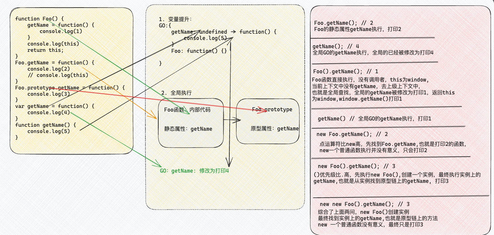

# 一道经典的函数面试题

先来看题目:

```js
function Foo() {
    getName = function() {
        console.log(1)
    }
    console.log(this)
    return this;
}
Foo.getName = function() {
    console.log(2)
    // console.log(this)
}
Foo.prototype.getName = function() {
    console.log(3)
}
var getName = function() {
    console.log(4)
}
function getName() {
    console.log(5)
}

Foo.getName(); // 2
getName(); // 4
Foo().getName(); // 1

getName() // 1
new Foo.getName(); // 2
new Foo().getName(); // 3 
new new Foo().getName(); // 3
```

这道题综合了函数的执行、构造函数、原型和原型链、new、变量提升、运算符优先级等知识点，所以答案看上去令人疑惑不解。

下面就用图解的方式向大家解释这道题目：



1. 首先就是变量提升，构造函数`Foo`和函数声明`getName`都会变量提升，`GO`中的`getName`此时打印5
2. 全局执行，在构造函数`Foo`（自身作为对象，可以存储属性）上添加了`getName2`的静态属性，在其原型上添加了`getName2`的属性，供其实例查找，全局`GO`的`getName5`被函数表达式重新覆盖成`getName4`
3. `Foo.getName(); `执行，是构造函数静态属性上的`getName2`,所以打印结果为2
4. `getName()`执行，全局的`getName4`执行，所以打印结果为4
5. `Foo().getName()`执行，`Foo`执行返回`this`为`window`, `Foo`执行时，当前上下文中并没有`getName`，向上级上下文中查找，最终找到全局的`getName4`，并将其修改为`getName1`, 返回结果为`window`,所以调用`window.getName`，也就是全局的`getName1`，打印1
6. 全局的`getName1`执行，打印1
7. `new Foo.getName(); `执行，点运算符优先级比new高，所以先找到`Foo`身上的静态属性，也就是普通函数`getName2`, new一个普通函数执行没有意义，只会打印2
8. `new Foo().getName(); `执行，()优先级比new高，先执行`new Foo()`,创建一个`foo`实例，找到实例上的`getName`,也就是原型链上的`getName3`,最终打印3
9. `new new Foo().getName();`执行，同样的，先执行`new Foo()`,然后问题演变为`new foo.getName()`,也就是`new getName3`, new一个普通函数执行没有意义，只会打印3

