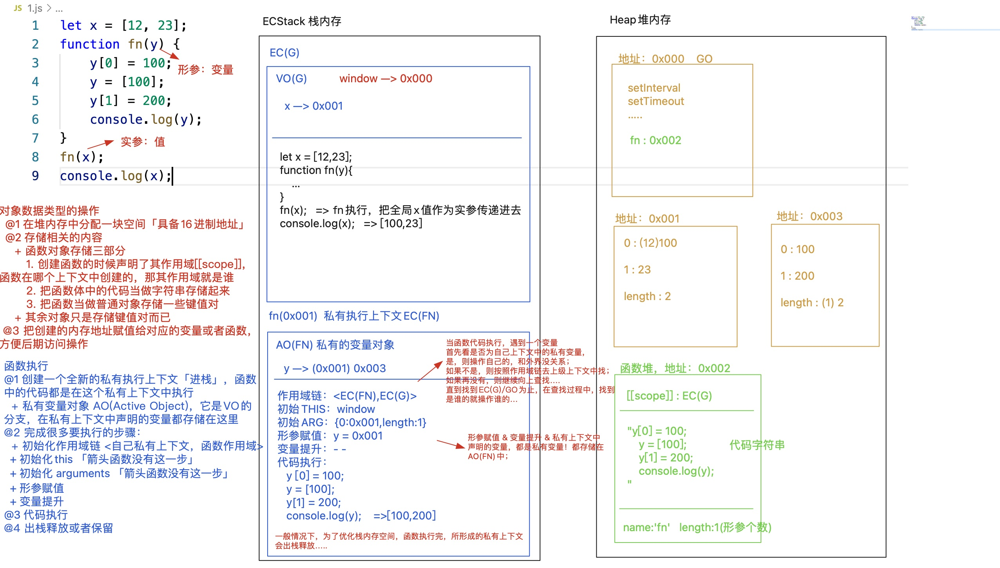
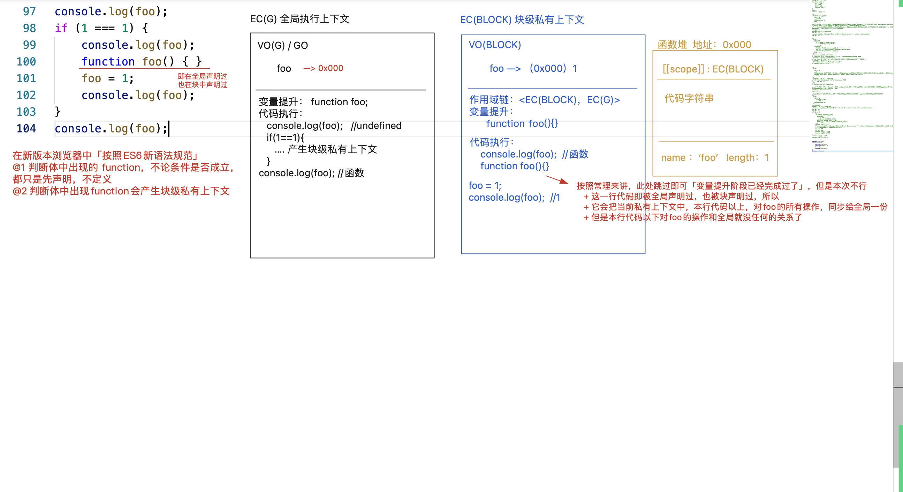

# 函数执行机制
函数的执行过程中发生了什么？
1. 执行上下文栈（ECStack)
2. 全局执行上下文(EC(G))/函数执行上下文
3. 变量提升
4. 作用域链（作用域链查找机制）
5. arguments


## 1. 函数的底层运行机制
**函数执行时发生了什么？**

1. 创建一个全新的私有执行上下文【进栈（执行上下文栈）执行】，函数中的代码都是在这个私有上下文中执行 
   1. **私有变量对象AO**(Active Object),是VO的分支，在私有上下文中声明的变量都存储在这里 
2. 完成很多要执行的步骤： 
   1. 初始化作用域链<自己私有上下文，函数作用域（上级上下文)>
      1. **当函数代码执行，遇到一个变量首先看是否为自己上下文中的私有变量，如果是则操作自己的，如果不是，则按照作用域链去上级上下文中查找，如果还没有，则继续向上查找，直到找到EC(G)/GO为止，在查找过程中，找到是谁的就操作谁的 （变量/作用域链查找机制）**
   2. 初始化this(箭头函数没有这一步） 
   3. 初始化arguments（箭头函数没有这一步） 
   4. 形参赋值 
   5. 变量提升 
      1. 形参赋值、变量提升、私有上下文中声明的变量，都是私有变量，都存放在当前上下文的AO中 
3. 代码执行 
4. 出栈释放或保留(保留形成闭包）
```javascript
let x = [12, 23];
// 函数也会开辟堆内存，函数堆内存中会存放3部分内容
// 1. 声明函数的作用域 scope: 当前所在的上下文（当前函数在哪个上下文中创建的，作用域就是谁）
// 2. 把函数体中的代码当做字符串存储起来
// 3. 键值对,比如 name:fn, length：形参个数
function fn(y) {
	// y是传递的形参
    y[0] = 100;
    y = [100];
    y[1] = 200;
    console.log(y);
}
// 函数执行传递实参
fn(x); // [100,200]
console.log(x); // [100,23]
```




## 2. 执行上下文

- 全局上下文（EC(G))
- 函数私有上下文（EC(FN）
- 块级私有上下文（EC(BLOCK))
   - 产生私有上下文 ---> 进栈执行 ---> 出栈释放（可能释放）
- 变量对象：当前上下文中，用来存储声明的变量的地方 
   - VO（Varibale Object）：VO(G) 或者 VO(BLOCK)
   - AO（Active Object）：AO()
- GO（Global Object）全局对象 
   - window 指向 GO 对象
   - 全局上下文中，基于var/function声明的变量是直接存储到GO对象上的；而基于let/const声明的变量才是存放在VO(G)中的；
## 3. 变量提升
[彻底解决 JS 变量提升| 一题一图，超详细包教包会😉](https://juejin.cn/post/6933377315573497864)

**在“当前上下文”中，代码执行之前，浏览器首先会把所有带var/function关键字的进行提前声明或者定义：带var的只是提前声明 & 带function的，此阶段声明+定义{赋值}都完成了**

- let/const/import/class声明的变量不存在变量提升 
- 重复声明的问题 
- **推荐使用函数表达式**，确保函数执行只能放在“创建函数”的下面，保证逻辑严谨性 
- 条件判断：在当前上下文中，变量提升阶段，不论条件是否成立，都要进行变量提升 
   - var：还是只声明 
   - function：判断体中的函数，在变量提升阶段，只声明不赋值「函数是个渣男」
1. 其实最开始浏览器从服务器端获取的js都是文本（字符串），只不过声明了格式是【Content-Type:application/javascript】，浏览器首先按照这个格式去解析代码 ---> **“词法解析”阶段**，目标是生成**AST词法解析树**
2. **基于let/const等声明的变量，在词法解析阶段，其实就已经明确了，未来在此上下文中，必然会存在这些变量（类似于变量提升，但是并没有声明）（也可以理解为暂时性死区）**
3. 但是在代码执行中，如果出现了在具体声明的代码之前使用这些变量，浏览器则会抛出错误
4. 真实项目中，目前推荐使用 函数表达式的方式（把函数作为值赋值给变量） 创建函数：这样抛开了变量提升的机制，导致函数的执行只能在创建函数代码之后，保证逻辑的严谨性！！
```javascript
// var a = undefined;
console.log(a) // undefined
var a = 12; // a = 12
//--------------------------------
// 为什么错误不是 b is not defined ?
console.log(b) // Reference Error: Cannot access 'b' before initialization
// 词法分析
let b = 12;

// 其实最开始浏览器从服务器端获取的js都是文本（字符串），只不过声明了格式是【Content-Type:application/javascript】，浏览器首先按照这个格式去解析代码 ===> “词法解析”阶段，目标是生成“AST词法解析树“
// 基于let/const等声明的变量，在词法解析阶段，其实就已经明确了，未来在此上下文中，必然会存在这些变量（类似于变量提升，但是并没有声明）（也可以理解为暂时性死区）
// 但是在代码执行中，如果出现了在具体声明的代码之前使用这些变量，浏览器则会抛出错误
```
```javascript
console.log(fn);
function fn(){ console.log(1); }
console.log(fn);
var fn = 12;
console.log(fn);
function fn(){ console.log(2); }
console.log(fn);

/*
ƒ fn(){ console.log(2); }
ƒ fn(){ console.log(2); }
12
12
*/

/*
VO(G)/GO
    fn ---> 0x001 
    fn ---> 0x002 
变量提升：
function fn() {console.log(1)} 0x001
var fn; // 上下文中已经存在fn变量了，不会重复声明
function fn() {console.log(2)} 0x002
代码执行：
    输出fn() {console.log(2)}
    跳过fn函数的声明加定义（变量提升阶段已经处理过了）
    输出fn() {console.log(2)}
    跳过var fn操作，但是赋值的操作需要执行 fn = 12
    输出12
    跳过fn() {console.log(2)}
    输出12
*/
```
```javascript
console.log(a); // undefined
// 'a' in window 验证key是否是obj的一个属性，不论是私有的还是公有的属性，只要是属性，结果就是true
// !true = false，条件不成立，不进入逻辑判断 var a = undefined
if (!('a' in window)) {
  var a = 13;
}
console.log(a); // undefined


/*
EC(G)
  1. VO(G)/GO
     a
  2. 变量提升：不论条件是否成立，都要进行变量提升（对于var来讲新老版本浏览器没有任何影响，但是对于判断体中出现的function来讲，新老版本表现不一致：老版本 函数还是声明+定义  新版本 函数只会声明，不再定义）
    var a;
*/
```
```javascript
// 真实项目中，目前推荐使用 函数表达式的方式（把函数作为值赋值给变量） 创建函数：这样抛开了变量提升的机制，导致函数的执行只能在创建函数代码之后，保证逻辑的严谨性！！
const fn = function() {}
let a = 10;
```
## 4. 块级上下文
上下文：全局上下文、函数执行产生的私有上下文，ES6规范中新提供的块级私有上下文
**除“函数和对象”的大括号外「例如：判断体/循环体/代码块…」，如果在大括号中出现了 let/const/function/class 等关键词声明变量，则当前大括号会产生一个“块级私有上下文”；它的上级上下文是所处的环境；var不产生块级上下文，也不受块级上下文的影响；**
```javascript
if() {
// 判断体
}
for() {
// 循环体
}
{
    // 代码块
}
```
```javascript
//忽略报错的影响
/*
 EC(G) 
   VO(G)/GO
     a -> （12）---> 100
     b -> 13
   变量提升：var a;
*/
console.log(a); // undefined
// console.log(b); // Error
var a = 12;
let b = 13;
if (1 == 1) {
/* 产生一个块级私有上下文 
	 EC(BLOCK) 块级私有上下文
    VO(BLOCK)
        b -> 200
    作用域链：<EC(BLOCK),EC(G)>
    没有this和arguments,也没有形参赋值
    变量提升：带var关键字的不受任何块的影响(!!!)
*/
    console.log(a); // 12, 向上级作用域中查找
    // console.log(b); // Uncaught ReferenceError: Cannot access 'b' before initialization 在块级上下文中，未来一定存在基于let声明的b，所以不允许在定义之前使用
    var a = 100; // 全局的a更改为100
    let b = 200;
    console.log(a); // 100
    console.log(b); // 私有的b: 200
}
console.log(a); // 全局的a: 100
console.log(b); // 全局的b: 13
```
```javascript
// 函数是个渣男
// foo只是先声明
console.log(foo); // undefined
if(1===1){
  	// 在块作用域中有变量提升：function() {}
    console.log(foo); // ƒ foo() {}
    function foo() {} // 把本行代码以上，对foo的所有操作，同步给全局一份，之后对foo的操作与全局无关
    foo = 1;
    console.log(foo); // 1
}
console.log(foo); // ƒ foo() {}

// 在新版本浏览器中，按照ES6新语法规范
// 1. 判断体中出现的function, 不论条件是否成立，都只是先声明，不定义
// 2. 判断体中出现function会产生块级私有上下文
```

[web前端一道很坑的面试题](https://blog.csdn.net/k358971707/article/details/56684575)

[题目解析](https://www.cnblogs.com/haogj/p/3926715.html)

[一道关于js函数的前端面试题引发的血案](https://www.cnblogs.com/leolai/p/2541838.html)

```javascript
f = function () {return true;};
g = function () {return false;};
(function () {
    if (g() && [] == ![]) {
        f = function () {return false;}
        function g() {return true;}
    }
})();
console.log(f());
console.log(g());
```
## 5. arguments

1. arguments对象是所有函数都具有的一个内置局部变量，表示的是函数实际接收的参数，是一个**类数组结构**
> 类数组结构通常有索引和Length属性，但是不具备数组的一些方法

2. arguments只能在函数内部使用，无法在函数外部访问到arguments对象
3. **arguments对象的值由实参决定，而不是由定义的形参决定**
   1. arguments对应的length在函数调用的时候已经确定，不会随着函数的处理而改变
   2. 指定的形参在传递实参的情况下，arguments对象与形参值相同，并且可以相互改变
   3. 指定的形参在未传递实参的情况下，arguments对象对应索引值返回“undefined”
   4. 指定的形参在传递实参的情况下，arguments对象与形参值不能相互改变
4. arguments对象有一个特殊的属性`callee`,表示的是当前正在执行的函数（常用在匿名函数内部需要对自身进行调用时）（但是并不推荐这样做，因为使用arguments.callee会改变内部的this值）
```javascript
function foo(a,b,c) {
	console.log(arguments.length) // 2
  arguments[0] = 11;
  console.log(a) // 11

  b = 12;
  console.log(arguments[1]) // 12
  
  arguments[2] = 3;
  console.log(c) // undefined
  
  c = 13;
  console.log(arguments[2) // 3
  
  console.log(arguments.length) // 2
}
foo(1,2)
```
```javascript
// arguments对象的应用

// 1. 检查传递的参数个数是否正确
function f(x,y,z) {
	if (arguments.length !== 3) {
  	throw new Error('期望传递3个参数')
  }
  // do something
}

// 2. 定义一个特定处理参数的函数
function joinStr(seperator) {
  // arguments是一个类数组结构，可以通过call调用slice方法
	var strArr = [].slice.call(arguments, 1)
  return strArr.join(seperator)
}

// 3. 模拟函数重载
// js没有函数重载
// - 形参无法确定类型
// - 函数的参数个数无法确定
// - 后面的函数覆盖前面的函数

// 通过求和函数
function sum() {
  // 得到函数参数数组
	 var arr = [].slice.call(arguments)
   return arguments.reduce((pre,curr) => {
     return pre + curr
   },0)
}
```
