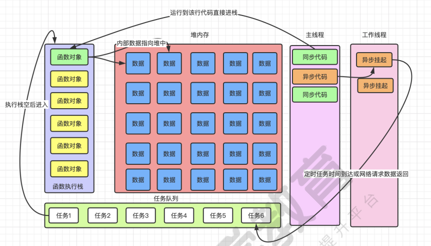
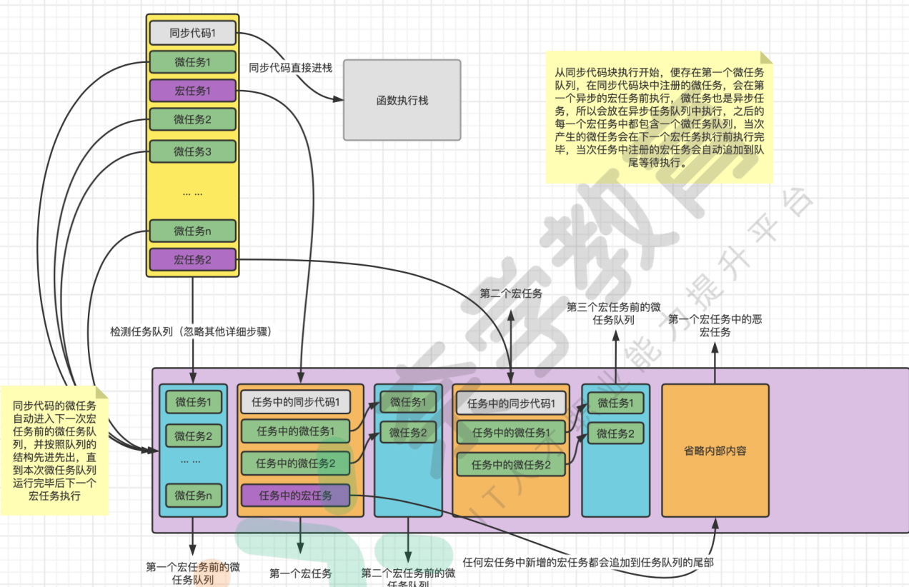
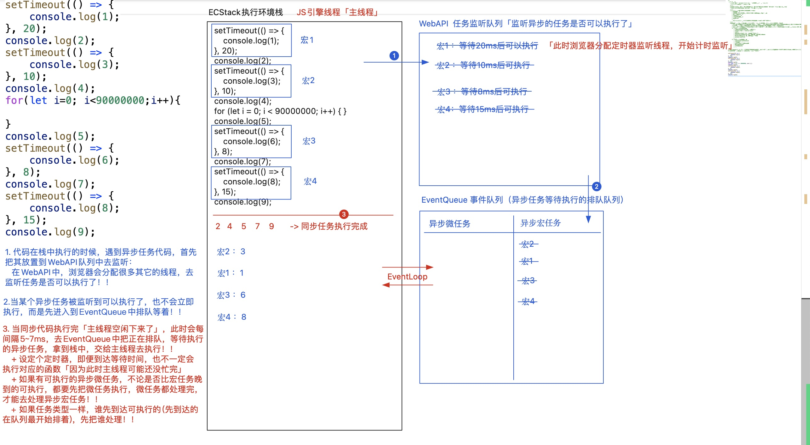
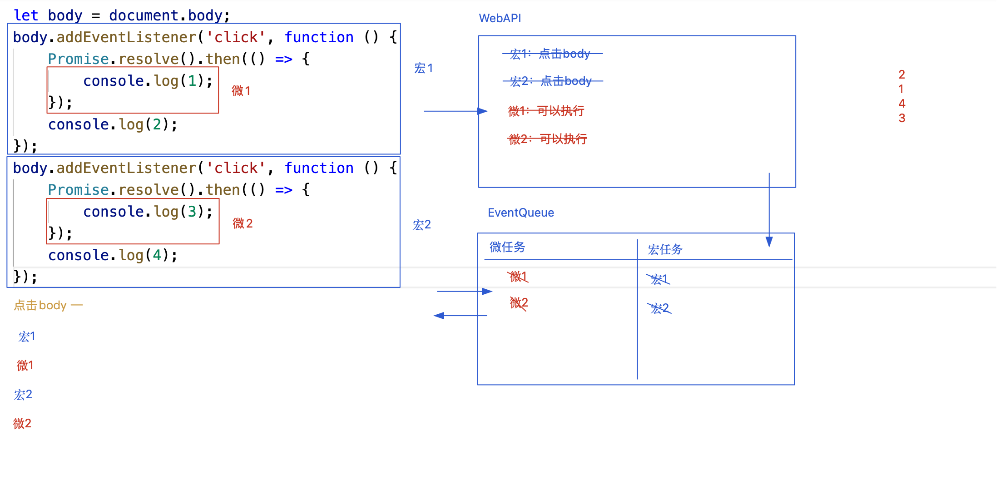
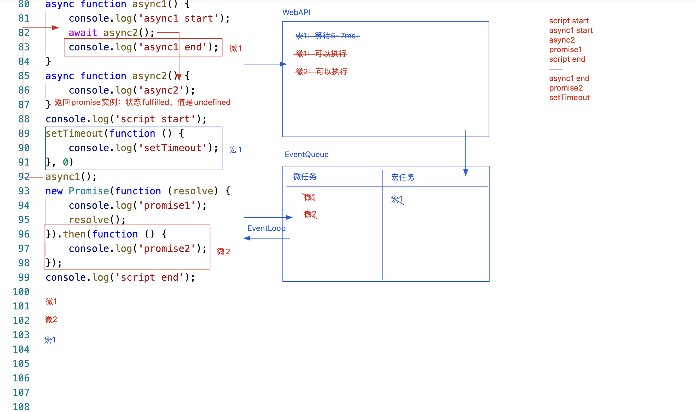

# 异步编程

1. 同步与异步
2. 进程与线程
3. 主线程与工作线程
4. 任务队列
5. 微任务与宏任务
6. Promise
7. Async和Await
8. 手写Promise

> 免责声明：本次内容来源于线上机构公开课，这里仅做部分笔记，如有侵权，请联系我删除。

[01 从头认识JavaScript的事件循环模型(2).pdf](https://www.yuque.com/attachments/yuque/0/2021/pdf/1863325/1639557829718-1259977f-333d-4622-bb13-c2d52e4dcfa2.pdf?_lake_card=%7B%22src%22%3A%22https%3A%2F%2Fwww.yuque.com%2Fattachments%2Fyuque%2F0%2F2021%2Fpdf%2F1863325%2F1639557829718-1259977f-333d-4622-bb13-c2d52e4dcfa2.pdf%22%2C%22name%22%3A%2201%20%E4%BB%8E%E5%A4%B4%E8%AE%A4%E8%AF%86JavaScript%E7%9A%84%E4%BA%8B%E4%BB%B6%E5%BE%AA%E7%8E%AF%E6%A8%A1%E5%9E%8B(2).pdf%22%2C%22size%22%3A3802915%2C%22type%22%3A%22application%2Fpdf%22%2C%22ext%22%3A%22pdf%22%2C%22status%22%3A%22done%22%2C%22taskId%22%3A%22u626a33ef-b010-40e4-b463-a6fc56dcea0%22%2C%22taskType%22%3A%22upload%22%2C%22id%22%3A%22iBzaW%22%2C%22card%22%3A%22file%22%7D)<br/>
[02 异步编程发展历程之Promise的演进史(1).pdf](https://www.yuque.com/attachments/yuque/0/2021/pdf/1863325/1639557837534-7b13e880-477e-46ed-9599-94a4b31c91b2.pdf?_lake_card=%7B%22src%22%3A%22https%3A%2F%2Fwww.yuque.com%2Fattachments%2Fyuque%2F0%2F2021%2Fpdf%2F1863325%2F1639557837534-7b13e880-477e-46ed-9599-94a4b31c91b2.pdf%22%2C%22name%22%3A%2202%20%E5%BC%82%E6%AD%A5%E7%BC%96%E7%A8%8B%E5%8F%91%E5%B1%95%E5%8E%86%E7%A8%8B%E4%B9%8BPromise%E7%9A%84%E6%BC%94%E8%BF%9B%E5%8F%B2(1).pdf%22%2C%22size%22%3A455674%2C%22type%22%3A%22application%2Fpdf%22%2C%22ext%22%3A%22pdf%22%2C%22status%22%3A%22done%22%2C%22taskId%22%3A%22ud54a1832-43c3-4600-8031-af60552e1dc%22%2C%22taskType%22%3A%22upload%22%2C%22id%22%3A%22Hc5i6%22%2C%22card%22%3A%22file%22%7D)<br/>
[4-1 直播 Promise.pdf](https://www.yuque.com/attachments/yuque/0/2021/pdf/1863325/1639559248850-76ad1811-07cb-4749-980d-ebf83c0fbaea.pdf?_lake_card=%7B%22src%22%3A%22https%3A%2F%2Fwww.yuque.com%2Fattachments%2Fyuque%2F0%2F2021%2Fpdf%2F1863325%2F1639559248850-76ad1811-07cb-4749-980d-ebf83c0fbaea.pdf%22%2C%22name%22%3A%224-1%20%E7%9B%B4%E6%92%AD%20Promise.pdf%22%2C%22size%22%3A1900998%2C%22type%22%3A%22application%2Fpdf%22%2C%22ext%22%3A%22pdf%22%2C%22status%22%3A%22done%22%2C%22taskId%22%3A%22u55025ea7-2e56-4f1e-a75d-dc04cfc3af1%22%2C%22taskType%22%3A%22upload%22%2C%22id%22%3A%22u03157157%22%2C%22card%22%3A%22file%22%7D)<br/>
[03 手撕Promise之从0开始实现完整的Promise对象.pdf](https://www.yuque.com/attachments/yuque/0/2021/pdf/1863325/1639557848637-3b6ffa57-2f3e-4dd9-9b91-b96c6dd0b766.pdf?_lake_card=%7B%22src%22%3A%22https%3A%2F%2Fwww.yuque.com%2Fattachments%2Fyuque%2F0%2F2021%2Fpdf%2F1863325%2F1639557848637-3b6ffa57-2f3e-4dd9-9b91-b96c6dd0b766.pdf%22%2C%22name%22%3A%2203%20%E6%89%8B%E6%92%95Promise%E4%B9%8B%E4%BB%8E0%E5%BC%80%E5%A7%8B%E5%AE%9E%E7%8E%B0%E5%AE%8C%E6%95%B4%E7%9A%84Promise%E5%AF%B9%E8%B1%A1.pdf%22%2C%22size%22%3A319179%2C%22type%22%3A%22application%2Fpdf%22%2C%22ext%22%3A%22pdf%22%2C%22status%22%3A%22done%22%2C%22taskId%22%3A%22u7362e8d3-5e71-4c78-8acb-ab485dae220%22%2C%22taskType%22%3A%22upload%22%2C%22id%22%3A%22Qu10Y%22%2C%22card%22%3A%22file%22%7D)

## 1. 事件循环机制
### 1. JS的运行机制

#### 1. 同步和异步

JavaScript是一门单线程的语言，但是代码的执行区分同步和异步
1. **同步的意思是严格按照单线程执行代码逻辑**（从上到下，从左到右执行）
2. **异步模式的代码时不会按照默认顺序执行的，遇到异步模式的代码，引擎会把当前任务挂起并略过，也就是先不执行这段代码，继续向下运行非异步模式的代码，直到同步代码全部执行完毕后，程序会将之前挂起的异步代码按照特定的顺序来进行执行。**
3. 同步在前，异步在后， 所有的异步任务都要等待当前的同步任务执⾏完毕之后才能执⾏。
```javascript
var a = 1
var b = 2
var d1 = new Date().getTime()
var d2 = new Date().getTime()
setTimeout(function(){
 console.log('我是⼀个异步任务')
},1000)
while(d2-d1<2000){
 d2 = new Date().getTime()
}
//这段代码在输出3之前会进⼊假死状态，'我是⼀个异步任务'⼀定会在3之后输出
console.log(a+b)
```
#### 2. JS的线程组成
浏览器是单线程执⾏JavaScript代码的，但是浏览器实际是以多个线程协助操作来实现单线程异步模型的，具体线程组成如下：

1. GUI渲染线程
2. JavaScript引擎线程「JS引擎线程会把栈内存中的代码逐行解析执行」
3. 监听事件触发线程
4. 定时器触发线程
5. 异步http请求线程
6. WebWorker
7. 其他线程

按照真实的浏览器线程组成分析，我们会发现实际上运⾏JavaScript的线程其实并不是⼀个，但是为什么说JavaScript是⼀⻔单线程的语⾔呢？因为这些线程中实际参与代码执⾏的线程并不是所有线程，⽐如GUI渲染线程为
什么单独存在，这个是防⽌我们在html⽹⻚渲染⼀半的时候突然执⾏了⼀段阻塞式的JS代码⽽导致⽹⻚卡在⼀半停住这种效果。**在JavaScript代码运⾏的过程中实际执⾏程序时同时只存在⼀个活动线程，这⾥实现同步异步就是靠多线程切换的形式来进⾏实现的。**
所以我们通常分析时，将上⾯的细分线程归纳为下列两条线程：

1. 【主线程】：这个线程⽤了执⾏⻚⾯的渲染，JavaScript代码的运⾏，事件的触发等等
2. 【⼯作线程】：这个线程是在幕后⼯作的，⽤来处理异步任务的执⾏来实现⾮阻塞的运⾏模式
### 2. JavaScript的运行模型EventLoop

上图是JavaScript运⾏时的⼀个⼯作流程和内存划分的简要描述，我们根据图中可以得知主线程就是我们JavaScript 执⾏代码的线程，主线程代码在运⾏时，会按照同步和异步代码将其分成两个去处，**如果是同步代码执⾏，就会直接将该任务放在⼀个叫做“函数执⾏栈”的空间进⾏执⾏，执⾏栈是典型的【栈结构】（先进后出）**，程序在运⾏的时候会将同步代码按顺序⼊栈，**将异步代码放到【⼯作线程】中暂时挂起**，【⼯作线程】中保存的是定时任务函数、JS的交互事件、JS的⽹络请求等耗时操作。当【主线程】将代码块筛选完毕后，进⼊执⾏栈的函数会按照从外到内的顺序依次运⾏，运⾏中涉及到的对象数据是在堆内存中进⾏保存和管理的。当执⾏栈内的任务全部执⾏完毕后，执⾏栈就会清空。**执⾏栈清空后，“事件循环”就会⼯作，“事件循环”会检测【任务队列】中是否有要执⾏的任 务，那么这个任务队列的任务来源就是⼯作线程**，程序运⾏期间，⼯作线程会把到期的定时任务、返回数据的http 任务等【异步任务】按照先后顺序插⼊到【任务队列】中，等执⾏栈清空后，事件循环会访问任务队列，将任务队列中存在的任务，按顺序（先进先出)放在执⾏栈中继续执⾏，直到任务队列清空。  

### 3. 微任务与宏任务
所有除同步任务外的代码都会在⼯作线程中，按照他到达的时间节点有序的进⼊任务队列，⽽且**任务队列 中的异步任务⼜分为【宏任务】和【微任务】**。**  在每下⼀个宏任务执⾏前，事件循环系统都会先检测当前的代码块中是否包含已经注册的微任务，并将队列中的微任务优先执⾏完毕，进⽽执⾏下⼀个宏任务。  **



【宏任务】:  宏任务是JavaScript中最原始的异步任务，**包括setTimeout、setInterVal、AJAX等**，在代码执⾏环境中按照同步代码的顺序，逐个进⼊⼯作线程挂起，再按照异步任务到达的时间节点，逐个进⼊异步任务队列，最终按照队列中的 顺序进⼊函数执⾏栈进⾏执⾏  
【微任务】:  微任务是随着ECMA标准升级提出的新的异步任务，微任务在异步任务队列的基础上增加了【微任务】的概念，每 ⼀个宏任务执⾏前，程序会先检测中是否有当次事件循环未执⾏的微任务，**优先清空本次的微任务后，再执⾏下⼀个宏任务，每⼀个宏任务内部可注册当次任务的微任务队列，再下⼀个宏任务执⾏前运⾏，微任务也是按照进⼊队 列的顺序执⾏的**<br/>【总结】: 
在JavaScript的运⾏环境中，代码的执⾏流程是这样的：

1. 默认的同步代码按照顺序从上到下，从左到右运⾏，运⾏过程中注册本次的微任务和后续的宏任务：
2. 执⾏本次同步代码中注册的微任务，将下⼀个宏任务开始前的所有微任务执⾏完毕
3. 执⾏最先进⼊队列的宏任务，并注册当次的微任务和后续的宏任务，宏任务会按照当前任务队列的队尾继续向下排列

「异步微任务：优先级高」

- requestAnimationFrame  实现JS动画
- Promise.then | resolve/reject
- await
- queueMicrotask 创建一个新的异步微任务
- IntersectionObserver 监听DOM元素和视口交叉的信息
- MutationObserver 监听DOM元素属性改变
- process.nextTick

「异步宏任务：优先级低」

- setTimeout/setInterval
- 事件绑定
- ajax/fetch异步数据请求
- MessageChannel
- setImmediate
### 4. 经典面试题
```javascript
setTimeout(() => {
    console.log(1);
}, 20);
console.log(2);
setTimeout(() => {
    console.log(3);
}, 10);
console.log(4);
for (let i = 0; i < 90000000; i++) { // 执行时间大概70ms}
console.log(5);
setTimeout(() => {
    console.log(6);
}, 8);
console.log(7);
setTimeout(() => {
    console.log(8);
}, 15);
console.log(9);
 
// 2 4 5 7 9 
// 3 1 6 8
```
分析过程：

1. 先执行同步代码，遇到异步的代码，首先将其放置到WebAPI队列中监听(什么时候可以执行）在WebAPI中，浏览器会分配很多其他的线程，去监听任务是否可以执行
2. 当某个异步任务被监听到可以执行了，也不会立即执行，而是先进入到EventQueue排队等着执行

分为微任务和宏任务，微任务优先级高于宏任务

3. 当同步代码执行完毕，就会执行异步任务（主线程空闲下来，此时会每间隔5-7ms（浏览器最快反应时间）去EventQueue中把正在排队，等待执行的异步任务，拿到栈中，交给主线程去执行）
   1.  设定的定时器，即便到达时间，也不一定会执行对应的函数（因为此时主线程可能还没有忙完） 
   2. 如果有可执行的异步微任务，不论是否比宏任务晚到，都要先把微任务执行，微任务都处理完，才能去处理异步宏任务 
   3. 如果任务类型一样，谁先到达先执行 (先到达的在队列最开始排着，先把谁处理!!!）


```javascript
setTimeout(function() {
  console.log('timer1')
}, 0)
requestAnimationFrame(function(){
 console.log('UI update')
})
setTimeout(function() {
  console.log('timer2')
}, 0)

new Promise(function executor(resolve) {
 console.log('promise 1')
 resolve()
 console.log('promise 2')
}).then(function() {
 console.log('promise then')
})
console.log('end')
```

1.  Promise对象虽然是微任务，但是 **new Promise时的回调函数是同步执⾏**的，所以优先输出promise 1 和 promise 2  
2.  在resolve执⾏时Promise对象的状态变更为已完成，所以then函数的回调被注册到微任务事件中，此时并不执 ⾏，所以接下来应该输出end  
3.  同步代码执⾏结束后，观察异步代码的宏任务和微任务，在本次的同步代码块中注册的微任务会优先执⾏，参考上 ⽂中描述的列表，**Promise为微任务**，setTimeout和requestAnimationFrame为宏任务，所以Promise的异步任务 会在下⼀个宏任务执⾏前执⾏，所以promise then是第四个输出的结果  
4.  接下来参考setTimeout和requestAnimationFrame两个宏任务，这⾥的运⾏结果是多种情况。如果三个宏任务都 为setTimeout的话会按照代码编写的顺序执⾏宏任务，⽽中间包含了⼀个requestAnimationFrame，这⾥就要学习⼀下他们的执⾏时机了。setTimeout是在程序运⾏到setTimeout时⽴即注册⼀个宏任务，所以两个setTimeout 的顺序⼀定是固定的timer1和timer2会按照顺序输出。⽽requestAnimationFrame是请求下⼀次重绘事件，所以 他的执⾏频率要参考浏览器的刷新率  
> requestAnimationFrame函数的执⾏频率是每秒钟60次左右，他是按照浏览器的刷新率来进⾏执 ⾏的，也就是当屏幕刷新⼀次时该函数就会触发⼀次，相当于运⾏间隔是16毫秒左右  
> setTimeout(fn,0)的执⾏频率是每秒执⾏200次左右，所以他的间隔是5毫秒左右  
> 由于这两个异步的宏任务出发时机和执⾏频率不同，会导致三个宏任务的触发结果不同，如果我们打开⽹⻚时，恰 好赶上5毫秒内执⾏了⽹⻚的重绘事件，requestAnimationFrame在⼯作线程中就会到达触发时机优先进⼊任务队 列，所以此时会输出：UI update->timer1->timer2。 
> ⽽当打开⽹⻚时上⼀次的重绘刚结束，下⼀次重绘的触发是16毫秒后，此时setTimeout注册的两个任务在⼯作线 程中就会优先到达触发时机，这时输出的结果是:timer1->timer2->UI update。  

```javascript
document.addEventListener('click', function(){
   Promise.resolve().then(()=> console.log(1));
   console.log(2);
})
document.addEventListener('click', function(){
   Promise.resolve().then(()=> console.log(3));
   console.log(4);
})
// 2 1 4 3
```

1.  当元素被点击时，两个事件会按照先后的注册顺序放⼊异步任务队列中进⾏执⾏，所以事件1和事件2 会按照代码编写的顺序触发  
2.  第⼀个事件执⾏时，console.log(2);是第⼀个宏任务中的同步代码，所以他会⽴即执 ⾏，⽽Promise.resolve().then(()=> console.log(1));属于微任务，他会在下⼀个宏任务触发前执⾏，所以这⾥输出 2后会直接输出1  


```javascript
document.addEventListener('click', function(){
   Promise.resolve().then(()=> console.log(1));
   console.log(2);
   setTimeout(function(){
    console.log(5)
   })
})
document.addEventListener('click', function(){
   Promise.resolve().then(()=> console.log(3));
   console.log(4);
   setTimeout(function(){
    console.log(6)
   })
})
// 2 1 4 3 5 6
```
## 2. Promise
### 1. 回调地狱
传统处理异步的方式是回调函数，而想要保证n个步骤的异步编程有序进行，就需要回调函数的嵌套（比如ajax的串行）， 而回调函数嵌套过多就会导致**“回调地狱”**
```javascript
$.ajax({
    url: '/api/test1',
    method:'GET',
    dataType: 'json',
    success(value) {
        console.log('第一个请求结果',value)         
        $.ajax({
            url: '/api/test2',
            method:'GET',
            dataType: 'json',
            success(value) {
                console.log('第二个请求结果',value)          
                $.ajax({
                    url: '/api/test3',
                    method:'GET',
                    dataType: 'json',
                    success(value) {
                        console.log('第三个请求结果',value)            
                    }
                })
            }
        })
    }
})
```
```javascript
setTimeout(function(){
   //第⼀秒后执⾏的逻辑
   console.log('第⼀秒之后发⽣的事情')
   setTimeout(function(){
     //第⼆秒后执⾏的逻辑
     console.log('第⼆秒之后发⽣的事情')
     setTimeout(function(){
       //第三秒后执⾏的逻辑
       console.log('第三秒之后发⽣的事情')
     },1000)
   },1000)
},1000)
```
### 2. Promise的使用
**Promise对象的主要⽤途是通过链式调⽤的结构，将原本回调 嵌套的异步处理流程，转化成“对象.then().then()...”的链式结构，这样虽然仍离不开回调函数，但是将原本的回调嵌套结构，转化成了连续调⽤的结构。**这样便可以按照上下顺序来进行异步代码的流程控制 
```javascript
const http1 = () => {
    return new Promise(resolve => {
        $.ajax({
            url: '/api/test1',
            success: resolve
        });
    });
};
const http2 = () => {
    return new Promise(resolve => {
        $.ajax({
            url: '/api/test2',
            success: resolve
        });
    });
};
const http3 = () => {
    return new Promise(resolve => {
        $.ajax({
            url: '/api/test3',
            success: resolve
        });
    });
};
```
#### 1. Promise的结构
Promise是ES6新增的内置类， 使用的时候是创建类的实例：实例具备私有属性、可以使用Promise.prototype上的方法、Promie作为对象存在一些静态的私有属性方法

1. new Promise实例的时候，必须传递一个可执行函数，传递的不是函数则会报错
2. **new Promise的时候，会立即把可执行函数执行（这个步骤是同步操作）**
3. **可执行函数执行的时候**，会接收两个参数，分别用resolve/reject来存储
   1. resolve/reject存储的值也是函数
   2. resolve([value]): 把创建实例的状态改为成功态（fulfilled），实例的值是[value](成功的结果）
   3. reject([reason])：把创建实例的状态改为失败态(rejected)，实例的值是[reason]（失败原因）
   4. 如果[executor]函数执行过程中，有异常错误抛出，则实例的状态依然是rejected，实例的值是报错原因
   5. 一但状态被改为fulfilled或者rejected，则不能再次修改了
4. 实例p1具备的属性
   1. **[[PromiseState]]:pending**实例状态：pending(准备/默认状态) & fulfilled(成功态) & rejected(失败态)
   2. **[[PromiseResult]]:undefined**  实例的值(结果)：存储成功的结果或者失败的原因，状态为pending则默认值是undefined
5. Promise.prototype为实例提供的公有属性方法
   1. catch
   2. finally
   3. Symbol(Symbol.toStringTag): "Promise"
   4. **then**
6. Promise作普通对象，具备静态私有属性方法
   1. all
   2. allSettled
   3. any
   4. race
   5. reject: [[PromiseResult]]:undefined  实例的值(结果)：存储成功的结果或者失败的原因，状态为pending则默认值是undefined
   6. resolve：Promise.resolve(xxx) 创建一个状态为fulfilled、值是xxx的promise实例
```javascript
let p1 = new Promise((resolve, reject) => {
	// 该部分是同步代码
})
console.log(p1)
/*  Promise<pending> {
	PromiseState: 'pending',
  PromiseResult: undefined,
  [[Prototype]]: Promise: {
  	catch: fn,
    finally: fn,
    then: fn,
    constructor: f Promise,
    Symbol(Symbol.toStringTag): "Promise"
  }
}
*/

```
#### 2. Promise.then
**promise实例.then([onfulfilled],[onrejected])**

1. **当实例的状态变为成功，则把[onfulfilled]函数执行，反之实例状态是失败，则把[onrejected]函数执行；并且把实例的值(成功的结果或者失败的原因)作为实参传递给某个函数**
2. **我们改变promise实例的状态和值，就是为了控制then中的两个方法谁来执行，以及实参值(value/reason)是多少**
3. **promise.then返回的结果是一个全新的promise实例[如p2]，它的状态和值由上一个实例.then传递的onfulfilled或者onrejected执行来决定**
   1. **如果执行方法报错了，则p2的状态是失败，值是报错的信息**
   2. **如果执行不报错，则看返回值**
      1. **如果返回的依然是一个promise实例[如 px]，则返回的promise实例的状态和值，决定了p2的状态和值**
      2. **如果返回的结果不是一个promise实例，则p2的状态是fulfilled, PromiseResult是返回值，不写则是undefined**
   3. **主要目的是为了实现链式写法**
4. **then链的穿透和顺延机制：每一次执行then，如果onfulfilled/onrejected没有传递，则顺延到下一个同等状态的方法上**
5. **promise实例.catch([onrejected]): 等同于promise实例.then(null, [onrejected])**
   1. **如果实例状态为失败，而我们也没有去设置onrejected进行处理，那么控制台会抛异常，但是不影响其余的代码执行**
   2. **所以我们会在then链的最末尾设置一个catch，这样不论哪一级返回失败的promise实例，都会把catch中执行的onrejected执行**
6. **finally中不管是成功的，还是失败的，都会进行处理**
```javascript

// Promise承诺异步编程结束后，根据处理的状态和结果，通知onfulfilled/onrejected执行「基于这种承诺，有效管理了异步编程的操作」

/*
Promise是如何管理异步编程的？
1. new Promise的时候创建一个promise实例，此时在可执行函数中管理一套异步的代码
2. 后期等异步操作成功或者失败的时候，执行resolve/reject，以此来控制promise实例的状态和结果
3. 根据状态和结果，就可以控制基于.then注入的两个方法中的哪一个去执行了

下述代码执行的顺序
	1. new Promise
  2. 执行函数，设置一个异步定时器
  3. 执行p1.then注入两个方法[注入的方法会保存起来] 等待1000ms
  4. 执行定时器的回调函数，执行resolve改变promise的状态和值
  5. 通知之前基于then注入的两个方法中的第一个执行

*/
let p1 = new Promise(function (resolve, reject) {
// new Promise的时候立即执行函数，在函数中管理了一个异步编程代码(此时的状态是pending)，当异步操作到达指定时间，开始执行的时候（理解为异步操作成功），此时我们通过执行resolve, 将promise状态修改为fulfilled
  
    // 一般会在executor函数中编写异步的代码
    setTimeout(() => {
      	// 状态由pending更改为fulfilled, then方法中的obfulfilled执行
        resolve(100);
    }, 1000);
});

// 控制promise实例的状态和值，就是为了控制then中的两个方法谁来执行 
p1.then(value => {
// 当p1实例状态修改为fulfilled的时候，通知传递的第一个函数执行，value -> [[PromiseResult]]
    console.log('成功：', value);
}, reason => {
// 当p1实例状态修改为rejected的时候，通知传递的第二个函数执行，res -> [[PromiseResult]]
    console.log('失败：', reason);
});
```
```javascript
Promise.reject(100).then(value => {
    console.log('成功：', value);
    return value / 10;
}).then(value => {
    console.log('成功：', value);
    return value / 10;
}).catch(reason => {
    console.log('失败：', reason);
}).finally(()=>{

});
```
```javascript
let p1 = new Promise(function (resolve, reject) {
    setTimeout(() => {
        resolve(100);
    }, 1000);
});
let p2 = p1.then()
// then链穿透机制的原理
/*
let p2 = p1.then(/!* value => {
    return value;
} */ /* ,reason=>{
    throw reason;
} *!/);
*/
p2.then(value => {
    console.log('成功：', value);
}, reason => {
    console.log('失败：', reason);
}); 
```
#### 3. Promise.all/any/race
Promise.all/any/race([promises])

1. [promises]是包含零到多个promise实例的集合，如果其中某一项不是promise实例，则浏览器也默认把其变为状态为fulfilled,值是自身的实例,返回结果都是一个新的promise实例
2. all: [promises]集合中每一项都是成功的，就是成功的，按照原始集合顺序，依次存储每一个实例的值，只要有一项是失败的，则结果就是失败的，值是此失败项的原因，后续还没处理的实例就不用再处理了
3. any: [promises]集合中只要有一项是成功的，则结果就是成功的，值是成功项的值，所有项都是失败的，结果才是失败的
4. race: 看集合中谁最先处理完成，那么就按照他的结果作为整体的结果，哪怕是失败态
```javascript
let p1 = new Promise(resolve => {
    setTimeout(() => {
        resolve(1);
    }, 2000);
});
let p2 = Promise.reject(2);
let p3 = 3; //-> Promise.resolve(3)
Promise.race([p1, p2, p3]).then(value => {
    console.log('成功：', value);
}).catch(reason => {
    console.log('失败：', reason);
});
```
#### 4. async和await
async和await只能出现在函数当中

1. async是用来修饰函数的
   1. 让函数返回的结果是一个promise实例
   2. 如果在函数中使用await, 则函数必须经过async 修饰
2. await可以把异步操作改为类似于同步的效果
   1.  await后面必须跟一个promise实例，如果不是，也会变为一个promise实例（状态为fulfilled, 值是本身）
   2.  需要等待后面的promise实例，状态为成功，才会执行“当前上下文”await下面的代码，如果后面实例是失败的，则下面代码就不执行了
   3. await后面的实例是失败的，我们可以基于try/catch实现异常捕获，在catch中处理状态是失败要做的事情
```javascript
const fn = async () => {
    return 10
} // 返回状态为fulfilled， 值为10的promise实例

const fn = async () => {
    console.log(a);
    return 10;
};
console.log(fn()); //=>状态rejected、值是报错信息

const fn = async () => {
    return Promise.resolve(100);
};
console.log(fn()); //=>状态fulfilled、值是100  以自己返回的为主
```
```javascript
let p1 = new Promise(resolve => {}
    setTimeout(() => {
         resolve(10)
         // rejetct(100)
    }, 2000)
)
(async function() {
    console.log(1)
    let value = await p1 // 失败的话，下面的代码不会执行
    console.log(value)
})()

// 基于try/catch实现异常捕获
(async function() {
    console.log(1)
    try {
        let value = await p1 
        console.log(value)
        console.log('Ok')
    } catch (err) {
        console.log(err, 'no')
    }
})()
```
#### 5. then和async/await的异步性
promise.then(onfulfilled,onrejected)

1. 已经明确知道promise的状态是成功还是失败的了，也不会立即执行onfulfilled、onrejected， 而是创建一个异步的微任务【webAPI -> EventQueue -> 同步代码执行完再去EventQueue中查找执行】
2. 不知道状态的， 此时的promise状态还是pending,则先把onfulfilled、onrejected存储起来，（也可以理解为放在WebAPI中监听），后续当我们基于resolve/reject把实例的状态立即修改后，也并不会立即去通知obfulfilled/onrejected执行，而是创建一个“异步微任务”（也可以理解为把WebAPI中的任务移到EventQueue中排队等待）
3. await的异步性:当前上下文中，遇到await，立即把下面的代码设置为一个异步微任务【webAPI中去监听】，当await后面的promise实例是成功态，再把之前的异步微任务挪到EventQueue中排队等待，等到主线程空闲下来之后再拿出来执行
```javascript
let p1 = Promise.resolve(100)
p1.then(value => {
    console.log('成功', value)
}
console.log('OK') 
// 'Ok' 成功:100

// ========================
let p2 = new Promise((resolve, reject) => {
    setTimeout(() => {
         resolve(10)
         console.log(p1) // 先输出p1, 再输出成功，100
         // rejetct(100)
    }, 2000)
})

p2.then(value => {
     console.log('成功', value)
})
// ===========================
(async function() {
    console.log(1)
    let value = await Promise.resolve(100)
    console.log(value)
    console.log('OK')
})()
console.log(2) // 1 2 100 'OK'
```
#### 6. 经典面试题
```javascript
async function async1() {
    console.log('async1 start'); // 2
    await async2();
    console.log('async1 end');  // 微任务1 // 6
}
async function async2() {
    console.log('async2'); // 3
}
console.log('script start'); // 1 
// 宏任务1
setTimeout(function() {
    console.log('setTimeout'); // 8
}, 0)
async1(); 
new Promise(function(resolve) {
    console.log('promise1'); // 4
    resolve();
}).then(function() {
    console.log('promise2');  // 微任务2 // 7
});
console.log('script end'); // 5

/*
script start
async1 start
async2
promise1
script end
async1 end
promise2
setTimeout
*/
```


