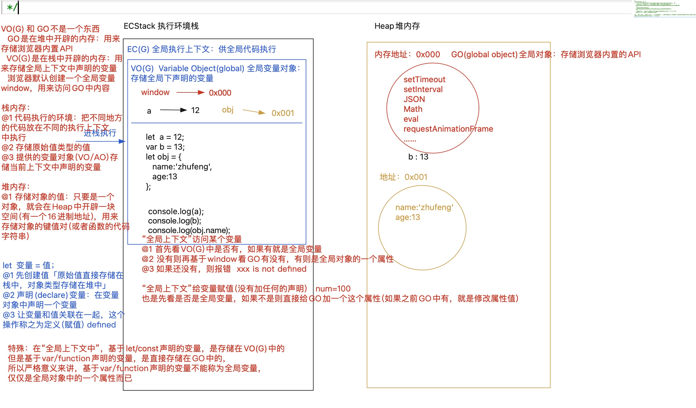
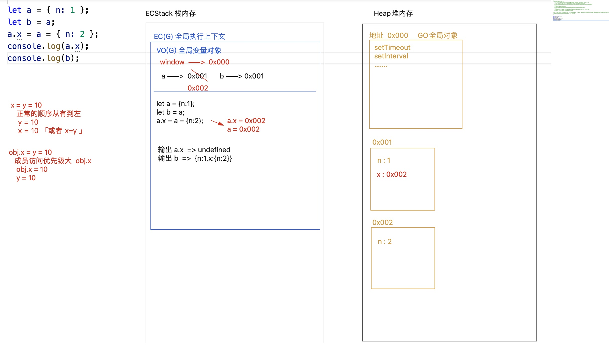

# 数据类型和堆栈内存
1. 有哪些数据类型？
   - 值类型
   - 引用类型
2. 这些数据类型的特点和应用？
3. 如何区分和检测数据类型？
4. 数据类型之间的转换规则？
5. 不同数据类型在计算机中的存储方案（堆栈内存）

## 1. 数据类型分类

- 原始值类型（**值类型**、基本数据类型） 
   - **number 数字**
   - **string 字符串**
   - **boolean 布尔**
   - null 空对象指针
   - undefined 未定义
   - **symbol 唯一值**
   - bigint 大数
- 对象类型（**引用数据类型**） 
   -  标准普通对象**Object**
   -  标准特殊对象**Array**、**正则RegExp**、Date、Math、Error、Set、Map
   -  非标准特殊对象，Number、String、Boolean基于构造函数创建出来的原始值对象类型的格式

`new Number(1) `

   -  可调用、执行对象【函数] **function （实现了call方法）**
## 2. 数据类型浅析
```bash
1. Number类型
主要包括下面几种（典型）：
1 -1 0 1.2 NaN Infinity(无限值，-Infinity)

NaN === NaN // false
Object.is(NaN,NaN) // true

2. String类型 
以'' "" ``包裹的叫做字符串

3. Boolean类型 
true false


4. bigint大数

5. null和undefined

6. Symbol唯一值
```
```javascript
// 1. num就是NaN才会返回true
Object.is(num,NaN)

// 2. isNaN([value]) 
// 检测一个值是否为有效数字（如果是有效数字，返回false,不是有效数字返回true),如果值不是number类型，会先隐式转换为数字类型再去检测
if(isNaN(num)) {

}

// 3. Symbol的特性
/*
a. symbol表示唯一值
b. Symbol('描述信息')
c. Symbol不能当做构造函数
作用1：可以给对象设置唯一值类型的属性
			([对象“属性名”的类型]:【string,symbol,number】)
      
for in无法迭代symbol类型的私有属性（可以获取自身和继承的可枚举属性，不包括Symbol属性）
Object.keys返回一个数组，可以获取非symbol类型的私有属性（对象自身的可枚举属性，不包括继承属性和Symbol属性）
Object.getOwnPropertyNames()返回一个数组，可以获取包含对象所有可枚举属性和不可枚举属性，不包含继承属性和Symbol属性
Object.getOwnPropertySymbols(obj)可以获取symbol类型的私有属性
Reflect.ownKeys(obj); 获取所有私有属性，不论是啥类型（包含可枚举属性，不可枚举属性，以及Symbol属性，不包含继承属性）
      
作用2： 把Symbol当做对象，提供的很多静态属性方法，是js很多的知识的底层原理
Symbol.toPrimitive
Symbol.hasInstance
Symbol.toStringTag
Symbol.iterator
Symbol.asyncIterator
      
作用3：vuex/redux中我们需要派发很多行为标识，我们可以把这些行为标识统一管理，为了保证行为标识的唯一性，可以基于symbol处理
*/
console.log(Symbol() === Symbol()) // false
console.log(Symbol('AA') === Symbol('AA')) // false
// console.log(new Symbol()); //Uncaught TypeError: Symbol is not a constructor

let sym = Symbol('BB')
let a = [10,20]
let obj = {
    name: 'zzf',
    age: 20,
    0:100,
  	// 属性key会转换为字符串显示
    [{xxx:'xxx'}]:200, // "[object Object]": 200
    [a]: 300, // "10,20": 300
    [sym]: 500，
    [Symbol('AA')]: 400
}
console.log(obj['name']) // 'zzf'
// obj[0]和obj['0']获取的结果一样（本质上是都转为字符串）
console.log(obj[0]) // 100
console.log(obj['0']) // 100

console.log(obj[sym]) // 500
console.log(obj[Symbol('AA'])  // undefined, 这是两个不同的唯一值

for(let key in obj) {
    console.log(key)
}

let keys = Object.keys(obj) // 获取非symbol类型的私有属性（返回包含属性名的数组）
keys = keys.concat(Object.getOwnPropertySymbols(obj)) // 获取symbol类型的私有属性
console.log(keys)

keys = Reflect.ownKeys(obj) // 获取所有私有属性，不论啥类型
console.log(keys)

// 4. BigInt的应用
// 最大安全数，超过这个数字进行运算，运算结果不一定正确
console.log(Number.MAX_SAFE_INTEGE)
/* 需求：服务器端数据库存储值有longInt(大数类型），如果服务器返回这样的值，一般以字符串形式返回。而且客户端在这个值基础上再次运算，我们该怎么处理呢?
1. 把服务器获取的值[value] 转换为bigint类型  BigInt([value]) 
2. 将结果进行运算（运算的另一个值也是Bigint类型的）
3. 把运算的结果转换为字符串（去掉n）再传递给服务器即可
*/

BigInt('9007199254740991234')
// BigInt('9007199254740991234n')
9007199254740991234n + 10n
(9007199254740991234n).toString()

// new BigInt() Uncaught TypeError: BigInt is not a constructor 
```
```javascript
// 一道面试题
var a = {}
var b = {key: 'a'}
var c = {key: 'c'}
a[b] = '123'
a[c] = '456'
console.log(a[b]) // '456'
```
## 3. 数据类型检测
数据类型检测的方式： 

1. **typeof运算符**
2. **Object.prototype.toString.call([value])【检测数据类型】**
3. **[value] instanceof [Constructor] 【检测实例是否属于某个类】**
4. **[value].constructor 【获取构造函数】**
> **其他的检测方法，比如Array.isArray([value]) 检测值是否为数组**


### 1. typeof

1. **typeof [value] 返回结果是字符串**,字符串中包含了对应的数据类型
2. **typeof null的结果是"object"**
```bash
为啥会这样?
1. 所有数据类型在计算机底层都是按照二进制的值来进行存储的，而typeof就是按照二进制的值进行检测的
  000 对象
  1 整数
  010 浮点数
  100 字符串
  110 布尔
  000000 null
2. typeof检测也是按照二进制值进行检测，其中就有一条规则：如果是以“000”开始的二进制，而会被识别为对象（null存储的二进制都是0，符合以000开始），然后再去看对象是否实现了[[call]],实现了则为函数（返回"function")，没实现就是对象(返回"object")
3. 因为是按照二进制进行检测，所以检测速度是比较快的。
```

3. typeof检测对象类型，除了function类型(实现call方法），其他都是"object",所以这种检测[不能细分对象]
4. typeof检测一个未被声明的变量，不会报错，结果是"undefined"
```javascript
// 1. 检测除null之外的原始值类型可以使用
typeof typeof typeof [1,2,3] // "string"

typeof null // "object"
typeof function(){} // "function"
typeof {} // "object"


// 2. 检测一个值是否为对象
if(val !== null && (typeof val === 'object' || typeof val === 'function')) {}
if(val !== null && /^(object|function)$/i.test(typeof val)) {}


// 3. 检测某个东西是否兼容
// 插件封装中的暴露API
(function() {
    let utils = {}
    if(typeof window !== "undefined") 
    	window.utils = utils;
    if(typeof module === 'object' && typeof module.exports === 'object') 
      module.exports = utils;
})()
```
**思考题：如何检测为标准普通对象**`isPlainObject`（纯粹对象 -> 对象.__proto__ === Object.prototype)
> 总结：typeof的应用
> - 检测除null之外的原始值类型可以使用
> - 检测是否为对象
> - 检测某个东西是否兼容


### 2. instanceof
**[对象] instanceof [构造函数]**  检测对象是否为这个类的实例，基于这个特点可以“临时”拿来检测数据类型 

1. 作用： 对typeof做了一个补充，可以适当的细分一下对象
2. 局限性： 
   1. 对原始值类型无效：instanceof左侧只要是原始值类型，结果就是false，默认不会进行“装箱”
   2. 无法检测是否为“标准普通对象”：因为所有对象都是Object的一个实例，检测结果都是true
   3. 因为我们可以修改原型链的指向`setPrototypeOf`，所以检测的结果不一定是准确的
```javascript
1 instanceof Number // false
new Number(1) instanceof Number // true
```
```javascript
let obj = [10,20]
// isArray(obj)
console.log(obj instanceof Array)
console.log(obj instanceof Object)
console.log(obj instanceof RegExp) // false， 上面两个结果都是true

let obj = {}
Object.setPrototypeOf(obj, RegExp.prototype) // obj.__proto__ = RegExp.prototype
console.log(obj instanceof RegExp) // true
```

3. 原理
   1. **传统版本：instanceof检测是按照实例的原型链进行查找的，只要 [构造函数].prototype 出现在了[对象]的原型链上，那么检测结果都是true**！
   2. 新版本：在Function.prototype上有一个`Symbol.hasInstance`属性方法(所有函数都可以使用)，当我们基于 “[对象] instanceof [构造函数]”检测处理的时候，内部是这样处理的：`[构造函数]Symbol.hasInstance([对象])`
```javascript
let arr = [10,20]
console.log(arr instanceof Array) // true
console.log(Array[Symbol.hasInstance](arr)) // true
         
// 面试题: 修改obj的原型为Fn后，如何让instanceof的检测结果为false?
class Fn {
    name = 'Fn';
    x = 10;
    y = 20;
    sum() {
        if (!this.name) 
          throw new TypeError('this.name is not defined');
        // ...
    }
    // 只有基于ES6中的class创建类，基于“static xxx”这种语法重写Symbol.hasInstance才有用；如果是ES5创建的类，基于 Fn[Symbol.hasInstance]=xxx 这样重写是无效的！！
    static [Symbol.hasInstance](obj) {
        return (obj.name && Object.getPrototypeOf(obj) === Fn.prototype) ? true : false;
    }
}
let f1 = new Fn;
// let f2 = new Fn;
console.log(f1 instanceof Fn); //true
// f1.sum(); // f1有name属性，可以调用该方法

let obj = {};
Object.setPrototypeOf(obj, Fn.prototype);


// console.log(obj instanceof Fn); // 没有重写该方法结果为true
// obj.sum(); // obj没有name属性，不可以调用该方法

console.log(obj instanceof Fn); //重写该方法后Fn[Symbol.hasInstance](obj)结果为false

```
```javascript
// 重写内置instanceof
var instance_of = function instance_of(obj, Ctor) {
    // 右侧必须是一个函数
    if (typeof Ctor !== "function") throw new TypeError("Right-hand side of 'instanceof' is not callable");
    // 原始值检测都是false
    if (obj == null || !/^(object|function)$/.test(typeof obj)) return false;
    // 构造函数必须具备prototype
    if (!Ctor.prototype) throw new TypeError("Function has non-object prototype 'undefined' in instanceof check");
    // 支持Symbol.hasInstance的使用这个方法处理
    if (typeof Symbol !== "undefined") return Ctor[Symbol.hasInstance](obj);
    // 不支持：自己按照原型链查找
    let proto = Object.getPrototypeOf(obj);
    while (proto) {
        if (proto === Ctor.prototype) return true;
        proto = Object.getPrototypeOf(proto);
    }
    return false;
};
let arr = [10, 20];
console.log(instance_of(arr, Array)); //true
console.log(instance_of(arr, RegExp)); //false
console.log(instance_of(arr, Object)); //true
```
### 3. constructor
它也是个临时工，局限性也很多，最主要的就是不准「因为我们可以随意修改constructor」

1. 作用：
   1. 可以检测是否为纯粹对象(标准普通对象)
   2. 对原始值(除null/undefined,因为他们两个无法进行成员访问)也有效
```javascript
let arr = [10,20]
let num = 1
console.log(arr.constructor === Array)
console.log(arr.constructor === RegExp) // false
console.log(arr.constructor === Object) // false
console.log(num.constructor === Number) // true
```
### 4. Object.prototype.toString.call
**Object.prototype.toString.call([value])**

1. 粗暴、准确、没有任何副作用
2. 除Object.prototype.toString之外，其余构造函数原型上的toString一般都是用来“转换字符串的”，只有它是用来检测数据类型的，**返回的结果 “[object result]”**
3. result是啥值 
   1. [value][Symbol.toStringTag] 有这个属性，属性值是啥，则结果中的“result”就是啥(Math & GeneratorFunction.prototype & Generator.prototype & Promise.prototype)
   2. 没有这个属性则一般找到的是自己所属的构造函数(以内置的为主)
```javascript
var class2type = {},
    toString = class2type.toString; //Object.prototype.toString
// 返回结果都是"[Object xxx]"
console.log(toString.call(1)); //"[object Number]"
console.log(toString.call(NaN));//"[object Number]"
console.log(toString.call(""));//"[object String]"
console.log(toString.call(true));//"[object Boolean]"
console.log(toString.call(null));//"[object Null]"
console.log(toString.call(undefined));//"[object Undefined]"
console.log(toString.call(Symbol()));//"[object Symbol]"
console.log(toString.call(10n));//"[object BigInt]"
console.log(toString.call({}));//"[object Object]"
console.log(toString.call([]));//"[object Array]"
console.log(toString.call(/^\d+$/));//"[object RegExp]"
console.log(toString.call(new Date()));//"[object Date]"
console.log(toString.call(function () { }));//"[object Function]"

// 修改原型链对检测结果也没有任何影响
var obj = {};
Object.setPrototypeOf(obj, Array.prototype);
console.log(toString.call(obj));// "[object Object]"

// 检测过程：
// 1. 先看value是否有Symbol.toStringTag属性，如果有这个属性，属性值是啥，结果就是啥
// 2. 没有这个属性则一般找到的是自己所属的构造函数
console.log(toString.call([]));//"[object Array]"
// Math上有Symbol.toStringTage这个属性
console.log(toString.call(Math));//"[object Math]" => Math[Symbol.toStringTag]: "Math"


// 面试题：1. 输出结果是什么？ 2. 如何修改检测结果就为"[Obeject Fn]"
class Fn { }
let f = new Fn;
console.log(Object.prototype.toString.call(f)); //"[object Object]" // 自定义类没用，检测结果一般以内置的为主

class Fn {
    [Symbol.toStringTag] = "Fn";
}
let f = new Fn;
console.log(Object.prototype.toString.call(f));//"[object Fn]
```
>  检测除null以外的基本数据类型用typeof
> 检测引用数据类型用Object.prototypet.toString.call
> 我们还可以封装`toType`专门用于在不同的场景下检测数据类型


## 4. 数据类型转换
### 1. 其他类型转为Number类型
隐式转换: 浏览器自动帮我们进行的转换，一般都是通过Number([value]),比如isNaN([value]). 如果 [value]不是number类型，浏览器会先变为number类型，再去检测

- isNaN()
- ==比较
- 数学运算

显式转换:代码书写中手动转换

- **Number([value])**
- **parseInt([val],radix)**
- **parseFloat()**
#### 1. Number()
```
1. 常用在 数学运算 、== 、isNaN()
2. 字符串转换为数字，空字符串（或者连续多个空格）转为0，如果出现任何非有效字符，结果都是NaN
3. 布尔转换为数字。true转换为1，false转为0
4. null转为0， undefind转为NaN
5. Symbol无法转换为数字,会报错：Uncaught TypeError: Cannot convert a Symbol value to a number
6. BigInt去掉"n",超过安全数字的，会按照科学计数法处理
7. 对象转换为数字
    1. 先调用对象的Symbol.toPrimitive这个方法，如果不存在这个方法
    2. 调用valueOf获取原始值，如果获取的值不是原始值
    3. 调用toString()转为字符串
    4. Number(字符串）转换为数字
```
```javascript
Number([10]) // 10
// 1. Symbol.toPrimitive ---> undefined
// 2. valueOf --->  [10]
// 3. toString() ---> '10'
// 4. Number('10') ---> 10 


Number([10,20]) // NaN
// 1. Symbol.toPrimitive ---> undefined
// 2. valueOf --->  [10,20]
// 3. toString() ---> '10,20'
// 4. Number('10,20') ---> NaN


let obj = { 
  0: 10, 
  length: 1 
};
console.log(Number(obj)); //NaN
// obj[Symbol.toPrimitive] -> undefined
// obj.valueOf() -> 非原始值
// obj.toString() -> "[object Object]"
// => NaN 


let num = new Number(10);
console.log(Number(num)); //10
// num[Symbol.toPrimitive] -> undefined
// num.valueOf() -> 10

let time = new Date();
console.log(Number(time)); //1637158306237
// time[Symbol.toPrimitive] -> 函数
// time[Symbol.toPrimitive]('number')  
// 执行这个方法可以传递三个参数 'number'/'string'/'default'  
// 除了Number(对象)按照这个流程处理，String(对象)把对象变为字符串也按照这个规则处理，如果存在Symbol.toPrimitive，则执行传递的是'string'
```
#### 2. parseInt(string,radix)和parseFloat()
```javascript
/* 
首先会把[value]变为字符串
1. 从字符串左侧第一个字符开始找，把找到的有效数字字符最后转换为数字「一个都没找到就是NaN」；
2. 遇到一个非有效数字字符，不论后面是否还有有效数字字符，都不再查找了；
3. parseFloat可以多识别一个小数点；
*/

/*
parseInt([val],[radix]) // val必须是字符串，如果不是字符串，也会转为字符串，第二个参数是进制
parseFloat([val])
*/

parseInt('12px1314') // 12

// parseInt()和Number()的区别？
parseInt('') // NaN
Number('') // 0

parseInt(null) // NaN, 先转为字符串处理
// parseInt('null') ---> NaN
Number(null) // 0


// 1. 在本身处理规则的基础上，还可以设置[radix]进制，在[val]字符串中，从左到右查找符合[radix]进制的内容（遇到一个不符合的规则结束查找，把找到的内容当做[radix]进制值最后转换为10进制
parseInt('10011',2) // 19
parseInt('1001134',2) // 19,后续的3和4超过2进制,，舍弃

// 2. [radix]不设置（或者设置为零），则默认值是10；但是如果字符串是以‘0x’开头的，则默认值是16；
parInt('12px') // 12

// 3. [radix]有取值范围，2-36,不在范围内，最后处理的结果都是NaN

// 4. 在浏览器中有一个特殊情况，如果数字是以0开始的，浏览器会认为这是8进制的值，他会把八进制默认转换为10进制再处理
parseInt(0013,2) // 0013八进制转为11
parseInt('11',2) // 3
parseInt('0013',2) // 1
```
```javascript
let arr = [27.2, 0, '0013', '14px', 123];
arr = arr.map(parseInt); // [27, NaN, 1, 1, 27]
// parInt('27.2', 0) ---> 按照10或者16处理， 所以是27
// parseInt('0', 1)  ---> NaN
// parseInt('0013',2) // 1
// parseInt('14px', 3) // 1
// parseInt('123',4) // 16 + 8 + 3 = 27

// map的第一个参数是item，第二个参数是index
arr = arr.map((item,index)=> {})
```
```javascript
let arr = [12.5, 100, 0013, '27px', 456];
arr = arr.map(parseInt);
// parseInt(0013,2) // 传八进制0013，转为十进制后为11， 转换为字符串“11“，然后转为2进制，得到结果为3
// [12, NaN, 3, 2, NaN]
```
### 2. 其他类型转换为String
```
转化规则：
    @1 拿字符串包起来
    @2 特殊：Object.prototype.toString
出现情况：
    @1 String([val]) 常用于隐式  或者 [val].toString() 常用于显式转换
    @2 “+”除数学运算，还可能代表的字符串拼接
        + 有两边，一边是字符串
        + 有两边，一边是对象
        + 只出现在左边
        
重点：对象转换为字符串基于这两种方式还是有区别的
1. 对象.toString()直接调取所属类原型上的toString方法进行处理
2. String(对象）首先获取对象[Symbol.toPrimitive]这个属性
	如果存在这个属性，对象[Symbol.toPrimitive]('string')
	如果不存在，则继续调用对象.valueOf()，如果获取的是原始值结束即可
  如果不是，才会调用toString方法进行处理
3. 标准普通对象调用的toString是Object.prototype.toString,是用来检测数据类型的，而不是转换为字符串

转换成字符串常见的情况：
1. 字符串拼接“+”在js中除了数学运算也有字符串拼接的意思
    1.1 有两边，其中一边是字符串，则一定是字符串拼接 12 + '13'
    1.2 有两边，其中一边是对象，可能是字符串拼接，因为其要把对象转换成数字，转换过程中如果遇到转换为字符串，则直接变为字符串拼接，如果遇不到还是数学运算
    1.3 只有一边 +[val] 一定是把val转换为数字
2. parseInt([val]) 如果val不是字符串也要先变为字符串再处理
3. alert/confirm/prompt/document.write都会把内容变为字符串，然后输出
```
```javascript
String(null) // "null"
null.toString() // 报错

12 + [13] // [13]需要转换为数字
// Symbol.toPrimitive -> valueOf -> toString() -> '13' 直接变为字符串拼接
// 12 + '13' -> 1213

12 + new Date()
// new Date()[Symbol.toPrimitive]('default') 转为字符串，变为字符串拼接

12 + new Number(13) 
// new Number(13)[Symbol.toPrimitive] -> new Number(13).valueOf()  
// 12 + 13 -> 15

// [val] + '' -> 把val转换为字符串
// +[val] -> 把val转换为数字
// +[] ---> 0 把数组变为数字
// +[12] ---> 12
// +new Date() 转为数字
// +{name:'lmy'} NaN

let res = 100 + true + 21.2 + null + undefined +'Tencent' + [] + null + 9 + false
// NaNTencentnull9false
```
```javascript
let obj = {x: 10};
console.log(10 + obj); //->"10[object Object]"
// 如何让结果为20呢？
let obj = {
	x: 10,
  [Symbol.toPrimitive](hint) {
    console.log(hint) // ”default“、”string“、”number“
		return this.x
	}
}

console.log(10 + obj); //->20
```
### 3. 其他数据类型转换为Boolean

1. 转换规则：**除了“0/NaN/空字符串/null/undefined”五个值是false，其余都是true**

​		(即便是只有空格的字符串也转为true)

2. 出现情况： 
   - Boolean([val]) 或者 !/!! 
   - 条件判断
### 4. "=="比较时的数据类型转换
“==”相等，两边数据类型不同，需要先转为相同类型，然后再进行比较 

1. 对象==字符串 对象转字符串「Symbol.toPrimitive -> valueOf -> toString」 
2. null==undefined -> true 

       null/undefined和其他任何值都不相等 
       null===undefined -> false 

3. 对象==对象 比较的是堆内存地址，地址相同则相等 
4. NaN!==NaN 
5. 除了以上情况，**只要两边类型不一致，剩下的都是转换为数字**，然后再进行比较的 
6. “===”绝对相等，如果两边类型不同，则直接是false，不会转换数据类型「推荐」 
7. switch-case是按照绝对相等比较的
```javascript
console.log([] == false);  // 都转换为数字，0==0， 结果为true
console.log(![] == false);  // ![]先转换为布尔再取反
// !true == false, false == false, 结果为true

console.log(!![]); //->true
console.log(!!-1); //->true
```
### 5. 练习题
```javascript
// isNaN(NaN) + 1 + "undefined" ===> "2undefined"
isNaN(parseInt(new Date())) + Number([1]) + typeof undefined;
// true
!(!"Number(undefined)");
// "2.6number"
parseFloat("1.6px") + parseInt("1.2px") + typeof parseInt(null);
// false + true + true + "boolean" ===> "2boolean"
Boolean(Number("")) + !isNaN(Number(null)) + Boolean("parseInt([])") + typeof !(null);
// false
isNaN(Number(!!Number(parseInt("0.8"))));
// false
!typeof parseFloat("0");
// 0 
Number("");

// '16[object Object]'
16+{};
// 16
{}+16;

var n = 6;
// 27,依旧是先运算后++
console.log((n++) + n-- + 5 + --n +--n);
// 4
console.log(n);
```
## 5. 堆栈内存
JS代码可以在浏览器环境和Node环境下运行，但不论什么环境下执行代码，总要开辟出相关的内存，用来存储值（栈内存）和[Heap]堆内存，以及运行代码[Stack栈内存]**E(Execution) C (Context) Stack执行环境栈**
```
栈内存
  1. 代码执行的环境，把不同地方的代码放置在不同的执行上下文中执行
  2. 存储原始值类型的值
  3. 提供的变量对象（VO/AO)存储当前上下文中声明的变量
堆内存
  1. 存储对象类型的值，只要是一个对象，就可以在heap中开辟一块空间（16进制地址),用来存储对象的键值对（或者函数的代码字符串）
```

- **GO全局对象**，是在堆中开辟的内存，用来存储浏览器内置API 
- **VO(G)全局变量对象**，是在栈中开辟的内存，用来存储全局上下文中声明的变量 
- 浏览器默认创建一个全局变量**window**,用来访问GO的内容
```
let 变量 = 值 发生了什么？
1. 先创建值，【原始值直接存储在栈中，对象类型存储在堆中】
2. 声明(declare)变量，在变量对象VO中声明一个变量
    特殊: 在全局上下文中，基于let/const声明的变量，是存储在VO(G)中的
    但是基于function/var声明的变量，是直接存储在GO中的，
    所以严格意义来将，基于var/function声明的变量不能称之为全局变量
    仅仅是全局对象中的一个属性而已
3. 让变量和值关联在一起，这个操作称之为定义（赋值）defined

console.log(a)发生了什么？ (全局上下文中访问某个变量)
1. 首先看VO（G）中是否有，如果有就是全局变量
2. 没有则基于window看GO有没有，有就是全局对象的一个属性
3. 如果没有，则报错 xxx is not defined

全局上下文中给变量赋值（没有加任何的声明）num = 100 发生了什么 ？
1. 也是先看是否是全局变量
2. 如果不是则直接给GO加一个这个属性（如果之前G0中有，就是修改属性值)
```


```javascript
// https://developer.mozilla.org/zh-CN/docs/Web/JavaScript/Reference/Operators/Operator_Precedence
var a = {n: 1};
var b = a;
// 成员访问的优先级大 a.x = {n:2}, a = {n:2}
a.x = a = {n: 2};
console.log(a.x);
console.log(b);
```

```javascript
let obj={
    x:1,
    y:[10,20]
};
let obj2=obj;
// 把obj2中的每一项“浅拷贝”一份到新的堆内存中
let obj3={
   ...obj2
};
obj2.x=100;
obj2.y[1]=30;
obj3.x=200;
obj3.y[2]=40;
obj=obj3.y={
   x:0,
   y:[1,2]
};
console.log(obj,obj2,obj3);
//obj: {x:0, y:[1,2]}
// obj2: {x:100, y:[10,30,40]}
//obj3: {x:0, y: {x:0, y:[1,2]}}
```
## 6. 其他补充
### i++和++i
```javascript
let n = '10';
console.log(+n); //10 ->转换为数字
console.log(++n); //11 ->转换为数字然后累加1
console.log(n++); //11 ->转换为数字然后累加1
/*
i++ 和 i=i+1 以及 i+=1  三个是否一样？
+ i=i+1 & i+=1 是一样的
i++一定返回的是数字 但是i+=1就不一定了，有可能是字符串拼接
*/
let i = 10;
console.log(5 + (++i)); //先i累加1，累加后的结果运算  16 i->11
console.log(5 + (i++)); //先运算 再累加1  15 i->11
```
### 0.1 + 0.2 !== 0.3

1. 十进制在计算机中以二进制的形式表示（如何将十进制转换成二进制）
- 整数部分（除2取余，倒着拼接）
- 小数部分（乘2取整，一直到结果是1为止）
```javascript
浮点数转为二进制会出现“无限循环”的情况，计算机底层存储的时候按照可以识别的最长位数存储，其他的直接舍弃，所以浮点数存储的二进制值本身就失去了精准度所以最后运算的结果也是缺乏精准度的
```

2. JS使用Number类型表示数字（整数和浮点数），遵循IEEE-754标准 通过64位二进制值来表示一个数字 
```javascript
 https://babbage.cs.qc.cuny.edu/IEEE-754.old/Decimal.html 
 第0位：符号位，0表示正数，1表示负数 S 
 第1位到第11位「11位指数」：储存指数部分 E 
 第12位到第63位「52位尾数」：储存小数部分（即有效数字）F 
 注：尾数部分在规约形式下第一位默认为1（省略不写）
```

3. 怎么解决精度问题
- 将数字转为整数【扩大系数】
- 三方库：Math.js、big.js、...
4. 实现不损失进度的plus方法
```javascript
// 找系数
const coefficient = function coefficient(num) {
    num = String(num);
    let [,char = ''] = num.split('.'),
        len = char.length;
    return Math.pow(10,len)
}

const plus = function plus(n,m) {
    n = Number(n)
    m = Number(m)
    if(isNaN(n) || isNaN(m) ） return NaN
    let coeffic = Math.max(coefficient(n), coefficient(m))
    return (n*coeffic + m * coeffic) / coeffic
}
console.log(plus(0.1, 0.2))
```
### {}+n和n+{}
```javascript
let n = 10;
{}+n // 10  把左侧的{}当做代码块，不参与运算，运算的只有 +n
n+{} // '10[object Object]' 字符串拼接
```
### 什么情况下a==1&&a==2&&a==3
```javascript
var a = ?;
// == 转换
if (a == 1 && a == 2 && a == 3) {
    console.log('OK');
}
// 方案1：利用 == 比较会把a转换为数字，再根据对象转数字会经历一系列的步骤，此时我们可以重写某一步骤，实现自己的需求
var a = {
    i = 0,
    // 重写Symbol.toPrimitive/valueOf/toString
    [Symbol.toPrimitive]() {
        return ++this.i;
    }
}
var a = [1,2,3]
a.toString = a.shift()  // 第一次删除1，返回1

// 方案2: 在全局上下文中基于var声明变量，是给window全局对象设置属性，再利用数据劫持，实现这个需求
var i = 0;
Object.defineProperty(window,'a', {
    get() {
        return  ++i;
    }
})
```
### JQ中数据类型检测方法
```javascript
/* 检测数据类型的方法 */
const getProto = Object.getPrototypeOf,
class2type = {};
toString = class2type.toString;       //Object.prototype.toString
hasOwn = class2type.hasOwnProperty;
//Object.prototype.hasOwnProperty
fnToString = hasOwn.toString;// Function.prototype.toString 把函数转换为字符串
ObjectFunctionString = fnToString.call(Object); // "function Object() {[native code]}"
```
```javascript
// isFunction, 检测是否为函数
// 排除某些浏览器的特殊用法
const isFunction = function isFunction(obj) {
  return typeof obj === "function" && typeof obj.nodeType !== "number" &&
    typeof obj.item !== "function";
};
```
```javascript
// isWindow, 检测是否为window对象
// window.window === window
const isWindow = function isWindow(obj) {
  return obj != null && obj === obj.window;
};
```
```javascript
// toType检测数据类型，返回结果是包含小写数据类型的字符串
const toType = function toType(obj) {
  let reg = /^\[object (.+)\]$/;
  // 排除null和undefined
  if (obj == null) return obj + "";
  return typeof obj === "object" || typeof obj === "function" ?
    reg.exec(toString.call(obj))[1].toLowerCase() :
  typeof obj;
};
```
```javascript
// isPlainObject:检测是否为标准普通对象（纯粹对象 ）
// 检测是否为标准普通对象(纯粹对象)
const isPlainObject = function isPlainObject(obj) {
  let proto, Ctor;
  if (!obj || toString.call(obj) !== "[object Object]") return false;
  // 原型对象不存在，Object.create(null)
  proto = getProto(obj);
  if (!proto) return true;
  // proto.hasOwnProperty('constructor') 
  Ctor = hasOwn.call(proto, "constructor") && proto.constructor;
  /*
  return typeof Ctor === "function"  fnToString.call(Ctor) === ObjectFunctionString; （前面定义的变量）
  */
  return typeof Ctor === "function" && Ctor === Object;
};
```
```javascript
// isEmptyObject： 检测是否为空对象
const isEmptyObject = function isEmptyObject(obj) {
  // 首先是个对象
  if (obj == null || !/^(object|function)$/.test(typeof obj)) return false;
  let keys = Object.getOwnPropertyNames(obj);
  if (typeof Symbol !== "undefined") keys = keys.concat(Object.getOwnPropertySymbols(obj));
  return keys.length === 0;
};
```
```javascript
// isArrayLike: 检测是否为数组或者为类数组
const isArrayLike = function isArrayLike(obj) {
  let length = !!obj && "length" in obj && obj.length,
      type = toType(obj);
  if (isFunction(obj) || isWindow(obj)) return false;
  return type === "array" || length === 0 ||
    typeof length === "number" && length > 0 && (length - 1) in obj;
};
```
```javascript
// 检测是否为数字
var isNumeric = function isNumeric(obj) {
  var type = toType(obj);
  return (type === "number" || type === "string") && !isNaN(+obj);
};
```
