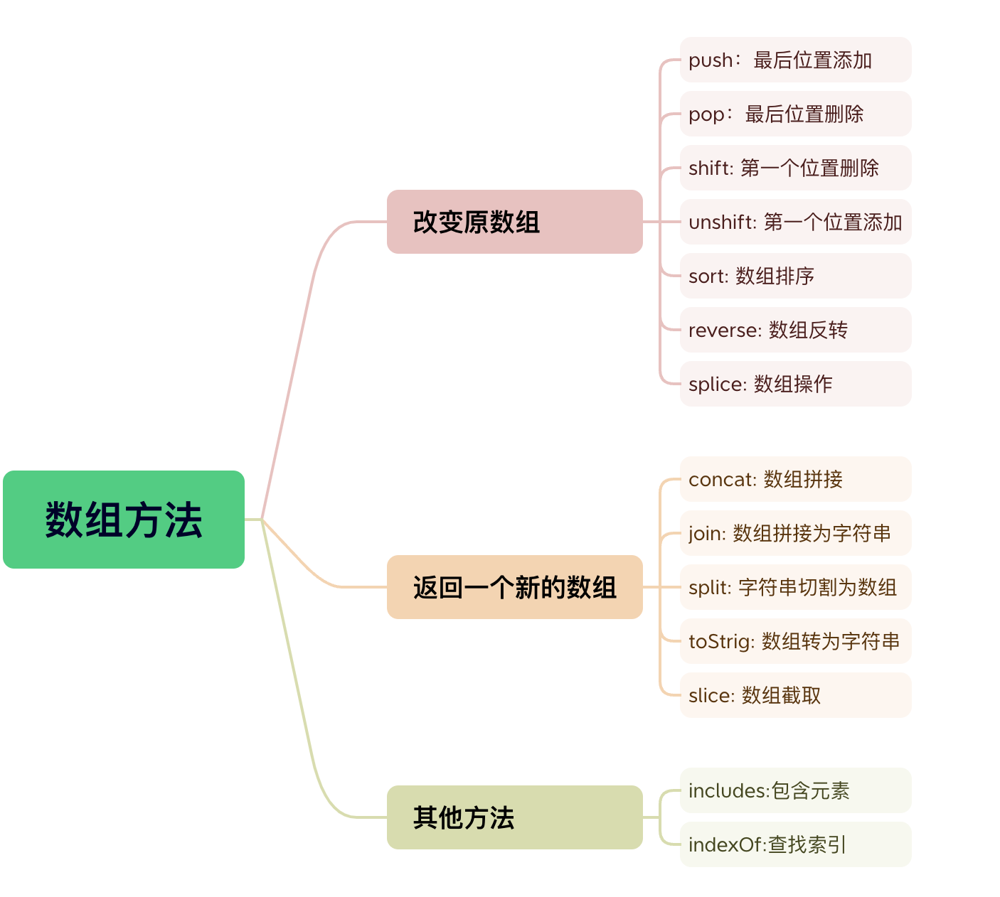
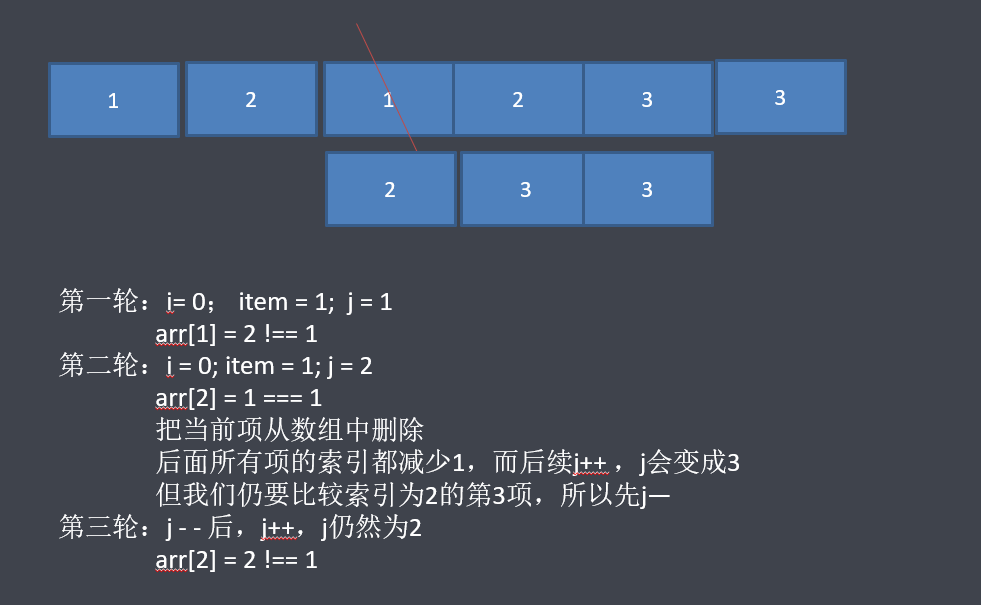
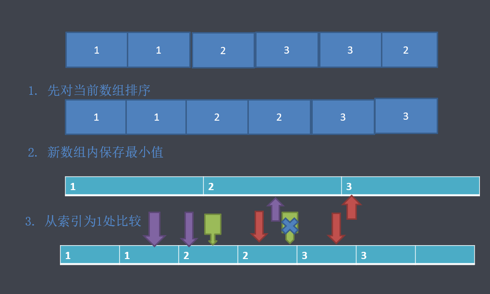

# 数组和类数组

> 推荐阅读： [JS数组奇巧淫技](https://juejin.cn/post/6844904194919366669)

## 1. 数组对象

数组也是对象，也可以通过构造函数生成。（有关对象的知识将在后面介绍，这里知道有这种写法即可）。

### 1.1 数组的两种写法

1. 字面量方法

```javascript
    // 字面量方法
    var arr = [];
    var arr = [1,2,3];
```

2. 构造函数

- var 变量名称 = new Array()：创建一个空数组
- var 变量名称 = new Array(size)：创建一个指定大小的数组
- var 变量名称 = new Array(data1,data2,..)：创建一个带数据的数组

```javascript
    // 空数组
    var arr1 = new Array();
    // 添加数据，可以传参数
    var arr2 = new Array(1,2,3);
    var arr3 = new Array("zs","ls","ww");
    var arr4 = new Array(3); //创建一个长度为3的数组
    console.log(arr1);
    console.log(arr2);
    console.log(arr3);
    console.log(arr4);

    // 检测数组的数据类型：object
    console.log(typeof(arr));
    console.log(typeof(arr3));

	
    // instanceof检测某个实例对象是否属于某个对象类型
    console.log(arr instanceof Array); // true
    console.log(arr2 instanceof Array); // true
```

## 2. 数组常用方法




### 2.1 增

#### 2.1.1在数组的最后添加数据

可以使用`push()`方法在数组的最后新增一条数据，并且**将新增内容之后，数组当前的长度返回。**
`push()`方法可以接收一个或多个参数,添加多个数据。

```javascript
var arr = ['a','b','c'];
var res = arr.push('d');
console.log(res); // 4
console.log(arr);// [a,b,c,d]
var res1 = arr.push('e','f');
console.log(arr);// [a,b,c,d,e,f]
```
```js
Array.prototype.myPush = function() {
  for(var i = 0; i < arguments.length; i++) {
    this[arr.length] = arguments[i]
  }
  return this.length
}
arr.myPush(1,2,3)
```
#### 2.1.2 在数组的首部添加数据

可以使用`unshift()`方法在数组的首部添加一条数据，并且将**新增内容之后数组当前的长度返回。**
`unshift()`方法可以接收一个或多个参数,添加多个数据。

```javascript
var arr = ['a','b','c'];
var res = arr.unshift('d');
console.log(arr); //[d,a,b,c]
var res1 = arr.unshift('e','f');
console.log(arr); // Array(6) [ "e", "f", "d", "a", "b", "c" ]
```

### 2.2 删

#### 2.2.1 在数组的最后删除一条数据

数组的`pop()`方法可以删除数组中的最后一条数据，并且**将删除的数据返回。**

```javascript
    var arr = [1,2,3,4]
    // 尾删，删除最后一项数据,并返回删除掉的数据
    // 不需要传参
    console.log(arr.pop()); // 4
    console.log(arr); // Array(3) [ 1, 2, 3 ]
```


#### 2.2.2 在数组的前面删除一条数据

数组的`shift()`方法可以删除数组中的第一条数据，并且**将删除的数据返回。**

```javascript
    var arr = [1,2,3,4];
    // 首删，删除第一项数据，不需要传参，返回删除掉的数据
    console.log(arr.shift());// 1
    console.log(arr); // Array(3) [ 2, 3, 4 ]
```

案例：将数组中的第一项移动到最后一项

- 删除第一项
- 将删除的项添加到最后一项

```javascript
arr.push(arr.shift());
```

### 2.3 splice()方法

`splice()`方法比较特殊，可以实现插入，删除和替换元素
splice方法可以传入多个参数：**【splice(index，number,  element1,  element2,...) 】**

- 第一个参数代表删除元素的开始位置
- 第二个参数代表删除元素的个数，可以为0
- 第三个元素开始就是要替换的新的数据

```js
// 实现传递负值，找到对应的索引值
function splice(arr,index) {
  return index += index >=0 ? 0: arr.length
}
```

#### 2.3.1 删除

要实现删除功能，就只需要传前两个参数，**返回值是删除的元素组成的数组。**

```javascript
    var arr = [1,2,3,4,5,6,7,8,9,10];
    // 删除功能，传前两个参数，返回值是删除的元素组成的数组
    console.log(arr.splice(2,5)); // Array(5) [ 3, 4, 5, 6, 7 ]
    console.log(arr); // Array(5) [ 1, 2, 8, 9, 10 ]
```

#### 2.3.2 替换

实现替换，需要传3个以上的参数

```javascript
    var arr = [1,2,3,4,5,6,7,8,9,10];
    // 替换功能，传3个及以上的参数
    arr.splice(2,5,"haha","hello");
    console.log(arr); // Array(7) [ 1, 2, "haha", "hello", 8, 9, 10 ]
```

#### 2.3.3 插入

实现插入功能，需要传3个及以上的参数，**但是第二个参数必须为0。**

```javascript
    var arr = [1,2,3,4,5,6,7,8,9,10]	
    arr.splice(2,0,"hello");
    console.log(arr);
```

### 2.4 合并方法concat()

`concat()`方法可以将两个数组合并，**返回值是合并后的数组，原数组不受影响。**

```javascript
    var arr = [1,2,3,4];
    var arr1 = arr.concat([5,6,7]);
    console.log(arr); // Array(4) [ 1, 2, 3, 4 ]
    console.log(arr1); // Array(7) [ 1, 2, 3, 4, 5, 6, 7 ]
```

### 2.5 截取方法slice()

`slice(start,end)`可以从数组中截取一部分，截取的内容包含start,但不包含end。**截取后原数组不受影响。**

```javascript
    var arr = [1,2,3,4,5,6,7,8,9,10];
    // 参数为正
    var arr1 = arr.slice(3,7);
    console.log(arr1); // Array(4) [ 4, 5, 6, 7 ]
    // 参数为负，结束位置是-1
    var arr2 = arr.slice(-7,-1); 
    console.log(arr2); // Array(6) [ 4, 5, 6, 7, 8, 9 ]
    // 只书写一个参数，参数是截取的开始位置
    var arr3 = arr.slice(7); // Array(3) [ 8, 9, 10 ]
    console.log(arr3);
    console.log(arr); // 原数组不受影响
```


### 2.6 查找元素位置indexOf()

`indexOf()`用于查找元素在数组中的位置，如果找到了指定的元素，则返回元素对应的位置
如果没找到，则返回-1。

- `indexOf`查找的是某个元素在数组中从前往后第一次出现位置的下标
- `lastIndexOf`查找的是某个元素从前往后最后一次出现位置的下标，也就是从后往前第一次出现位置的下标
- 可以指定第二个参数，作为开始查找的位置

```javascript
    var arr = [1,2,3,4,5,6,7,8,9,10,4,5];

    // 查找某个元素在数组中从前往后第一次 出现位置的下标
    console.log(arr.indexOf(4)); // 3
    // 查找某个元素在数组中从前往后最后一次出现位置的下标
    console.log(arr.lastIndexOf(4)); // 10
    // 如果没找到返回-1
    console.log(arr.lastIndexOf(11)); // -1
```

### 2.7 倒序reverse()方法

`reverse()`方法会将数组中的内容反转，并且会修改原来的数组

```javascript
    // 倒序排列,reverse()返回值就是倒序数组
    var arr = [1,2,3,4]
    console.log(arr.reverse()); //Array(4) [ 4, 3, 2, 1 ]
    console.log(arr); // Array(4) [ 4, 3, 2, 1 ]
```

### 2.8 sort()方法

`sort()`方法默认按照字符编码顺序从小到大排列

```javascript
   // 排序，默认按照字符编码顺序从小到大排列
    var arr = [1,2,3,4,5,6,7,8,9,10,20,30];
    arr.sort();
    console.log(arr); // 1,10,2,20,3,30,4,5,6,7,8,9
```

`sort()函数`也可以添加一个一个比较函数的参数，进行大小的比较

```javascript
var arr = [1,2,3,4,5,6,7,8,9,10,20,30];
arr.sort(function(a,b){
      if (a < b) {
        return -1;   //表示 a 要排在 b 前面
      } else if (a > b) {
        return 1;  //表示 a 要排在 b 后面
      } else {
        return 0;  //表示 a 和 b 保持原样，不换位置
      }
    });
    console.log(arr); //Array(12) [ 1, 2, 3, 4, 5, 6, 7, 8, 9, 10, … ]

arr.sort((a,b) => a - b) // 升序排列
```

### 2.9 toString()方法

`toString()`方法可以将数组转字符串。

```javascript
	var arr= [1,2,3,4];   			
	var str = arr.toString();
        console.log(str); // 1,2,3,4
        console.log(typeof str); //string
```

### 2.10 join()方法

`join(）方法`将数组连接成字符串，默认以逗号连接，也就是调用toStirng()，如果传递了参数，就会将传递的参数作为元素和元素的连接符号。

```javascript
    var arr = [1,2,3,4,5,6,7,8,9,10,20,30];

    // 转字符串方法,连接成字符串，默认以逗号连接
    var str = arr.join();// 1,2,3,4,5,6,7,8,9,10,20,30
    console.log(str);
    var str = arr.join("+");
    console.log(str); // 1+2+3+4+5+6+7+8+9+10+20+30
```

### 2.11 includes()方法

`includes()`方法可以判断数组中是否包含某个元素，有则返回true,没有则返回false

```javascript
    var arr = [1,2,3,4];
    console.log(arr.includes(4)); //true
    console.log(arr.includes(12)); //false
```

### 2.12 清空数组

- 令arr = []
- 令数组的长度为0
- 使用splice()方法

```javascript
    var arr = [1,2,3,4,5,6,7,8,9,10,20,30];
    // arr = [];
    // arr.length = 0;
    arr.splice(0,arr.length);
    console.log(arr);
```

## 3. 数组的排序

> 还有很多种排序，这里目前只列出最简单的，待补充。

### 4.1 桶排序

> 这里参考了《啊哈！算法》第一章，初学者如果不理解，可以参考这本书。

```javascript
	// 10以内的排序
        let arr = [5,6,8,7,2];
        let wrapper = new Array(10);
        for(let i=0;i<arr.length;i++){
            let number = arr[i];
            wrapper[number] = 1;
        }
        for(let i = 0;i < wrapper.length;i++){
            if (wrapper[i] == 1){
                console.log(i);
            } 
        }
        //  2 5 6 7 8
```

```javascript
	//  如果有重复数字，怎么办？ [2,5,7,4,5]
        // 数组的fill方法的作用: 设置数组中所有元素的值为指定的数据
        let arr = [2,5,7,4,5]
        let wrapper = new Array(10);
         // 初始化为0
        wrapper.fill(0);
        for(let i=0;i<arr.length;i++){
            let number = arr[i];
          	// 每出现一次，桶内的数据 + 1
            wrapper[number] += 1;
        }
        for(let i = 0;i < wrapper.length;i++){
            for(let j =0;j<wrapper[i];j++){
                console.log(i);
            } 
        }// 2 4 5 5 7

```

### 4.2 选择排序

> 我们小学是如何排序的，比如5,4,2,7,3是不是可以拿第一个和后面的逐个比较，如果后面的数比它小，交换位置，交换后和下一个比较，直到取出最小的那个数，然后是第二个和后面的逐个比较

```javascript
        // 第0个依次和后面的比较，取出倒数第一小的值
        // 第一个依次和后面的比较，取出倒数第二小的值
        // 第二个依次和后面的比较
        let arr = [5,4,2,7,3];
        for(let i=0;i<arr.length;i++){
            for(let j =i+1;j<arr.length;j++){
                if(arr[j] < arr[i]){
                    let temp = arr[i];
                    arr[i] = arr[j];
                    arr[j] = temp;
                }
            }
        }
        console.log(arr);

```

### 4.3 冒泡排序

> 冒泡排序的每一轮选取最大的元素
> 冒泡排序是把数字和临近的数字比较，如果大于临近的数字，交换位置，这样每轮都能选取最大的元素

```javascript
        // 第0个依次和后面的比较，取出倒数第一小的值
        // 第一个依次和后面的比较，取出倒数第二小的值
        // 第二个依次和后面的比较
        let arr = [5,4,2,7,3];
        for(let i=0;i<arr.length-1;i++){
            for(let j =0;j<arr.length -1 - i;j++){
                if(arr[j] > arr[j+1]){
                    let temp = arr[j];
                    arr[j] = arr[j+1];
                    arr[j+1] = temp;
                }
            }
        }
        console.log(arr);
```

### 4.4 随机排序

```js
arr.sort((a,b) => {
  var rand = Math.random()
 	return rand - 0.5 > 0 ? 1 : -1
})
```

## 4. 数组的去重

> 所谓去重，就是去掉数组中重复的项

### 4.1  数组遍历

> 思路分析：
>
> 新建一个[空数组]，循环获取当前数组中的每一项，并添加到空数组中，每次添加的时候进行检验，如果新数组中**存在该项不添加，不存在则添加**

```js
    function unique(arr){
      // 1. 新建一个数组
      let newArr = [];
      // 2. 对数组进行遍历
      for(let i = 0; i< arr.length;i++){
        // 3. 获取当前项
        let item = arr[i];
        // 4. 如果新数组中已经有当前项，跳过
        // 也可以使用indexOf
        if(newArr.includes(item)){
          continue;
        }
        // 5. 如果不包含该项，则push到新数组中
        newArr.push(item);
      }
      // 6. 返回新数组
      return newArr;
    }

    let arr = [1,2,3,3,2,1,2,2,3];
    console.log(unique(arr));
```

```js
function unique(arr) {
  var array = [];
  for (var i = 0; i < arr.length; i++) {
      // 使用indexOf判断是否包含当前项
    if (array.indexOf(arr[i]) === -1) {
      array.push(arr[i])
    }
  }
  return array;
}
```

### 4.2 两次循环遍历当前数组



> 思路：循环原数组中的每一项，每次拿出来的值A都和后面的每项进行比较，比较过程中遇到一项和A相同的，使用splice把这一项从数组中删除
>
> 但是会出现数组塌陷的问题

```js
var arr = [1,2,3,1,2,1,2,3,2,1,2,3];
for(var i= 0; i<arr.length;i++){
    // 1. 拿到当前项
    var item = arr[i];
    // 2. 把当前项和后面的每一项进行比较
    for(var j = i+1;j < arr.length; j++){
        // 如果第j项和当前项相同
        if(arr[j] === item) {
            // 把当前项从数组中删除
            arr.splice(j,1);
            // 数组塌陷了，j后面的索引都提前了一位，下一次要比较的应该还是j这个索引的内容
            // 改进，j--
            j--;
        }
    }
}
```

### 4.3 利用对象

> 该方法和第一种类似，是使用对象的方式，先建立一个空对象，然后遍历数组，把数组的每一项对应的值当做属性，也当做属性值。如果在对象中找到和当前一样的属性，说明该项重复，在数组中删除该项，如果没有找到一样的，将之添加到对象中。

```js
var arr = [1,2,3,1,2,1,2,3,2,1,2,3];
// 1. 创建一个空对象
let obj = {}
// 2. 循环数组中每一项，把每一项向对象中进行存储
for(let i = 0; i< arr.length;i++){
    // 每一次存储之前进行判断：验证obj中是否有当前项
    let item = arr[i];
    if(obj[item] !== undefined){
        // 对象中已经存在和这一项相同的值，在数组中删除该项
        arr.splice(i,1);
        i--;
        continue;
    }
    // 如果没有，将属性名和属性值放在对象中
    obj[item] = item;
}
```

> 改进：基于splice实现删除性能不好，当前项被删后，后面每一项的索引都要向前提一位，如果后面内容过多，会影响性能。

```js
var arr = [1,2,3,1,2,1,2,3,2,1,2,3];
// 1. 创建一个空对象
let obj = {}
// 2. 循环数组中每一项，把每一项向对象中进行存储
for(let i = 0; i< arr.length;i++){
    // 每一次存储之前进行判断：验证Obj中是否存在
    let item = arr[i];
    if(obj[item] !== undefined){
        // 改进的办法是，当前项和最后一项替换位置，然后删除最后一项，这样就不用改变很多数的索引
        arr[i] = arr[arr.length-1];
        arr.length--;
        i--;
        continue;
    }
    // 如果没有，将属性名和属性值放在对象中
    obj[item] = item;

}
```

### 4.4 先排序后去重

> 思路，先利用sort函数将当前数组排序后，再去重。



```js
function unique(arr) {
    // 1. 排序
      arr.sort((a,b) => a-b)
    // 2. 新建一个数组，只存放最小的一个数
      var arrry = [arr[0]];
    // 3. 从索引为1处遍历原数组，将当前项与前一项进行比较，如果不同，将当前项push到新数组
      for (var i = 1; i < arr.length; i++) {
        if (arr[i] !== arr[i - 1]) {
          arrry.push(arr[i]);
        }
      }
    // 4. 返回新数组
      return arrry;
    }
    let arr = [1,2,3,3,2,1,2,2,3];
    console.log(unique(arr));
```
### 4.5 ES6 set去重
```js
function unique(arr) {
  return Array.from(new Set(arr))
}
```

## 5. 类数组

类数组具有数组的部分特性，比如可以通过索引来访问元素，也拥有`length`属性，类数组对象可以使用`for...of` 或者 `forEach` 等迭代方法来遍历元素。但是**不具备数组方法：**如 `push`、`pop`、`splice` 等。

常见的类数组对象包括函数的 `arguments` 对象、DOM元素集合（例如 `document.querySelectorAll` 的结果）、字符串等。

```js
function test() {
    // argument并没有继承自Array.prototype
    console.log(arguments)
}
test(1,2,3,4)
// document.getElementByTagName('div')

var obj = {
    0: 1,
    1: 2,
    length: 2,
    'splice': Array.prototype.splice,
    'push': Array.prototype.push
}

// Object.prototype.push = Array.prototype.push
Array.prototype.push = function(elem) {
    this[this.length++] = elem
}
```

