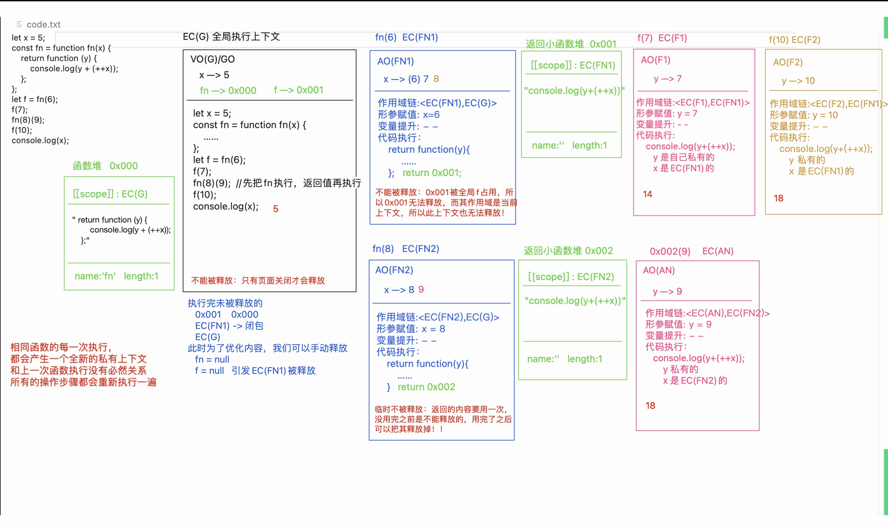
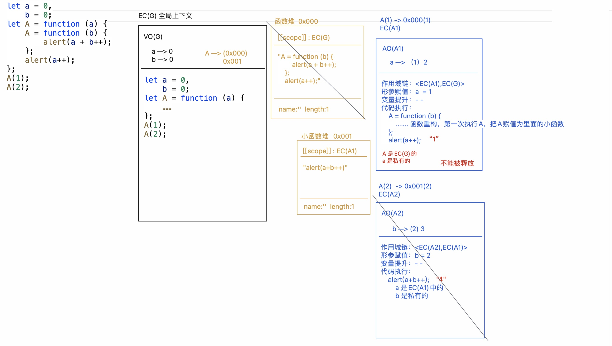

# 闭包作用域和垃圾回收机制
> 三座大山之一：闭包

## 垃圾回收机制
浏览器的垃圾回收机制：浏览器在空闲的时候，会把所有未被占用的内容释放掉，以次来优化内存空间
> 详细内容参考下面两篇文章

[【硬核JS】你真的了解垃圾回收机制吗](https://juejin.cn/post/6981588276356317214)

[JS垃圾回收机制-知乎](https://zhuanlan.zhihu.com/p/352323793)
### 标记清除
整个标记清除算法大致过程就像下面这样

- 垃圾收集器在运行时会给内存中的所有变量都加上一个标记，假设内存中所有对象都是垃圾，全标记为0
- 然后从各个根对象开始遍历，把不是垃圾的节点改成1
- 清理所有标记为0的垃圾，销毁并回收它们所占用的内存空间
- 最后，把所有内存中对象标记修改为0，等待下一轮垃圾回收
```javascript
var m = 0,n = 19 // 把 m,n,add() 标记为进入环境。
add(m, n) // 把 a, b, c标记为进入环境。
console.log(n) // a,b,c标记为离开环境，等待垃圾回收。
function add(a, b) {
  a++
  var c = a + b
  return c
}
```
### 引用计数
**引用计数的关键在于跟踪记录每个变量被使用的次数，如果该变量被引用的次数为0，将会被回收**
```javascript
// 引用数+1
let obj = {
    name: 'zzf',
    age: 20
}
let obj2 = obj // 引用数+1
obj2 = null; // 引用数-1
obj = null // 引用数-1
```
问题是存在循环引用问题
```javascript
function test(){
  let A = new Object()
  let B = new Object()
  
  A.b = B
  B.a = A
}
```
### 内存泄露
如果我们书写代码不当，JavaScript的垃圾回收机制无法处理，就会造成内存无法被回收，造成“内存泄露”

1. 意外的全局变量（GO中的变量只有在页面销毁才会回收）
2. 被遗忘的定时器或回调函数
3. **闭包**

## 闭包作用域
全局执行上下文：在浏览器打开页面的时候创建，在浏览器关掉页面的时候释放（F5刷新，把上一次释放，再形成一个新的）
**私有上下文：函数执行形成的栈内存，默认情况下，代码执行完，都会出栈释放。**
**但是如果上下文中的某些内容（一般指的是一个堆内存（比如一个新的函数）），被上下文以外的事物占用了，不仅被占用内容不能释放，连带着当前这个私有上下文也不能被释放**
**闭包：函数执行，产生一个不被释放的上下文，这样不仅函数中的私有变量不受外界的干扰（保护），而且存储的信息也不会被释放掉（保存，可以供其下级上下文调取使用），我们把这种“保存 + 保护“的机制称之为闭包**
```javascript
let x = 5;
const fn = function fn(x) {
    return function(y) {
        console.log(y + (++x));
    }
}
let f = fn(6); // 函数执行，返回的函数被全局的f占用，无法释放，形成闭包
f(7); //14
// 相同函数的每一次执行，都会产生一个全新的私有上下文，和上一次函数执行没有必然联系，所有的操作步骤都会重新执行一遍
fn(8)(9); // 18
f(10); //18
console.log(x); //5 
```

```javascript
let a=0,
    b=0;
let A = function (a){
    A=function(b){
        alert(a+b++);
    };
    alert(a++);
}
A(1); // 1 ---> a = 1, alert(a++),a = 2, A=一个新的函数
A(2); // 4 ---> b = 2,  a = 2 ,alert(a+b++)
```

