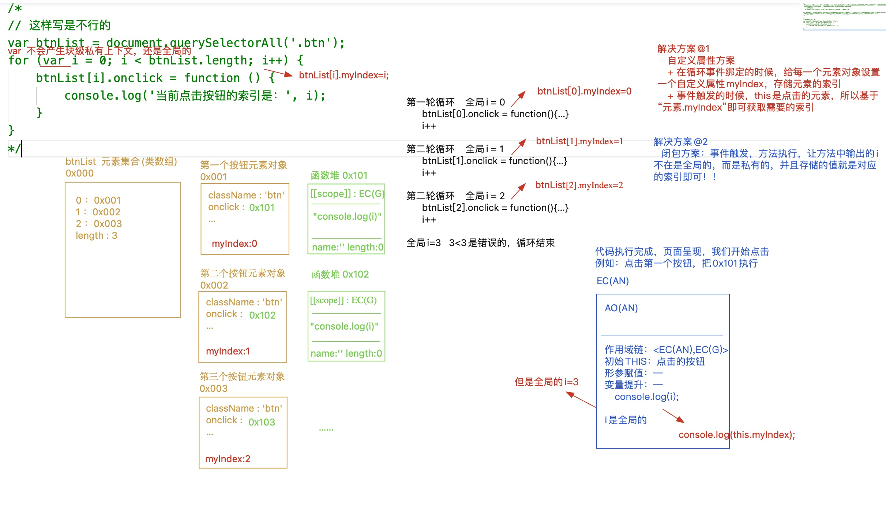

# 闭包的应用
1. 回顾：闭包是什么？
2. 闭包的应用
    - 循环事件绑定
    - 隔秒输出
    - jQuery源码解读
    - 函数柯里化
    - compose组合函数
    - 惰性函数
3. 闭包总结

## 1. 闭包是什么？
闭包：它是一种机制，函数执行，产生一个不被释放的上下文，一方面“保护”里面的私有变量不受干扰，另一方面私有变量的值也“保存”下来了，可以供其上级上下文中调取使用，这种保护 + 保存的机制称之为闭包

1. 保护 & 保存
2. 弊端：导致栈内存增加【如果滥用闭包，会导致产品性能降低】

## 2. 循环事件绑定
页面中有五个按钮，点击每个按钮输出对应的索引，请问下面方式是否可以实现？如果不可以，请问该如何解决？
```javascript
// js中获取的每一个DOM元素都是个元素对象【堆内存】，拥有很多内置的属性和方法，我们实现元素的点击事件行为绑定xxx
// onclick = function 就是给元素对象的私有onclick属性赋值，当点击的时候，浏览器监听到事件触发，帮助我们把赋值的函数执行
var btnList = document.querySelectorAll('.btn');
for (var i = 0; i < btnList.length; i++) {
    btnList[i].onclick = function () {
        console.log(`当前点击按钮的索引：${i}`);
    };
}
// 输出结果都是3
```

### 1. 自定义属性
在循环事件绑定的时候，给每一个元素对象设置一个自定义属性myIndex, 存储元素的索引 
事件触发的时候,this是点击的元素，所以基于“元素.myIndex”即可获取需要的索引
```javascript
var btnList = document.querySelectorAll('.btn');
// 自定义属性【前提：能够给对象设置属性，方法执行还可以获取这个对象的这个属性】
for (var i = 0; i < btnList.length; i++) {
    btnList[i].myIndex = i;
    btnList[i].onclick = function () {
        // console.log(`当前点击按钮的索引：${i}`);
        // this：btnList[i]
       console.log(this.myIndex);
    };
}
```
### 2. 闭包
事件触发，方法执行，让方法中输出的i不再是全局的，而是私有的，并且存储的值就是对应的索引即可。
```javascript
var btnList = document.querySelectorAll('.btn');
// 闭包方法【性能是最差的】
for (var i = 0; i < btnList.length; i++) {
// 每一轮循环，自执行函数都会执行，而且把当前这一轮下，全局i的值赋值给函数的私有变量i，私有上下文不会被释放
// 第一次循环 EC(AN1)  i ---> 0
// 第二次循环 EC(AN1)  i ---> 1
// 第三次循环 EC(AN1)  i ---> 2
   (function (i) {
       btnList[i].onclick = function () {
         console.log(`当前点击按钮的索引`，i);
       };
   })(i)
}

var btnList = document.querySelectorAll('.btn');
for (var i = 0; i < btnList.length; i++) {
    btnList[i].onclick = (function (i) {
        return function () {
            console.log(`当前点击按钮的索引`，i);
        }
    })(i)
}

```
### 3. let产生块级上下文
```javascript
// 基于let声明的i【for的小括号中或者大括号中出现let等，就可以产生块级私有上下文】,循环体{}会产生一个私有的块级上下文，i是私有的变量，分别存储着索引值
// 第一轮循环 EC(B1） i= 0
// 第二轮循环 EC(B2） i=1
var btnList = document.querySelectorAll('.btn');
for (let i = 0; i < btnList.length; i++) {
    btnList[i].onclick = function () {
        console.log(`当前点击按钮的索引：${i}`);
    };
}
```
### 4. 事件委托
点击文档任意元素，都会触发document的点击行为【事件的冒泡机制】
```javascript
// 事件委托：点击文档中任意元素，都会触发document的点击行为「事件的冒泡传播机制」
document.onclick = function (ev) {
    let target = ev.target,
        targetTag = target.tagName,
        targetClass = target.className;
    if (targetTag === "BUTTON" && targetClass === 'btn') {
        console.log('当前点击按钮的索引是：', target.getAttribute('index'));
    }
}
```
## 3. 隔秒输出
```javascript
// 能否实现每间隔1秒输出 0 1 2?
for (var i = 0; i < 3; i++) {
    setTimeout(function () {
        console.log(i);
    }, i * 1000);
}
```
## 4. jQuery源码解读(环境区分和封装）
```javascript
(function (global,factory) {
    /*
        global: window(浏览器） / global
        factory: 传入一个函数（回调函数）
    */
    "use strict"；
    if（typeof module === "object" && typeof module.exports === "object") {
        // 当前环境支持CommonJS规范（Node和Webpack）
        // webpack环境下才有global.document
        // Node环境下 【不支持jq的使用】
            // module.exports = function（） {}
            // 使用let $ = require('jquery')  ---> $() 出错
        module.exports = global.document ? factory(global,true): function(w) {}
    } else {
        // 当前环境不支持CommonJS规范（浏览器环境）
        factory(global)
    }
})(
    typeof window !== 'undefined' ? window: this,
    function(window, noGlobal) {
      // 浏览器环境下导入jQ window---> window noGlobal ---> undefined
      // webpack环境下运行：window ---> window noGlobal--->true  把factory执行的返回值导出
      var jQuery = function(selector, context) {
      
      }
    /* 暴露API */
    // 当前环境下支持AMD模块思想（导入了require.min.js），此时我们基于AMD思想定义JQ模块
    //  使用：require(['jquery'],function($){ $(); });
    if (typeof define === "function" && define.amd) {
        define("jquery", [], function () {
            return jQuery;
        });
    }
    // 浏览器中直接导入运行  使用：$()或者jQuery()
    if (typeof noGlobal === "undefined") {
        window.jQuery = window.$ = jQuery;
    }
    // 在webpack环境下运行：module.exports = jQuery;   
    // 使用：const $ = require('jquery'); -> $();
    return jQuery;   
)
```
## 5. 函数柯里化
```javascript
// 柯里化函数：编程思想，函数执行产生一个闭包，把一些信息预先存储起来，目的是供其下级上下文调取使用
// 作用域 VS 上下文
// 都是函数执行，在栈内存中分配出来的空间；创建函数的时候，在哪个上下文中创建的，那么其作用域就是谁（作用域不是函数自己执行产生的这个空间，而是创建函数所在的这个空间），而上下文是函数自己执行产生的 ！   ====> 函数执行产生的私有上下文，其上级上下文是它的作用域

const fn = function fn(...params) {
    // params: [1,2]
    return function proxy(...args) {
        // args: [3}
        return params.concat(args).reduce((x,item) => x+item)
    }
}
let res = fn(1,2)(3)
console.log(res)
```
```javascript
// 需求：add一直持续执行，执行几次是不确定的，我们需要把每一次执行传递的累加求和
// 浏览器没有升级之前，基于console.log或者alert输出一个函数，会默认先把函数转化为字符串「Symbol.toPrimitive -> valueOf -> toString」然后再输出「只不过浏览器为了让开发者知道这是个函数字符串，所以在输出的字符串前面，加了一个“f”」
// 但凡其中一项返回了对应的值，则控制台以返回值输出为主，但是升级后，转换为字符串的操作流程还会触发，但是控制台最后呈现的依然是函数!

const curring = function curring() {
    let params = [];
    const add = (...args) => {
        // args是个数组，接收每一次add执行传递的实参
        params = params.concat(args);
        // add返回的函数还是add
        return add;
    };
    add[Symbol.toPrimitive] = () => params.reduce((result, item) => result + item);
    // 第一次返回add
    return add;
};

let add = curring()
console.log(+add(1)(2)(3)(4)(5))

add = curring()
console.log(+add(1,2)(3,4)(5)
add = curring()
console.log(+add(1,2,3,4,5)
```
## 6. 函数式编程
```
函数式编程 VS 命令式编程
  函数式编程：WHAT 把具体执行的步骤封装到一个函数中，后期需要处理的时候，只需要把函数执行即可；我们不再关注执行的步骤，只关注最后处理的结果；
    + 低耦合高内聚
    + 快捷化开发、方便维护
    + 不能灵活掌控程序处理的步骤，无法在某一步骤做些特殊处理...
  命令式编程：HOW 更关注处理的步骤，需要我们自己去实现每一步的操作
    + 灵活，想咋处理咋处理
    + 代码冗余度高、开发效率慢...
真实项目中推荐使用函数式编程 
```
```javascript
// forEach就是函数式编程：函数内部实现了对数组迭代的封装，每一次迭代都把回调函数执行，并且把当前迭代这一项及其索引传递过来！！
arr.forEach((item, index) => {
    console.log(item, index);
}); 
// 自己写循环就是命令式编程
for (let i = 0; i < arr.length; i++) {
    console.log(arr[i], i);
} 
```
```
for循环和forEach的区别？
// 1. 总结  2. 分析(通过原理分析表象） 3. 应用
参考答案：
1. for循环代表的是命令式编程、forEach代表的是函数式编程；
2. forEach其实就是把数组迭代的操作步骤封装好，这样我们应用起来会更加方便；我之前研究过forEach等数组常见方法的源码，forEach内部是依次迭代数组每一项，每一次迭代把传递的回调函数执行，把迭代的内容及索引传递给回调函数....直到整个数组都迭代完毕才结束，不支持中间以任何形式跳过或者结束迭代操作！！而for循环是命令式编程，所有的操作步骤自己可以管控，想啥时候结束就结束，想咋循环就咋循环；
3. 我在项目开发的时候，一般应用的都是forEach，这样可以提高我的开发效率，减少代码的冗余！！但是遇到一些需要灵活迭代的需求，则自己基于for循环操作！！
```
## 7. compose组合函数
```javascript
/* 
    在函数式编程当中有一个很重要的概念就是函数组合， 实际上就是把处理数据的函数像管道一样连接起来， 然后让数据穿过管道得到最终的结果。 例如：
    const add1 = (x) => x + 1;
    const mul3 = (x) => x * 3;
    const div2 = (x) => x / 2;
    div2(mul3(add1(add1(0)))); //=>3

    而这样的写法可读性明显太差了，我们可以构建一个compose函数，它接受任意多个函数作为参数（这些函数都只接受一个参数），然后compose返回的也是一个函数，达到以下的效果：
    const operate = compose(div2, mul3, add1, add1)
    operate(0) //=>相当于div2(mul3(add1(add1(0)))) 
    operate(2) //=>相当于div2(mul3(add1(add1(2))))

    简而言之：compose可以把类似于f(g(h(x)))这种写法简化成compose(f, g, h)(x)，请你完成 compose函数的编写 
*/
const add1 = x => x + 1;
const mul3 = x => x * 3;
const div2 = x => x / 2;
```
```javascript
const compose = function compose(...funcs) {
    // funcs：数组，依次存储要执行的函数，而且按照从右到左的顺序执行
    return function operate(x) {
        // x: 函数执行的初始值
        let len = funcs.length
        if (len === 0) return x
        if (len === 1) return funcs[0](x)
        return funcs.reduceRight((x,func) => {
            return func(x) // 把x这一项经过func处理后返回
        },x)
    }

}
const operate = compose(div2, mul3, add1, add1);


// redux插件中的compose组合函数「思考题：自己回去捋顺了」
const compose = function compose(...funcs) {
    if (funcs.length === 0) return x => x;
    if (funcs.length === 1) return funcs[0];
    return funcs.reduce((a, b) => {
        return x => {
            return a(b(x));
        };
    });
};
const operate = compose(div2, mul3, add1, add1);
console.log(operate(0)); //3
console.log(operate(2)); //6 
```
## 8. 惰性函数
```javascript
// 惰性函数：懒，执行一次可以搞定的，绝对不会执行第二次
// currentStyle: IE6-8
// getComputedStyle计算属性

// 常规写法
var getCss = function (elem, attr) {
    if (window.getComputedStyle) {
        return window.getComputedStyle(elem)[attr];
    }
    return elem.currentStyle[attr];
};
console.log(getCss(document.body, 'margin'));
console.log(getCss(document.body, 'padding'));
//瑕疵：浏览器没换、页面没关，第一次执行需要判断兼容性是必须的，但是第二次及以后再执行，如果还要判断兼容性，是没有必要的

var getCss = function (elem, attr) {
    // 非IE6-8环境下
    if (window.getComputedStyle) {
        getCss = function (elem, attr) {
            return window.getComputedStyle(elem)[attr];
        };
    } else {
        getCss = function (elem, attr) {
            return elem.currentStyle[attr];
        };
    }
    return getCss(elem, attr);
};
console.log(getCss(document.body, 'margin'));
console.log(getCss(document.body, 'padding')); 
```
## 9. 参考资料
[我从来不理解JavaScript闭包，直到有人这样向我解释它 - 掘金](https://juejin.cn/post/6844903858636849159#heading-4)

[JS 闭包经典使用场景和含闭包必刷题 - 掘金](https://juejin.cn/post/6937469222251560990#heading-9)

[破解前端面试(80% 应聘者不及格系列):从闭包说起 - 掘金](https://juejin.cn/post/6844903474212143117)

[一篇文章彻底理解Javascript闭包(含闭包高频面试题) - 掘金](https://juejin.cn/post/6911473286627098638)

```latex
维度：基础知识、实战应用、高阶应用、源码阅读、插件组件封装「切忌背书式回答，需要润色一个故事」
    @1 STACK、HEAP、EC、VO、AO、GO、SCOPE、SCOPE-CHAIN
    @2 GC浏览器垃圾回收机制: 标记清除 && 引用计数
    @3 实际应用及优缺点
    @4 进阶专题:单例模式、惰性函数、柯理化函数、compose组合函数...
    @5 再次进阶:手撕源码「jQuery源码、Lodash源码、Redux源码...」
    @6 臻于大成:插件组件封装 
注：中国人儒家思想“温良恭俭让”；不要展开太细了「留一些悬念给面试官接着问即可」“引导面试官”；剧本精神：写剧本
```
