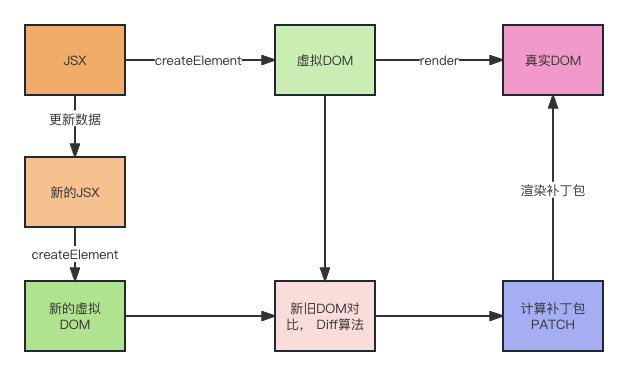

# JSX语法

`JSX`为`JavaScript and XML`的缩写，`JSX`语法允许将JavaScript与HTML混合在一起。

## JSX基本用法

```jsx
import React from 'react';
import ReactDOM from 'react-dom/client';

// 创建root,首先要获取页面中的容器
const root = ReactDOM.createRoot(document.getElementById('#root'))
//基于render方法渲染我们编写的视图，把渲染后的内容，全部插入到#root中进行渲染
root.render(<App/>)
```

- 在HTML中嵌入“JS表达式”，需要基于`“{} 胡子语法”`
   - **变量、值、数学运算**
```jsx
import React, { Component } from 'react';
class App extends Component {
  render() {
    const words = 'Hello React'
    return (
      <div>
        <h2>Welcome to learn React</h2>
        <h2>{words}</h2>
      </div>
    )
  }
}
```

   - **三元表达式**
   - `Array.map()`
> 👀小复习：`Array.prototype.map`方法返回一个新数组，是由原来的数组经过map中的函数处理后的新内容组成。

```jsx
let flag = false;
let isRun = false;
function App() {
    render() {
        return (
           <div>   
               {flag ? <button>按钮文字</button> : null}
               <button>
                   {isRun ? '正在处理中' : '立即提交注册'}
               </button>
           </div>
        )
    }
}
```

- 每一个构建的视图，只能有一个“根节点”
   - 出现多个根节点则报错 `Adjacent JSX elements must be wrapped in an enclosing tag. `
   - React给我们提供了一个特殊的节点(标签)：`React.Fragment` 空文档标记标签`<></>`，既保证了可以只有一个根节点，又不新增一个HTML层级结构。
- `{}胡子语法`内不同的数据类型有不同的显示特点：
   - `number/string`：数值是什么，就渲染出来什么
   - `boolean/null/undefined/symbol/bigInt`：渲染的内容是空
   - 除数组对象外，**其余对象一般都不支持在{}中进行渲染**，但是也有特殊情况: 
      - JSX虚拟DOM对象,比如`{React.createElement('button',null,'submit')}`
      - 给元素设置style行内样式，要求必须写成一个对象格式
   - 数组对象：把数组的每一项都分别拿出来渲染「并不是变为字符串渲染，中间没有逗号」`[10,20] ->1020`
   - 函数对象：不支持在{}中渲染，但是可以作为`函数组件`渲染
- 元素样式的设置方式
```jsx
// 行内样式，需要基于对象
<h2 style={{
  color: 'red',
  fontSize: '18px' //样式属性要基于驼峰命名法处理
}}>JSX</h2>
// 样式类名
<h2 className="box">

<button style={
  { display: flag ? 'block' : 'none'}
}></button>
```
```jsx
const list = [
  {
    id: 1,
    title: '人事部'
	}, 
  {
    id: 2,
    title: '技术部'
	},
  {
    id: 3,
    title: '企划部'
	}
];

function App() {
    render() {
        return (
           <>
               <ul>
/* 循环创建的元素一定要设置key属性，属性值是本次循环中的“唯一值”「优化DOM-DIFF」 */
                   {
                       list.map((item,index) => {
                           return <li key={item.id}>
                              <span> {item.title}</span>
                           </li>
                       })
                   }
               </ul>
           </>
        )
    }
}

/* 扩展需求:没有数组，就是想单独循环五次 */
{new Array(5).fill(null).map((_, index) => {
    return <button key={index}>
        按钮{index + 1}
    </button>;
})}
```
## JSX渲染机制

1. 将`JSX`转换成`虚拟DOM对象（Virtual DOM)对象`
   1. 将`JSX`转换成`React.createElement(ele, props, ...children)`的形式
      1. `ele`: 组件或者元素标签名
      2. `props`: 元素的**属性**对象
      3. `children`: 当前元素的子节点
   2. 将`createElement`函数执行，生成`虚拟DOM对象`
2. 基于React中的`render`方法，将`虚拟DOM`转化成真实DOM
3. 更新的时候，**将旧的虚拟DOM与新的虚拟DOM进行**`DOM Diff`**,计算出差异部分，并进行更新**
```javascript
React.createElement("div", null, 
React.createElement("h2", {
  className: "title",
  style: styleObj
}, "\u5F20\u5B50\u67AB"), 
React.createElement("div", {
  className: "box"
}, 
React.createElement("span", null, x), "|", 
React.createElement("span", null, y)))


virtualDOM = {
    $$typeof: Symbol(react.element),
    ref: null,
    key: null,
    type: "h2" // 标签名「或组件」,
    // 存储了元素的相关属性 && 子节点信息
    props: {
        // 元素的相关属性,
        // 子节点信息「没有子节点则没有这个属性、属性值可能是一个值、也可能是一个数组」
        children: []
    }
  }
```
```jsx
// 基于ReactDOM中的render方法处理，渲染成真实的DOM
// React v16
  ReactDOM.render(
    <>...</>,
    document.getElementById('root')
  );

// React v18
  const root = ReactDOM.createRoot(document.getElementById('root'));
  root.render(
    <>...</>
  );
```

