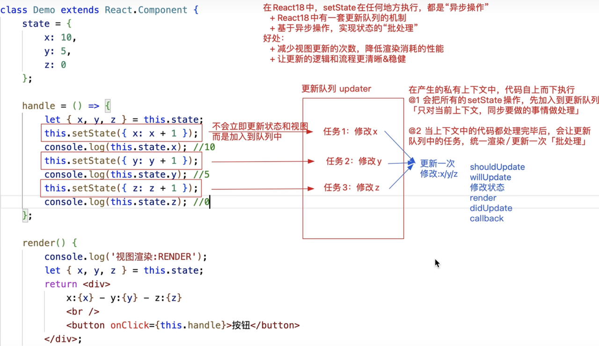

# setState的进阶处理

```jsx
this.setState({
    x:100 //不论总共有多少状态，我们只修改了x，其余的状态不动
});
```
> 1. `this.setState([partialState],[callback])`
> - `[partialState]:`支持部分状态更改
> - `[callback]:`_**在状态更改/视图更新完毕后触发执行**「也可以说只要执行了_`setState`_，_`callback`一定会执行」
>    1. **发生在**`componentDidUpdate`周期函数之后_「`DidUpdate`会在任何状态更改后都触发执行；而回调函数方式，可以在指定状态更新后处理一些事情；」
>    2. _特殊：即便我们基于_`shouldComponentUpdate`_阻止了状态/视图的更新，DidUpdate周期函数肯定不会执行了，但是我们设置的这个callback回调函数依然会被触发执行！！_
>    3. 类似于Vue框架中的_`$nextTick`
> 
> 2. 在React18中，**setState操作都是异步的**,不论是在哪执行，例如：合成事件、周期函数、定时器...」
> 
 目的：实现状态的批处理「统一处理」
> - 有效减少更新次数，降低性能消耗
> - 有效管理代码执行的逻辑顺序
> 
原理：利用了更新队列_`updater`_机制来处理的
> - **在当前相同的时间段内「浏览器此时可以处理的事情中」，遇到setState会立即放入到更新队列中！**
> - 此时状态/视图还未更新
> - **当所有的代码操作结束，会“刷新队列”「通知更新队列中的任务执行」：把所有放入的setState合并在一起执行，只触发一次视图更新「批处理操作」**

```jsx
handler = () => {
    let { x } = this.state
    this.setState({
       x: x + 1 
    }, () => {
        console.log(this.state.x)
        console.log('更新完毕')
    })
}
componentDidUpdate() {
    console.log('更新')
}
```
```jsx
state = {
    x: 10,
    y: 5,
    z: 0
}
handler = () => {
    let { x, y, z } = this.state
    this.setState({ x: x + 1})
    console.log(this.state.x) // 并没有修改
    this.setState({ y: y + 1})
    this.setState({ z: z + 1})
}
```

```jsx
state = {
    x: 10,
    y: 5,
    z: 0
}
handler = () => {
    let { x, y, z } = this.state
    this.setState({ x: x + 1})
    console.log(this.state.x) 
    this.setState({ y: y + 1})
    // 同步操作完成后就合并渲染一次  
    
    setTimeout(() => {
        this.setState({z:z+1})
        console.log(this.state). // x,y已经更新完毕，z并没有更新
    })
}
```
