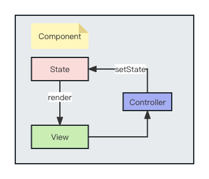
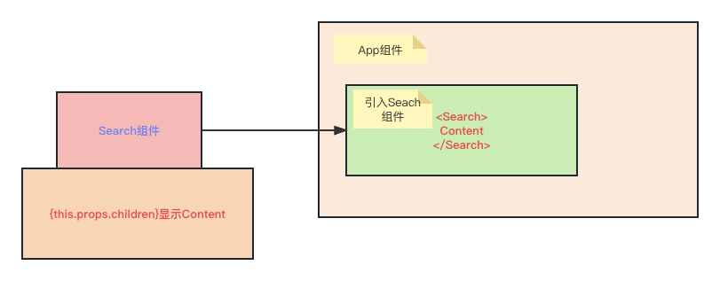
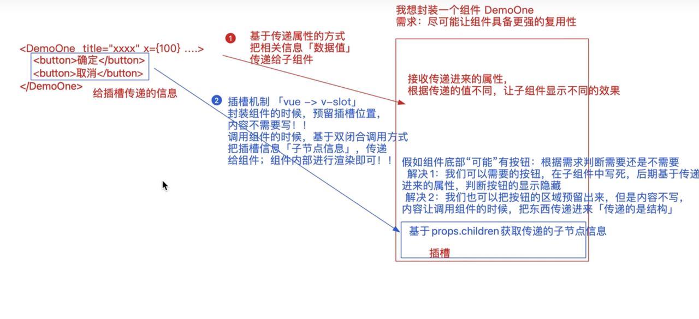

# 类组件与函数式组件

### 类组件

```jsx
class App extends React.Component {
  constructor(props) {
    super(props)
    // 初始化state数据和绑定this
    state = {
      list: [
        id: 1,
        name: 'zzf'
      ]
    }
  }
  // 渲染JSX, 是类组件中必须实现的方法
  render() {}
}
```
在`constructor`构造器中，可以调用`super(props)`, 会在构造函数中设置`this.props`, 以供在构造函数中访问他们，否则当在构造函数中访问`this.props`, 会得到`undefined`
```jsx
const list = [
  {
    objectId: 1,
    title: 'React',
  }
]
class App extends Component {
	constructor() {
    state = {
      list,
      num: 10
    }
  }
  addNumber = () => {
    
  }
 	render() {
    const { list, num } = this.state
    return (
      <div className="App">
        <span>{num}</span>
        <span>{list.title}</span>
        <button onClick={() => this.addNumber}>Add</button>
      </div>
		)
 }
}
```
```javascript
const filterList = () => {
  const updateList = this.state.list.filter(item => {
    return item.id !== id;
  })
  // item => item.id !== id;
  this.setState({ list: updateList })
}
```

### 函数式组件
函数式组件是`无状态组件`，也没有生命周期方法, 只返回渲染内容（未来会学习Hooks组件，在函数组件中使用状态）
当你需要使用`state`或者生命周期方法中，就需要使用类组件（现在不推荐使用类组件，因为React Hooks语法只支持函数式组件）
```jsx
const Demo = function Demo() {
    return (
        <div>
            Demo组件
        </div>
    )
}
export default Demo;
```
### 事件处理机制
```jsx
render() {
  return (
    <button onClick={() => this.onDismiss(id)}>
      Dismiss
    </button>
  )
}
onDismiss = () => {
  
}
```
当绑定事件时，需要传递参数到事件中，绑定的事件函数不能是`onClick={fn()}`这种形式，`fn()`函数会在浏览器打开程序时立即执行。
### 表单交互
```jsx
state = {
  list: []
  searchWords: ''
}
render() {
  const { list, searchWords } = this.state;
  return (
    <div>
      <form>
        <input type="text"
          onChange={this.onSearchChange}
          />
      </form>
      {
        list.filter(isSearched(searchWords)).map(item => {})
      }
    </div>
  )
}
// 此处的event是React合成事件
onSearchChange = (event) => {
  this.setState({
    searchWords: event.target.value
  })
}


// 高阶函数，函数返回函数
const isSearched = searchWords => item => 
  item.title.toLowerCase().includes(searchWords.toLowerCase());
```
### 受控组件
```jsx
state = {
  list: []
  searchWords: ''
}
render() {
  const { list, searchWords } = this.state;
  return (
    <div>
      <form>
        <input 
          type="text"
          value="searchWords"
          onChange={this.onSearchChange}
          />
      </form>
    </div>
  )
}
```
### 拆分组件

```jsx
class App extends Comoonent {
  render() {
    return (
      <div>
        <Search/>
        <List/>
      </div>
    )
  }
}
```
### 组件`Props`
可以给组件传递属性并在组件中使用。通常是`<Component attr={prop}/>`的形式，通过`props属性`的传递，可以给组件传递不同的属性，子组件根据不同的属性展示的内容不同，从而增强组件的复用性。
```jsx
class App extends Comoonent {
  render() {
    return (
      <div>
        <Search
          value="searchWords"
          onChange={this.onSearchChange}
          />
        <List
          list={list}
          pattern={searchTerm}
          onDismiss={this.onDismiss}
        />
      </div>
    )
  }
}
class Search extends Component {
  render() {
    const { value, onChange } = this.props;
    return (
      <form>
        <input type="text"
          value={value}
          onChange={onChange}
        />
      </form>
    )
  }
}
class List extends Component {
  render() {
    const { list, pattern, onDismiss } = this.props;
    return (
      <div>
        {
          list.filter(isSearched(pattern)).map(item => {
            return (
              <div>
                <span>{item.title}</span>
                <button
                  onClick={() => onDismiss(item.id)}
                  >onDismiss</button>
              </div>
            )
          })
        }
      </div>
    )
  }
}
```
 ⚠️ **需要注意的一点是：传递过来的属性Props是“只读"的，不允许修改, 我们常见的做法是将传递的**`props`**赋给其他变量，再对变量进行操作。**
### PropTypes
通过`prop-types`可以向父组件向子组件传递的`props属性`进行类型校验，但是不管校验成功还是失败，`props`属性依旧会被传递给子组件，如果不符合规则类型，会在控制台发出警告错误。
```jsx
import PropTypes from 'prop-types'  // 首先需要安装
//  函数式组件
const Demo = function Demo(props) {
  const { title, num } = props
  return (
    <div>
      Demo
    </div>
  )
}
// 把函数当成对象，设置静态的私有属性和方法，来给其设置属性的校验规则
// 1. 设置校验规则
Demo.propTypes = {
  title: PropTypes.string.isRequired,
  num: PropTypes.number,
  y: PropTypes.oneOfType( // 多种规则校验中的一个
    [PropTypes.number, PropTypes.bool]
  )
}
// 2. 设置默认属性
Demo.defaultProps = {
  title: 'Demo',
  num: 0
}
```
### `Children`
在组件标签里面写的内容会以`children`的形式传递给对应的子组件
```jsx
<Search>
	Search
<Search/>
```
```jsx
class Search extends Component {
  render() {
    const { value, onChange, children } = this.props;
    return (
      <form>
        {children}: 
        <input type="text"
          value={value}
          onChange={onChange}
        />
      </form>
    )
  }
}
```



```jsx
import React from 'react';
const Demo = function Demo(props) {
  // console.log(props)
  let {children} = props;
  // 可以基于React.Children对象中提供的方法，对props.children做处理
  children = React.Children.toArray(children);
  console.log(children)
  return (
    <div className="demo">
      {children[0]}
      <h2>你好</h2>
      {children[1]}
    </div>
  )
}
```
```jsx
<Demo title="react" num={10}>
  <div slot="header">
    <span>青年演员:</span>
    <span>张子枫</span>
  </div>
  <span>文琪</span>
  <span slot="footer">庄达菲</span>
</Demo>
```
```jsx
import React from 'react';
const Demo = function Demo(props) {
  // console.log(props)
  let {children} = props;
  children = React.Children.toArray(children);
  // console.log(children)
  let headerSlot = [], footerSlot = [], defaultSlot = [];
  children.forEach(child => {
    // 传递进来的插槽信息，都是编译为virtualDOM后传递进来的「而不是传递的标签」
    // console.log(child)
    let {slot} = child.props;
    if(slot === 'header') {
      headerSlot.push(child)
    } else if(slot === 'footer') {
      footerSlot.push(child)
    } else {
      defaultSlot.push(child)
    }
  })
  return (
    <div className="demo">
      {headerSlot}
      <div>
        <span>你好</span>:
        {defaultSlot}
      </div>
      {footerSlot}
    </div>
  )
}

```
### 可复用组件
组件复用是指组件创建后可以在多个地方使用，避免重复书写，从而提升开发效率。
```jsx
class Button extends Component {
  render() {
    const { children, onClick, className = '' } = this.props;
    return (
      <button
        onClick={onClick}
        className={className}
        >{ children }</button>
    )
  }
}
```
### 组件声明样式

- `Less/Scss/CSS ClassNames`
- `Inline Style`
- `CSS Modules`
- `styled-Components`

内联样式的写法，定义`JavaScript`对象，并传递一个元素的`style属性`，`<element style={styleObj}`
```jsx
const styleObj = {
  color: 'red',
  fontSize: '24px'
}
class App extends Component {
	render() {
    return (
        <div className="title">
        	<span style={styleObj}></span>
        </div>
    )
  }
}
```
### 总结
```jsx
const Vote = function Vote(props) {
    const { title } = props;
    let supNum = 10,
        oppNum = 5;

    return <div className="vote-box">
        <div className="header">
            <h2 className="title">{title}</h2>
            <span>{supNum + oppNum}人</span>
        </div>
        <div className="main">
            <p>支持人数：{supNum}人</p>
            <p>反对人数：{oppNum}人</p>
        </div>
        <div className="footer">
            <button onClick={() => {
                supNum++;
                console.log(supNum);
            }}>支持</button>

            <button onClick={() => {
                oppNum++;
                console.log(oppNum);
            }}>反对</button>
        </div>
    </div>;
};
export default Vote;
```
:::info
第一次渲染组件，把函数执行

- 产生一个私有的上下文：`EC(V)`
- 把解析出来的`props`「含children」传递进来「但是被冻结了」
- 对函数返回的JSX元素`「virtualDOM」`进行渲染

当我们点击按钮的时候，会把绑定的小函数执行：

- 修改上级上下文EC(V)中的变量
- 私有变量值发生了改变
- 但是“视图不会更新”

也就是说，**函数组件第一次渲染完毕后，组件中的内容，不会因为组件内的某些操作进行更新，所以称它为静态组件**

除非在父组件中，重新调用这个函数组件「可以传递不同的属性信息」

:::

---

:::warning
函数组件是“静态组件”：

- 组件第一次渲染完毕后，无法基于“内部的某些操作”让组件更新「无法实现“自更新”」；但是，如果调用它的父组件更新了，那么相关的子组件也一定会更新「可能传递最新的属性值进来」；
- 函数组件具备：属性props...「其他状态等内容几乎没有」
- 优势：比类组件处理的机制简单，这样导致函数组件渲染速度更快！！

类组件是“动态组件”：

- 组件在第一渲染完毕后，除了父组件更新可以触发其更新外，我们还可以通过：`this.setState`修改状态 或者 `this.forceUpdate`等方式，让组件实现“自更新”！
- 类组件具备：属性、状态、周期函数、ref...「几乎组件应该有的东西它都具备」
- 优势：功能强大！！


Hooks组件「推荐」：

- 具备了函数组件和类组件的各自优势，在函数组件的基础上，基于hooks函数，让函数组件也可以拥有状态、周期函数等，让函数组件也可以实现自更新「动态化」！
:::

