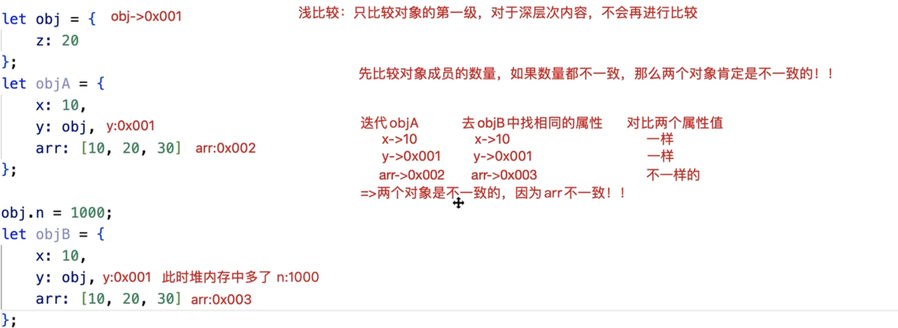

# 类组件的渲染和更新流程

### 创建类组件


创建类组件要求必须继承`React.Component/PureComponent`这个类, 且必须给当前类设置一个`render`的方法「放在其原型上」：在`render`方法中，返回需要渲染的视图

```jsx
import React from 'react'
class Vote extends React.Component {
    state = {
    }
    render() {
        return (
            <div>
            </div>
        )
    }
}

export default Vote;
```
```jsx
function Component(props,context,updater) {
    this.props = props;
    this.context = context;
    this.refs = {};
    this.updater = updater || ReactNoopUpdateQueue;
}

import React from 'react'
class Parent extends React.Component {
    constructor(props) {
        super(props)
    }
    state = {
    }
    render() {
        return (
            <div>
            </div>
        )
    }
}

export default Parent;
/*
render函数在渲染的时候，如果type是：
- 字符串：创建一个标签
- 普通函数：把函数执行，并且把props传递给函数
- 构造函数：把构造函数基于new执行（创建类的实例），把解析的props传递过去
    - 每调用一次类组件都会创建一个单独的实例
    - 把类组件编写的render函数执行，把返回的jsx(虚拟DOM）当做组件视图进行渲染。
*/
```
基于`extends`实现继承的过程

1. 首先基于`call`继承 ，`React.Component.call(this)`，**给创建的组件实例设置四个私有属性**: `props、context、refs、updater`
2. 再基于原型继承，`Parent.prototype.__proto__ === React.Component.prototype`
- `paretnt —> Parent.prototype -> React.Component.prototype -> Object.prototype`
- 实例除了具备`Parent.prototype`提供的方法之外，还具备了`React.Component.prototype`原型上提供的方法：`isReactComponent, setState, forceUpdate`
3. 只要自己设置了`constructor,`则内部第一行代码要执行`super()`
### 类组件的渲染流程
从调用类组件`new Vote({})`开始，类组件内部发生的事情：

1. `初始化属性 && 规则校验`, 先规则校验，校验完毕后，再处理属性的其他操作
```javascript
  constructor(props) {
    super(props); //会把传递进来的属性挂载到this实例上
    console.log(this.props); //获取到传递的属性
  }
```
即便我们自己不在`constructor`中处理(或者`constructor`都没写)，在`constructor`处理完毕后，React内部也会把传递的props挂载到实例上；所以在其他的函数中，只要保证`this`是实例，就可以基于`this.props`获取传递的属性, `this.props`获取的属性对象是被冻结的(只读的)

2. `初始化状态`
   1. 如果我们没有做任何的处理，`React`内部会帮我们默认设置一个`state`, 值为`null`, 即`this.state = null`
   2. 更多的时候，我们是用代码的方式手动指定，`state = {}`
   3. 当通过`setState`修改`state`中的值时，会触发`React`的更新流程，但是如果我们使用了`this.state.xxx = newValue`这样的方式，只会改变`state`中的值，并不会触发更新流程。
   4. 我们还可以通过`forceUpdate`的方式强制视图更新
3. 触发`componentWillMount`生命周期函数(生命周期钩子）
> 🧡 钩子函数：在程序运行到某个阶段，我们可以基于提供一个处理函数，让开发者在这个阶段做一些自定义的事情

   - `React`官方打算移除这个生命周期函数，所以将这个函数设置为`不安全的`，所以会在控制台中输出黄色警告⚠️， 如果想要移除这个黄色警告，可以使用 `UNSAFE_componentWillMount`
   - 如果我们开启了`StrictMode严格模式`（检查不规范的语法或不建议使用的API） ，则使用`UNSAFE_componentWillMount`时，控制台会直接发出红色警告🚨
4. 触发`render`函数，渲染内容
5. 触发`componentDidMount`生命周期函数，第一次渲染完毕，在此阶段我们可以拿到`DOM`元素
### 类组件的更新流程
:::info
组件更新的逻辑「第一种：组件内部的状态被修改，组件会更新」

1. 触发 `shouldComponentUpdate`周期函数：是否允许更新, 返回结果为`true/flase`, 如果结果为`true`, 则允许更新，并执行后面的操作，如果返回结果为`false`,则不进行更新
2. 触发 `componentWillUpdate`周期函数：更新之前
- 此周期函数也是不安全的, 在这个阶段，状态/属性还没有被修改
3. 修改状态值/属性值`setState`, 让`this.state.xxx`改为最新的值
4. 触发 `render `周期函数：组件更新
- 按照最新的状态/属性，把返回的JSX编译为virtualDOM
- 和上一次渲染出来的virtualDOM进行对比`「DOM-DIFF」`
- 把差异的部分进行渲染「渲染为真实的DOM」
5. 触发`componentDidUpdate`周期函数：组件更新完毕

特殊说明：如果我们是基于 `this.forceUpdate()`强制更新视图，会跳过 `shouldComponentUpdate`周期函数的校验，直接从`componentWillUpdate`开始进行更新「也就是：视图一定会触发更新」！
:::
:::warning
组件更新的逻辑「第二种：父组件更新，触发的子组件更新」

1. 触发 `componentWillReceiveProps `周期函数：接收最新属性之前, 该周期函数是不安全的
2. 触发 `shouldComponentUpdate` 周期函数

之后的操作和组件的第一种更新逻辑相同

组件卸载的逻辑

1. 触发 `componentWillUnmount`周期函数：组件销毁之前
2. 销毁

父子组件嵌套，处理机制上遵循**深度优先**原则：父组件在操作中，遇到子组件，一定是把子组件处理完，父组件才能继续处理

- _父组件第一次渲染_

 父 willMount -> 父 render「子 willMount -> 子 render -> 子didMount」 -> 父didMount 

- _父组件更新：_

父 shouldUpdate -> 父willUpdate -> 父 render 「子willReceiveProps -> 子 shouldUpdate -> 子willUpdate -> 子 render -> 子 didUpdate」-> 父 didUpdate

- _父组件销毁：_

父 willUnmount -> 处理中「子willUnmount -> 子销毁」-> 父销毁
:::
```jsx
shouldComponentUpdate(nextProps,nextState) {
     // nextState:存储要修改的最新状态
     // this.state:存储的还是修改前的状态「此时状态还没有改变」
     console.log(this.state, nextState);
    
     // 此周期函数需要返回true/false
     //   返回true：允许更新，会继续执行下一个操作
     //   返回false：不允许更新，接下来啥都不处理
     return true;
}
UNSAFE_componentWillUpdate(nextProps, nextState) {
    console.log('componentWillUpdate:', this.props, nextProps);
}

UNSAFE_componentWillReceiveProps(nextProps) {
    // this.props:存储之前的属性
    // nextProps:传递进来的最新属性值
    console.log('componentWillReceiveProps:', this.props, nextProps);
}
```
### `PureComponent`
当我们定义类组件的时候，通常有以下两种形式：
```javascript
import React from 'react';

class Demo1 extends React.PureComponent {}

class Demo2 extends React.Component {}
```
那么，定义的组件继承`PureComponent/Component`有什么区别吗？
:::info
相比于`Component`, `PureComponent`会给类组件默认加一个`shouldComponentUpdate`周期函数

- _在此周期函数中，它对新老的属性/状态 会做一个**浅比较**_
- _如果经过浅比较，发现属性和状态并没有改变，则返回false「也就是不继续更新组件」；有变化才会去更新！！_
:::
### 
```javascript
// 检测是否为对象
const isObject = function isObject(obj) {
    return obj !== null && /^(object|function)$/.test(typeof obj);
};

// 对象浅比较的方法
const shallowEqual = function shallowEqual(objA, objB) {
    if (!isObject(objA) || !isObject(objB)) return false;
    if (objA === objB) return true;
    // 先比较成员的数量
    let keysA = Reflect.ownKeys(objA),
        keysB = Reflect.ownKeys(objB);
    if (keysA.length !== keysB.length) return false;
    // 数量一致，再逐一比较内部的成员「只比较第一级：浅比较」
    for (let i = 0; i < keysA.length; i++) {
        let key = keysA[i];
        // 如果一个对象中有这个成员，一个对象中没有；或者，都有这个成员，但是成员值不一样；都应该被判定为不相同！！
        if (!objB.hasOwnProperty(key) || !Object.is(objA[key], objB[key])) {
            return false;
        }
    }
    // 以上都处理完，发现没有不相同的成员，则认为两个对象是相等的
    return true;
};

```
```javascript
shouldComponentUpdate(nextProps, nextState) {
    let { props, state } = this;
    // props/state：修改之前的属性状态
    // nextProps/nextState：将要修改的属性状态
    // 有一项返回结果为false(props或者state更改), shouldComponentUpdate才会返回true
    return !shallowEqual(props, nextProps) || !shallowEqual(state, nextState);
} 

// 当往state中的arr进行操作后，arr的地址并没有更改，为了让组件更新，复制一份放在新数组中
this.setState({
   arr: [...arr] //我们是让arr状态值改为一个新的数组「堆地址」
})
```
### 对象的密封、冻结和封装

1. 冻结
冻结对象：`Object.freeze(obj)`
检测是否被冻结：`Object.isFrozen(obj) => true/false`
被冻结的对象：不能修改成员值、不能新增成员、不能删除现有成员、不能给成员做劫持`Object.defineProperty`
2. 密封
密封对象：`Object.seal(obj)`
检测是否被密封：`Object.isSealed(obj)`
被密封的对象：**可以修改成员的值**，但也不能删、不能新增、不能劫持
3. 扩展
把对象设置为不可扩展：`Object.preventExtensions(obj)`
检测是否可扩展：`Object.isExtensible(obj)`
被设置不可扩展的对象：除了不能新增成员、其余的操作都可以处理
被冻结的对象，既是不可扩展的，也是密封的，同理，被密封的对象，也是不可扩展的。
