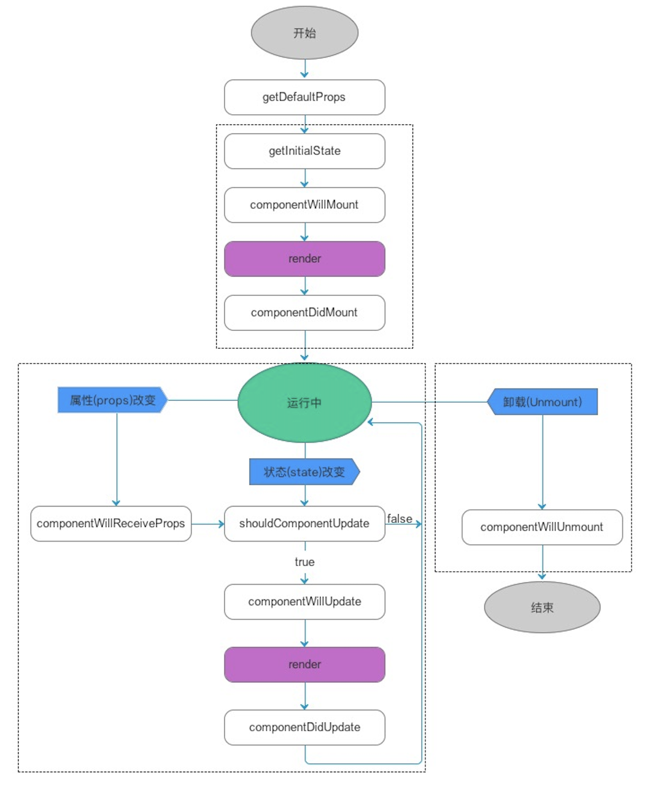

# 组件的生命周期

组件的生命周期包含`挂载mount、更新update、卸载unmount`三个阶段

1. 挂载过程中有四个周期方法：
- `constructor()`：只有在组件实例化的时候才会被调用，可以设置初始化状态及绑定类方法
- `componentWillMount()`：组件挂载之前
- `render`：必须存在，**返回需要渲染的内容，这个方法应该是一个纯函数，不应该在这个方法中修改组件的状态。**
- `componentDidMount`：组件挂载完毕，**是发起异步请求去API获取数据的绝佳时期。**
2. 当组件状态`state`或属性`props`发生改变时，组件更新，组件更新时候的生命周期方法如下：
- `componentWillReceiveProps(nextProps)`：基于新的属性和之前的属性作出对比，从而基于对比的结果去实现不同的行为。
- `shouldComponentUpdate(nextProps, nextState)`：每次组件因为属性或者状态修改的时候，都会被调用，返回一个布尔值，组件及子组件会根据这个布尔值来决定是否需要重新`render`, 这样可以避免不必要的渲染。
- `componentWillUpdate(nextProps,nextState)： 这里拿到了最新的数据和状态，可以做渲染之前最后的准备，但是不要再触发`setState`
- `render()`
- `componentDidUpdate()`： 组件更新之后，在`render`之后立即调用。
3. 组件卸载时的生命周期
- `componentWillUnmount()`: 组件销毁之前被调用，常用来执行清理任务。

