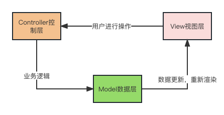

# 认识React

`React`是一个用于构建用户界面的JavaScript框架。React的底层逻辑不再基于传统的`DOM/BOM`操作，而是基于`数据驱动视图`，开发者无须直接操作DOM,而是通过操作和改变数据来改变视图，当数据改变，页面也会重新渲染，这样有效避免了`DOM的重排与重绘`，提升了性能。

## MVC模式
`MVC模式`包含了3个部分：

- `View视图层`：React通过`JSX`构建界面
- `Model数据层`: 在视图中，凡是需要动态变化的（样式或者内容），都需要构建对应的数据模型
- `Controller控制层`: 根据业务需求，当用户进行某些操作的时候，去修改对应的数据，然后React根据最新的数据重新渲染视图，用户看到最新的界面。

不同于`Vue框架`的`双向数据绑定`，React是单向驱动，当视图中的**表单**中的内容发生改变，与之对应的数据不会随之更新，需要开发者基于代码手动实现。


> React中实现状态更新视图渲染的方法主要有两个：
> - `setState`: 修改状态的同时通知视图渲染
> - `forceState`: 通知视图强制更新

## create-react-app的使用
`React`官方为我们提供了`create-react-app`脚手架，使用`create-react-app`能够帮我们快速的创建一个`React`项目，具体安装和使用步骤如下：

```shell
# 全局安装create-react-app, mac系统要在命令的前面加上 sudo 
npm i create-react-app -g
# 查看create-react-app的版本
create-react-app --version
# 创建项目，名称命名只能使用数字、小写字母、_
create-react-app projectName
# 进入到项目目录
cd projectName
# 启动项目
npm start | yarn start
```
## React项目目录
你可以在编辑器中打开这个项目，类似下面的文件结构会呈现在你面前：
```
|- node_modules  包含安装的模块
|- public  页面模板和icon
    |- favicon.icon
    |- index.html
|- src  我们编写的程序
    |- index.jsx  程序入口「jsx后缀名可以让文件支持jsx语法」
|- package.json
|- ...
```
```json
{
  "dependencies": {
    "react": "^18.2.0",  //核心
    "react-dom": "^18.2.0",  //视图编译
    "react-scripts": "5.0.1", //对打包命令的集成
    "web-vitals": "^2.1.4"  //性能检测工具
  },
}
```
`create-react-app`脚手架：默认配置的`sass`，如果使用`less`,则需要自己处理

