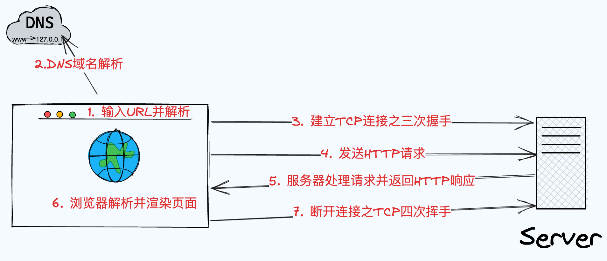

### 在浏览器中输入URL并按下回车之后会发生什么

> 超高频面试题，从这道面试题开始可以延伸到计算机网络有关的很多问题，如果这道题答的很好，可以把面试官引导到你更熟悉的地方。

1. 第一步：输入URL并解析

> 这里可以引申到URL的组成部分，这里不做过多的展开。

输入`URL`后，浏览器会解析出协议、主机、端口、路径等信息，并构造一个HTTP请求（浏览器会根据请求头判断是否有`HTTP缓存`,并根据是否有缓存决定是从服务器获取资源还是使用缓存资源，具体内容会在HTTP缓存章节讲解）

2. 第二步：DNS域名解析, 将域名解析成对应的IP地址

在发送HTTP请求之前，浏览器需要知道想要访问网页(url)对应的IP地址，这就需要使用到`DNS域名解析`（DNS域名解析的具体内容也会在后面章节中讲解）。

3. 第三步：建立起TCP连接之三次握手

> 这里是重中之重，可以扩展很多问题，比如为什么是三次，不是两次、四次？如果第一次握手丢失了会发生什么？三次握手过程中可以携带数据吗？

客户端和服务器之间进行HTTP请求和HTTP响应的过程中，需要建立起TCP连接，TCP连接需要进行三次握手（具体内容在后面章节中讲解）。

4. 第四步：浏览器发送HTTP/HTTPS请求到web服务器

> 这一步也可以扩展很多问题，比如HTTP/HTTPS的区别？请求的方式？请求的状态码，凡是与HTTP请求的问题都可以问。

5. 第五步：服务器处理HTTP请求并返回HTTP报文

> HTTP响应报文和状态码也是常考的内容。

服务器会接受请求并将其传递给请求处理程序并发送HTTP响应，一般响应报文包含：请求的网页以及状态码，压缩类型，如何缓存的页面，设置的cookie;  

5. 第六步：浏览器渲染页面

> 浏览器渲染页面的流程对于前端同学来说也是必会的、还会牵扯到回流和重绘的问题。

7. 第七步：断开连接之TCP四次挥手

> 这里也是特别重要的知识点，四次挥手的过程，为什么是四次？

客户端和服务器之间断开连接需要进行四次挥手（具体内容在后面章节汇总讲解）。

